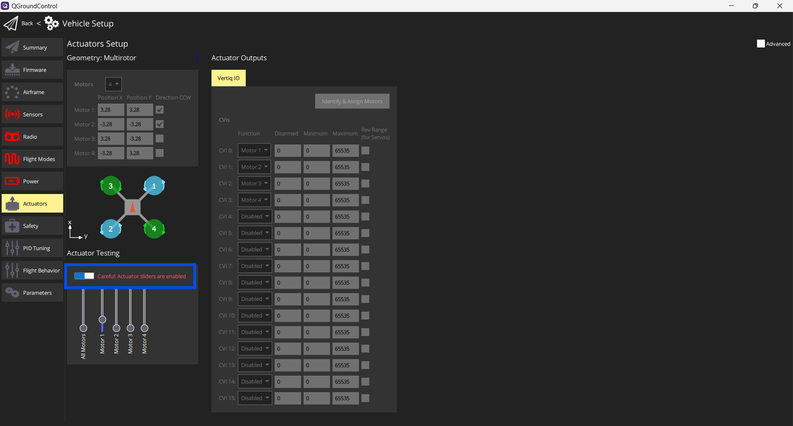

.. include:: ../text_colors.rst
.. toctree::

.. _ifci_px4_flight_controller:

****************************************************
Setting up PX4 Firmware for Use with IFCI
****************************************************
.. Converted from Jordan's google docs tutorial
This tutorial covers how to build and set up Vertiq’s PX4 fork which provides access to Vertiq’s IQUART protocol. With IQUART integrated into your flight controller, you gain the ability to control, configure, and receive telemetry from all connected modules through a single serial port. Please note that in order to control your module with our PX4 fork, your module must support the :ref:`IQUART Flight Controller Interface (IFCI)<controlling_ifci>`. The features supported by your module and firmware style can be found on your module’s family page.
.. .. note::
..     Our IQUART integrations are not currently included in mainline PX4, but there is a pull request being reviewed
.. set up motor -- all done in ifci px4 flight controller or 
..      ensure the motor is flashed with underactuated
..      If using multiple motors ensure that the IDs are different
..      Set the baudrate to 921600 or higher
..      Ensure the proper default file is selected
..      point forward and zero offset
..      More information can be found here *up12 setup page*
..  
.. set up px4 -- all done in ifci px4 flight controller
..      assume flashed with correct stuff
..      enable Vertiq stuff on correct port
..          vertiq io cfg? 
..      set vertiq_baud to matching baud (921600)
..      set num cvs
..      set telemetry ids
..      set Disarm trigger

Setting Up the PX4 Toolchain
=============================

.. This can section can be removed once we are integrated in

In order to use our PX4 fork, you must install the PX4 toolchain.. We recommend that you follow `PX4's guides <https://docs.px4.io/main/en/dev_setup/dev_env.html>`_ in order to install the toolchain for your specific device. Note that when the PX4 guide gives the instruction to run ``git clone https://github.com/PX4/PX4-Autopilot.git --recursive`` it should be replaced with ``git clone https://github.com/iq-motion-control/PX4-Autopilot --recursive`` in order to clone Vertiq's fork rather than the mainline PX4.

Once the toolchain is installed go into the directory and add the remote original PX4 remote repository:

.. code-block:: bash

    git remote add upstream git@github.com:PX4/PX4-Autopilot.git
    git fetch upstream

This should result in tags being added to the local repository. Once this is done you should be able to build PX4.

.. once we are in px4, this whole section can be replaced with install px4 toolchain as described by them

Setting Up PX4 for IQUART and Building
======================================

Once the toolchain is set up, you must change the settings for your board to turn on Vertiq IQUART integrations. To do this, enter your PX4 directory and use the command below, but replace ``<your-flight-control-board>`` with your flight control board's name.

.. code-block:: bash

    make <your-flight-control-board> boardconfig

This should bring up the boardconfig window in the terminal. The 'Model' section should have your board name. In the image below we are using an ``fmu-v6c``.

    Main Board Config Page

Navigate to the ``drivers`` subsection with the arrow keys and press ``Enter`` to enter it.

    Selecting the Drivers Section

Navigate to the ``actuators`` submenu with the arrow keys and press ``Enter`` to enter it.

.. figure:: ../_static/tutorial_images/ifci_px4_flight_controller/board_config_select_actuators.png
    :align: center
    :scale: 50
    :alt: Selecting the Actuators Section

    Selecting the Actuators Section

Navigate to the ``vertiq_io`` subsection and press space to select it. An asterisk should appear in the box. Once the asterisk is in the box, press ``Enter`` to enter the vertiq_io submenu.

.. figure:: ../_static/tutorial_images/ifci_px4_flight_controller/actuators_select_vertiq_io.png
    :align: center
    :scale: 50
    :alt: Selecting the vertiq_io Section

    Selecting the vertiq_io Section

Inside the ``vertiq_io`` submenu one option should appear for including IFCI configuration parameters. Select this by pressing space.

.. figure:: ../_static/tutorial_images/ifci_px4_flight_controller/ifci_unselect.png
    :align: center
    :scale: 50
    :alt: Include IFCI Parameters

    Include IFCI Parameters

Once this is selected, a second option will appear for including pulsing module configurations. If you plan on using underactuated propellers, select this as well.

Once done, press ``Q`` and then ``Y`` to save the configuration.

    Save the Configuration

Once saved, build the firmware with the following command, replacing ``your-flight-control-board`` with the name of your flight control board. This will be the same name as used in the :ref:`previous steps<Setting Up the PX4 Toolchain>`.

.. code-block:: bash

    make your-flight-control-board

Your firmware file should appear in the ``PX4-Autopilot/build/your-flight-control-board_default`` folder as ``your-flight-control-board_default.px4``

.. warning::
    Adding the IFCI configuration features will increase the size of the PX4 build. This could make the build larger than the flash size available on your board.
    
    .. figure:: ../_static/tutorial_images/ifci_px4_flight_controller/large_code.png
        :align: center
        :scale: 50
        :alt: Oversized Code

        Oversized Code

    If the build is too large does, you will have to turn off other features to fit the binary on your flight controller. We recommend excluding other output drivers (PWM, DShot, DroneCAN, etc.) that you will not be using. Features can be turned off through boardconfig exactly as you turned on Vertiq’s features.

    .. figure:: ../_static/tutorial_images/ifci_px4_flight_controller/disable_outputs.png
        :align: center
        :scale: 50
        :alt: DShot and PWM Location

        DShot and PWM Location

    With the build settings updated, rebuild the program. When the compiled program occupies under 100% of the flash size, you will be able to fully build the PX4 application.

    .. figure:: ../_static/tutorial_images/ifci_px4_flight_controller/small_code.png
        :align: center
        :scale: 50
        :alt: Trimmed Code

        Trimmed Code

Flashing PX4 to Your Flight Controller
======================================

Once built, you must program your flight controller with your compiled ``.px4`` file. To do this, open QGroundControl, go to the vehicle settings menu and enter the 'Firmware' menu. Once there, plug in your board, select the 'Advanced Settings' checkbox, and then the 'Custom Firmware' option.

    Custom Firmware Selection

Once you press 'OK', a file explorer should appear. Find the ``your-flight-control-board_default.px4`` file that you built and select it. The flashing process should begin. 

Enabling and IFCI Your Flight Controller
===================================================

Once the flashing is complete, connect to your flight controller with QGroundControl and go to the parameters menu. In the parameters menu :red:`search for 'vertiq'`. The parameter ``VERTIQ_IO_CFG`` :blue:`should appear`. Once you find this, :green:`set it to the serial port that you plan on using`, save, and reboot the flight controller as instructed by QGroundControl.

.. figure:: ../_static/tutorial_images/ifci_px4_flight_controller/vertiq_io_enable.png
    :align: center
    :scale: 50
    :alt: Enabling Vertiq IO

    Enabling Vertiq IO

After reboot, and with Vertiq IO enabled, you should now see a :blue:`Vertiq IO` submenu in the QGroundControl parameter settings. Adjust the :red:`VERTIQ_BAUD` parameter to match what your modules will be using. We recommend using a baud rate of 921600.

    Vertiq IO Submenu

Now your Vertiq modules must be configured for proper communication with the flight controller.

Configuring Your Vertiq Modules for Use with IFCI and PX4
========================================================
.. check which pulsing firmware we need.

To use your Vertiq modules properly with IFCI 23-xx modules must be running speed firmware version 0.32 or newer, or pulsing firmware 0.27 or newer. Once flashed with appropriate firmware, connect each module **individually** to IQControlCenter and set the :blue:`UART Baud Rate` and the :red:`Module ID`. As stated previously, we recommend that you use a baud rate of 921600. Ensure that each module connected to the flight controller is set to a different, unique module ID.

.. figure:: ../_static/tutorial_images/ifci_px4_flight_controller/control_center_settings.png
    :align: center
    :scale: 50
    :alt: Control Center Settings

    Setting Baud Rate and Module ID

With the modules set to unique module IDs, and the baud rate set to match the flight controller's, you can now connect your modules to the flight controller. To do this, find the flight controller's serial port configured to run the VERTIQ_IO module, and connect the TX of the serial port to each module's RX port. Connect the RX of the serial port to each module's TX port.

.. figure:: ../_static/manual_images/pulsing_propeller/motor_serial_connection.png
    :align: center
    :alt: Bussed Serial Connection

    Bussed Serial Connection

Integration Setup
=================

.. warning::
    Ensure that there are not propellers connected to the motor modules during this testing.

With the modules connected to the flight controller and everything connected to a common ground power on the system, connect the flight controller to QGroundControl and go to the 'Parameters' section. Under the Vertiq IO submenu, set the ``Target_MODULE_ID`` parameter to the module ID of one of your modules and save. When you do this, the parameters should refresh and display the module's configured parameters. Any parameter that has a description starting with 'Module Param - ' is a value retrieved from the module.

For each module ID that you have connected, set the following parameters to your desired values: ``CONTROL_MODE``, ``VERTIQ_FC_DIR``, ``VERTIQ_MOTOR_DIR``. Additionally for each module set the ``THROTTLE_CVI`` parameter to a different value. CVI stands for Control Value Index and more information can be found in :ref:`controlling_ifci`. Matching the module ID is a good way to do this, but if your module IDs do not start at 0, it is recommended that your CVIs do. If ``CONTROL_MODE`` is set to Voltage or Velocity, set the corresponding ``MAX_VOLTAGE`` or ``MAX_VELOCITY`` parameter as well.

.. figure:: ../_static/tutorial_images/ifci_px4_flight_controller/module_parameters.png
    :align: center
    :scale: 50
    :alt: PX4 Module Parameters

    PX4 Module Parameters

Once these are all set, set the ``VERTIQ_NUM_CVS`` parameter to the highest CVI that you used plus 1. This refers to the number of Control Values the flight controller should send. If you only have 4 control values, but the highest one is 11, the flight controller needs to send 12 control values, even if some intermediate ones are unused. It better to use every control value you are sending to reduce overhead on the serial line. If you are doing a quadcopter and used ``THROTTLE_CVI`` 0, 1, 2, 3, you should set the ``VERTIQ_NUM_CVS`` to 4.

.. figure:: ../_static/tutorial_images/ifci_px4_flight_controller/num_cvs.png
    :align: center
    :scale: 50
    :alt: Num CVs

    Setting the Number of Control Values

The final values to set are ``TELEM_IDS_1`` and ``TELEM_IDS_2``. These control which module IDs have telemetry requested. When you click on one of these parameters, a list of checkboxes should show up. Tick each module ID that is on your bus to request telemetry from that module.

.. figure:: ../_static/tutorial_images/ifci_px4_flight_controller/telem_ids.png
    :align: center
    :scale: 50
    :alt: Telem Modules

    Setting the Modules to Request Telemetry From

Actuator Setup
==============

The next step is to set up the actuator associations. Go to the actuator tab in QGroundControl settings and select the 'Vertiq IO' tab on the top right. Initially every ESC function will be disabled. Each ESC number in this section corresponds to a CVI number plus 1. For example ESC 1 corresponds to CVI 0 and so on. Based on the geometry drawing, match the motor with the appropriate ESC # (and therefore CVI). As you do, also ensure that the direciton checkbox is ticked properly. Module ID is irrelevant here.

.. figure:: ../_static/tutorial_images/ifci_px4_flight_controller/geometry_setup.png
    :align: center
    :scale: 50
    :alt: geometry setup

    Matching Motor Geometry to ESCs

In the example image above, the from right module has a ``THROTTLE_CVI`` of 0, the back left module; 1, front left; 2, back left; 3. This is conveniently in order, so an additional example is shown below where this is not the case.

.. figure:: ../_static/tutorial_images/ifci_px4_flight_controller/silly_geometry_setup.png
    :align: center
    :scale: 50
    :alt: geometry setup

    Matching Motor Geometry to ESCs with a 'Non-Conventional' Setup

In the setup above the ``THROTTLE_CVI`` for the front right; 0, back right; 1, front left; 2, back left; 3. As long as the module CVI to Motor number association is correct, the right motor will spin.

Spin Testing
============

Now that everything is setup correctly, you can attempt to spin the modules. In the same 'Actuators' tab, enable the Acutator Testing slider. Once this is enabled the motors can spin. Slide each motor slide up and down, and ensure that it corresponds to the expected motor in your geometry image.

    Testing the Actuators