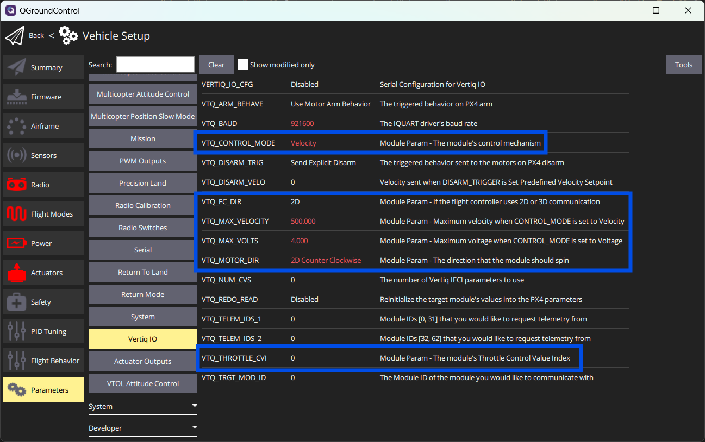
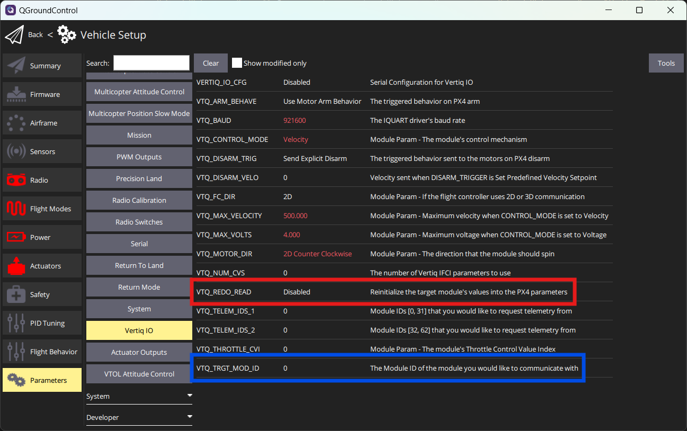
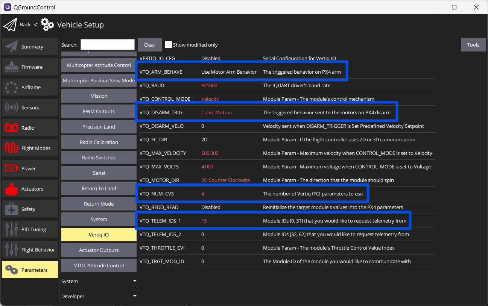
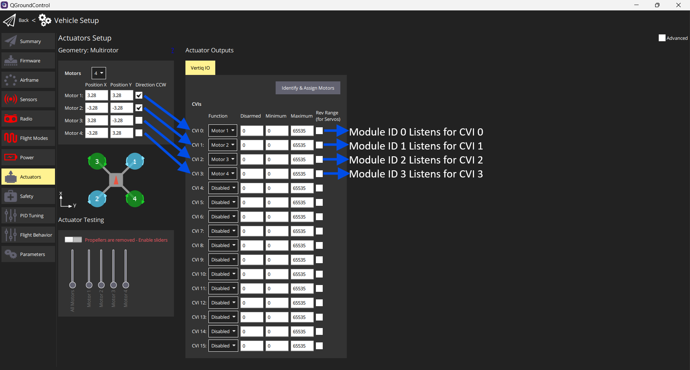
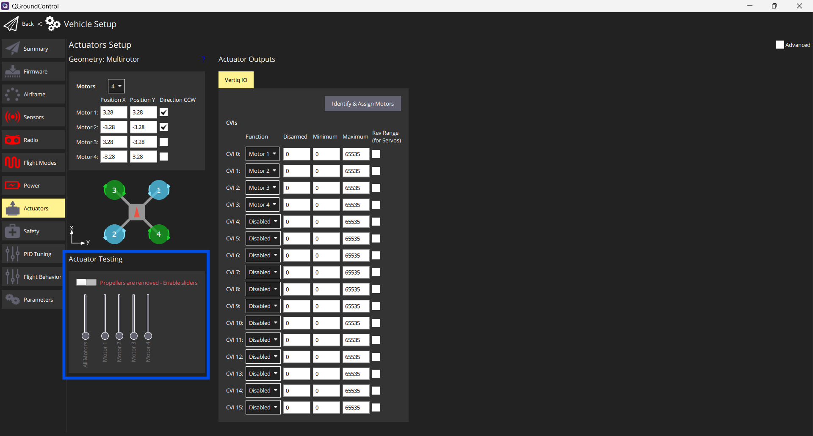

.. include:: ../text_colors.rst
.. toctree::

.. _ifci_px4_flight_controller:

****************************************************
Setting up PX4 Firmware for Use with IFCI
****************************************************
.. Converted from Jordan's google docs tutorial
This tutorial covers how to build and set up Vertiq’s PX4 fork which provides access to Vertiq’s IQUART protocol. With IQUART integrated into your flight controller, you gain the ability to control, configure, and receive telemetry from all connected modules through a single serial port. Please note that in order to control your module with our PX4 fork, your module must support the :ref:`IQUART Flight Controller Interface (IFCI)<controlling_ifci>`. The features supported by your module and firmware style can be found on your module’s family page.

Setting Up the PX4 Toolchain
=============================

In order to use our PX4 fork, you must install the PX4 toolchain.. We recommend that you follow `PX4's guides <https://docs.px4.io/main/en/dev_setup/dev_env.html>`_ in order to install the toolchain for your specific device. Note that when the PX4 guide gives the instruction to run ``git clone https://github.com/PX4/PX4-Autopilot.git --recursive`` it should be replaced with ``git clone https://github.com/iq-motion-control/PX4-Autopilot --recursive`` in order to clone Vertiq's fork rather than the mainline PX4.

.. warning::
    If you do not replace the standard PX4 fork with our fork, nothing will work. Make sure you properly replace ``git clone https://github.com/PX4/PX4-Autopilot.git --recursive`` with ``git clone https://github.com/iq-motion-control/PX4-Autopilot --recursive`` as mentioned above.
    
Once the toolchain is installed go into the directory and add the remote original PX4 remote repository:

.. code-block:: bash

    git remote add upstream git@github.com:PX4/PX4-Autopilot.git
    git fetch upstream

This should result in tags being added to the local repository. Once this is done you should be able to build PX4.

.. once we are in px4, this whole section can be replaced with install px4 toolchain as described by them

Setting Up PX4 for IQUART and Building
======================================

Once the toolchain is set up, you must change the settings for your board to turn on Vertiq IQUART integrations. To do this, enter your PX4 directory and use the command below, but replace ``<your-flight-control-board>`` with your flight control board's name.

.. code-block:: bash

    make <your-flight-control-board> boardconfig

This should bring up the boardconfig window in the terminal. The 'Model' section should have your board name. In the image below we are using an ``fmu-v6c``.

.. figure:: ../_static/tutorial_images/ifci_px4_flight_controller/board_config_main.png
    :align: center
    :scale: 50
    :alt: Main Board Config Page

    Main Board Config Page

Navigate to the ``drivers`` subsection with the arrow keys and press ``Enter`` to enter it.

.. figure:: ../_static/tutorial_images/ifci_px4_flight_controller/board_config_select_drivers.png
    :align: center
    :scale: 50
    :alt: Selecting the Drivers Section

    Selecting the Drivers Section

Navigate to the ``actuators`` submenu with the arrow keys and press ``Enter`` to enter it.

    Selecting the Actuators Section

Navigate to the ``vertiq_io`` subsection and press space to select it. An asterisk should appear in the box. Once the asterisk is in the box, press ``Enter`` to enter the vertiq_io submenu.

    Selecting the vertiq_io Section

Inside the ``vertiq_io`` submenu one option should appear for including IFCI configuration parameters. Select this by pressing space.

.. figure:: ../_static/tutorial_images/ifci_px4_flight_controller/ifci_unselect.png
    :align: center
    :scale: 50
    :alt: Include IFCI Parameters

    Include IFCI Parameters

Once this is selected, a second option will appear for including pulsing module configurations. If you plan on using underactuated propellers, select this as well.

Once done, press ``Q`` and then ``Y`` to save the configuration.

.. figure:: ../_static/tutorial_images/ifci_px4_flight_controller/save.png
    :align: center
    :scale: 50
    :alt: Save the Configuration

    Save the Configuration

Once saved, build the firmware with the following command, replacing ``your-flight-control-board`` with the name of your flight control board. This will be the same name as used in the :ref:`previous steps<Setting Up the PX4 Toolchain>`.

.. code-block:: bash

    make your-flight-control-board

Your firmware file should appear in the ``PX4-Autopilot/build/your-flight-control-board_default`` folder as ``your-flight-control-board_default.px4``

.. warning::
    Adding the IFCI configuration features will increase the size of the PX4 build. This could make the build larger than the flash size available on your board.
    
    .. figure:: ../_static/tutorial_images/ifci_px4_flight_controller/large_code.png
        :align: center
        :scale: 50
        :alt: Oversized Code

        Oversized Code

    If the build is too large does, you will have to turn off other features to fit the binary on your flight controller. We recommend excluding other output drivers (PWM, DShot, DroneCAN, etc.) that you will not be using. Features can be turned off through boardconfig exactly as you turned on Vertiq’s features.

    .. figure:: ../_static/tutorial_images/ifci_px4_flight_controller/disable_outputs.png
        :align: center
        :scale: 50
        :alt: DShot and PWM Location

        DShot and PWM Location

    With the build settings updated, rebuild the program. When the compiled program occupies under 100% of the flash size, you will be able to fully build the PX4 application.

    .. figure:: ../_static/tutorial_images/ifci_px4_flight_controller/small_code.png
        :align: center
        :scale: 50
        :alt: Trimmed Code

        Trimmed Code

Flashing PX4 to Your Flight Controller
======================================

Once built, you must program your flight controller with your compiled ``.px4`` file. To do this, open QGroundControl, go to the vehicle settings menu and enter the 'Firmware' menu. Once there, plug in your board, select the 'Advanced Settings' checkbox, and then the 'Custom Firmware' option.

.. figure:: ../_static/tutorial_images/ifci_px4_flight_controller/custom_firmware.png
    :align: center
    :scale: 50
    :alt: Custom Firmware Selection

    Custom Firmware Selection

Once you press 'OK', a file explorer should appear. Find the ``your-flight-control-board_default.px4`` file that you built and select it. The flashing process should begin. 

Enabling and IFCI Your Flight Controller
===================================================

Once the flashing is complete, connect to your flight controller with QGroundControl and go to the parameters menu. In the parameters menu :red:`search for 'vertiq'`. The parameter ``VERTIQ_IO_CFG`` :blue:`should appear`. Once you find this, :green:`set it to the serial port that you plan on using`, save, and reboot the flight controller as instructed by QGroundControl.

    Enabling Vertiq IO

After reboot, and with Vertiq IO enabled, you should now see a :blue:`Vertiq IO` submenu in the QGroundControl parameter settings. Adjust the :red:`VERTIQ_BAUD` parameter to match what your modules will be using. In this tutorial we will be using a baud rate of 921600 which is what we recommend.

.. figure:: ../_static/tutorial_images/ifci_px4_flight_controller/vertiq_io_settings.png
    :align: center
    :scale: 50
    :alt: Vertiq IO Submenu

    Vertiq IO Submenu

Now your Vertiq modules must be configured for proper communication with the flight controller.

Configuring Your Vertiq Modules for Use with IFCI and PX4
========================================================
To use your Vertiq modules properly with IFCI, your modules must be flashed with a compatible firmware version. Please consult your module's family page to find if your module supports IFCI. Once flashed with appropriate firmware, connect each module **individually** to IQControlCenter and set the :blue:`UART Baud Rate` and the :red:`Module ID`. As stated previously, we recommend that you use a baud rate of 921600. Both of these parameters will cause the motor to reboot when set, so make sure you reconnect to the motor after each one is set. Ensure that each module connected to the flight controller is set to a different, unique module ID. For this tutorial we will be using the module IDs 0, 1, 2, and 3.

.. figure:: ../_static/tutorial_images/ifci_px4_flight_controller/control_center_settings.png
    :align: center
    :scale: 50
    :alt: Control Center Settings

    Setting Baud Rate and Module ID

With the modules set to unique module IDs, and the baud rate set to match the flight controller's, you can now connect your modules to the flight controller. To do this, find the flight controller's serial port configured to run the Vertiq IO module, and connect the TX of the serial port to each module's RX port. Connect the RX of the serial port to each module's TX port. Connect a commond ground between the flight controller and each module.

    Module Flight Control Wiring

Integration Setup
=================

.. warning::
    Please remove all propellers from any module you plan on testing. Failure to do so can result in harm to you or others around you. Further, please ensure that your module is secured to a stationary platform or surface before attempting to spin it. 

Connect your flight controller and motors as shown in the diagram above. Ensure that both the motors and flight controller are receiving power. Connect the flight controller to qgroundcontrol, navigate to the :red:`parameters menu`, and select the :blue:`Vertiq IO` subsection as shown below.

.. figure:: ../_static/tutorial_images/ifci_px4_flight_controller/vertiq_parameters.png
    :align: center
    :scale: 50
    :alt: PX4 Vertiq IO Parameters

    PX4 Vertiq IO Parameters

The parameters available in this subsection either control how px4 talks to the modules, or parameters that are specific to the module. Parameters that are specific to the module are called out using ‘Module Param -’ in their description.

    PX4 Module Parameters

The :blue:`TARGET_MODULE_ID` parameter sets which module the Module Params are synchronized with. When this parameter is written the Module Params will update. If you would like to specifically update those parameters without switching module IDs you can set :red:`TRIGGER_READ`. It will immediately set itself back to disabled, but the Module Params will update.

    PX4 Module Parameters

In this example we will be setting the modules up in PWM mode. We will be setting up the motors to work as if the quadcopter is set up as in the diagram below.

    Module Organization on Quadcopter

First we will set the flight controller specific parameters. ``ARMING_BEHAVE`` can be left as the default “Use Motor Arm Behave”. ``DISARM_TRIGGER`` will be set to “Coast Motors”. This will turn the motor controllers off and allow the motors to spin freely. In ``TELEM_IDS_1`` 0, 1, 2, 3 will be selected to indicate that the flight controller should request telemetry from those module IDs (because this is a bitset parameter, the actual number that is set will be 15). ``VERTIQ_NUM_CVS`` will be set to 4. This means that your IFCI packet will be filled with 4 control signals and that the available control value indices will be 0, 1, 2, and 3. More can be read about this in the :ref:`IFCI documentation<controlling_ifci>`. After these parameters are set, the flight controller will need to be rebooted.

    PX4 Module Parameters

Next the module parameters will be set. First the ``TARGET_MODULE_ID`` parameter will be set to 0. The Module Params should be reloaded. ``The CONTROL_MODE`` parameter will be set to PWM. The ``MAX_VELOCITY`` and ``MAX_VOLTS`` parameters can be ignored because we are not controlling the motor with velocity or voltage mode. If ``CONTROL_MODE`` is set to one of those, the MAX\_ parameter that it corresponds to needs to be set appropriately. ``VERTIQ_FC_DIR`` should be set to 2D. All of these parameters will be the same for all of the modules. The last two parameters ``THROTTLE_CVI``, and ``VERTIQ_MOTOR_DIR`` will vary with each module. In our example ``THROTTLE_CVI`` will be set to match the module ID. Since we are currently setting module ID 0’s settings, we will set ``THROTTLE_CVI`` to 0. ``VERTIQ_MOTOR_DIR`` will be set to 2D Counter Clockwise to match the diagram of the quadcopter above. Ensure the ``VERTIQ_MOTOR_DIR`` parameter matches the direction shown in the diagram for each module ID. This is then repeated for each module ID by selecting a new ``TARGET_MODULE_ID``. The resulting parameters for each module are shown below. Blue boxes are the parameters that match between modules, red are the ones that vary, and yellow is the module ID.

    All Modules Set Correctly

Actuator Setup
==============

Now the actuators must be set up in the actuator tab of QGroundControl. Navigate to the actuator tab of QGRoundControl and ensure that the Vertiq IO tab shows up.

    Vertiq IO Tab Appears

The geometry section determines where each motor is on the aircraft and what direction it is spinning. The Actuator Outputs section determines which motor defined in the geometry section is connected to which actuator. In this case we want to associate Motors from the geometry section with our Modules. The ESCs in the Actuator Outputs section correspond to the CVIs set in the previous section, but are offset by 1. If you would like to set the Motor associated with CVI 0, you need to set that motor on ESC 1, for CVI 1, you must set ESC 2, etc. In this example we have set the CVIs such that we can associate Motor 1 with ESC 1, Motor 2 with ESC 2, Motor 3 with ESC 3, and Motor 4 with ESC 4.

    Motor to Actuator to CVI Associations

If you accidentally put the wrong CVI on a motor you can just switch the motor functions in the actuator outputs section. If for example you accidentally set the front right motor as CVI 2 and the front left motor as CVI 0, then you can just set ESC 1 as Motor 3, and ESC 3 as Motor 1. You could also change the CVIs associated with each module, but we find that this is the most straightforward way to swap connections.

.. figure:: ../_static/tutorial_images/ifci_px4_flight_controller/actuator_associations_swap.png
    :align: center
    :scale: 50
    :alt: Motor to Actuator to CVI Associations with Swap

    Motor to Actuator to CVI Associations with Swap

Spin Testing
============

.. warning::
    Please remove all propellers from any module you plan on testing. Failure to do so can result in harm to you or others around you. Further, please ensure that your module is secured to a stationary platform or surface before attempting to spin it. 

Now that the modules and flight controller have been configured, the modules can be tested. This is done in the same Actuators Tab in QGroundControl with the Actuator Testing section.

    Actuator Testing Section

Enable the actuator testing slider. This effectively arms the modules. Now the sliders will control the modules that they correspond to. Slide each motor slider up individually and confirm that it corresponds to the expected module in the geometry picture. Additionally confirm that it is spinning in the correct direction.

.. figure:: ../_static/tutorial_images/ifci_px4_flight_controller/actuator_test.png
    :align: center
    :scale: 50
    :alt: Actuator Testing

    Actuators Armed and Enabled

If the modules are incorrectly mapped you can rearrange the motor function associations as discussed in the previous section. If the direction of the motor is incorrect you will need to change the parameter ``VERTIQ_MOTOR_DIR`` for that module. For example, if motor 3 in the geometry image is spinning counterclockwise you need to determine which module ID that it is assoicated with (in our case module ID 2), and adjust the parameter by setting ``TARGET_MODULE_ID`` to 2 and then adjusting ``VERTIQ_MOTOR_DIR`` to 2D Clockwise.
