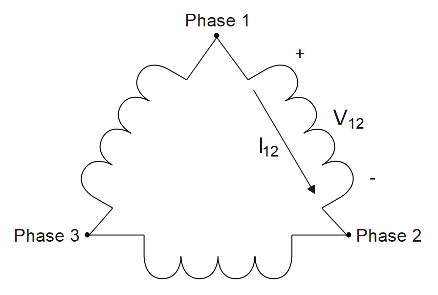
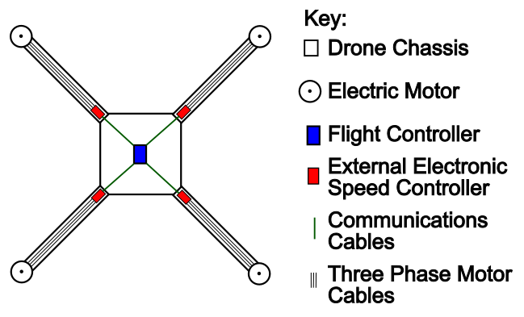
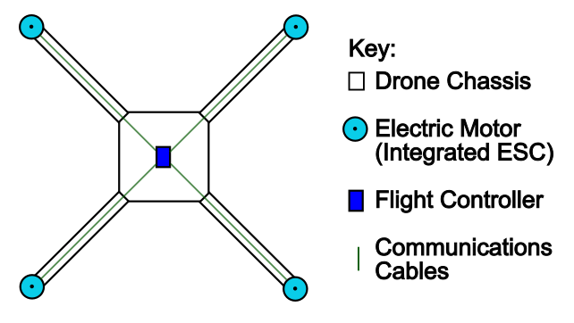
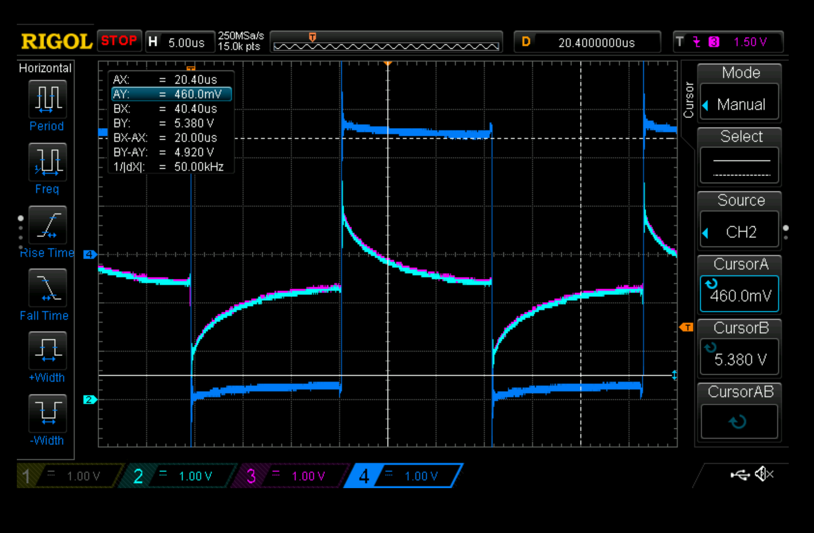
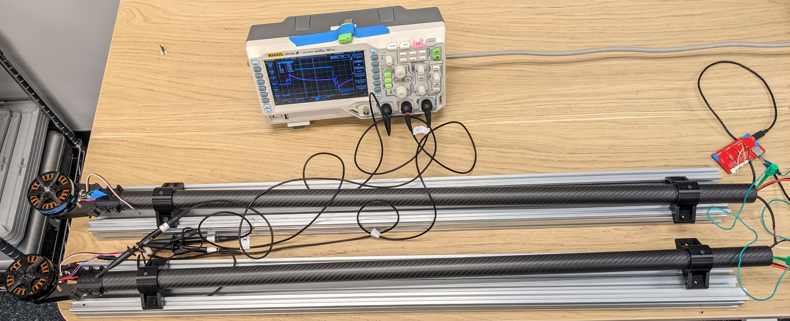
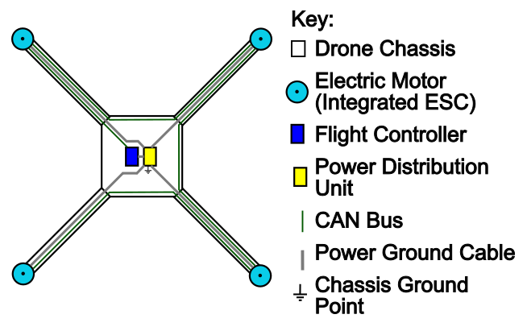
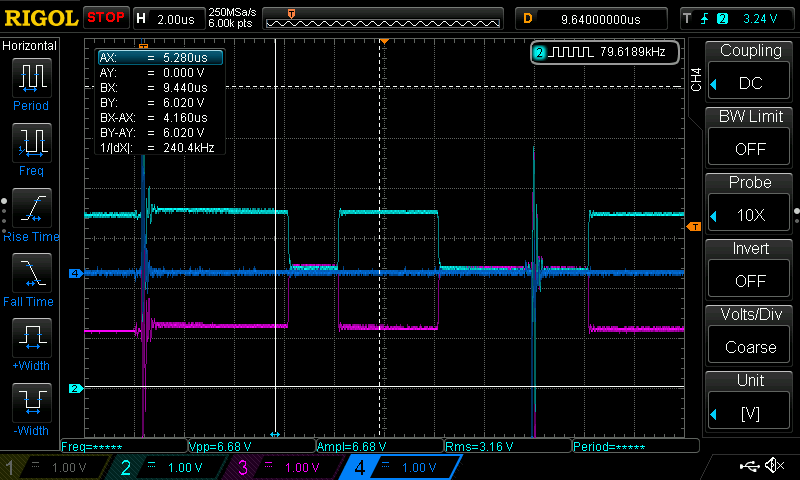
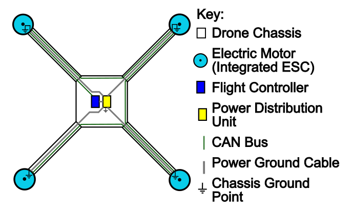
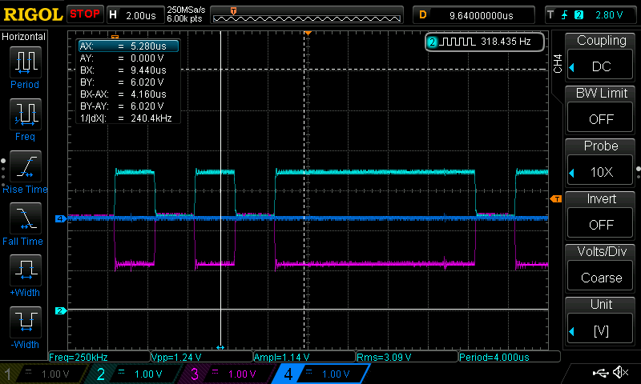

.. include:: ../text_colors.rst
.. toctree::

.. _motor_noise_debugging:

***********************************************************************
Understanding And Debugging Communication Errors From Motor Noise
***********************************************************************

Where Does Motor Noise Come From?
======================================
Electric motors produce torque through interactions between the motor’s permanent magnetic field and the electric current flowing through the motor’s wire windings. 
The electric current in the motor’s windings produces a variable magnetic field which can be controlled to exert a force on the motor’s permanent magnets/magnetic field. 
Current is directed through the motor’s windings by applying a voltage across the windings. The direction the current flows through the windings can be switched by 
changing the voltage polarity across the windings. In a three phase brushless DC motor like those produced by Vertiq, the three windings are connected between each of the 
three phases as seen below in figure 1. The process of directing the current through the coils of a three-phase motor is known as commutation.

    Figure 1: Simplified Phase Wiring Diagram

However, motors are neither perfect nor closed systems. The same switching voltages that occur during commutation to spin the motor may also cause electromagnetic interference 
(EMI) in nearby electronic systems, including those used to drive and communicate with the motor. EMI originating from an electric motor is what we call motor noise. 
EMI can be radiated, coupled, or conducted and can occur at different frequencies and their harmonics. Therefore, it is important to understand the sources and impacts of 
EMI when designing mitigation techniques. 

This tutorial will address the mitigation of motor noise that couples to a motor’s body through stray capacitances inside the motor. Stray capacitance (also known as 
parasitic capacitance) will exist  between two conductors that are physically close to each other and carry different potential voltages. The electric field between the 
two conductors will store a small charge which creates an effective capacitance. Stray capacitances are typically in the picofarad range. Unfortunately, a few picofarads 
is enough to couple significant motor noise to the motor’s body. Noise coupled to a motor’s body can then be conducted to conduits carrying communications cables such as 
a vehicle frame or drone arm. Motor noise may also be radiated from the motor and its coils, but the impacts of radiated noise on unmanned vehicle systems tend to be less 
significant and the same techniques can be used to mitigate them.

Why Are Internal ESCs More Susceptible To Noise?
=====================================================
Drones that utilize electric motors with integrated ESCs tend to have longer communication wires than vehicles that use external ESCs. This is because external ESCs 
are typically installed close to a drone’s power distribution unit to keep DC wire length short. Therefore, the communications buses only need to be routed to the ESCs' 
locations and the three phase motor cabling will extend along the arm to reach the motor itself. A simplified diagram of a drone wired with external ESCs can be seen below 
in figure 2.

    Figure 2: Simplified Drone Cabling Diagram With External ESCs

Conversely, a drone utilizing motors with internal ESCs will have communications cables extending the entire length of the drone arm to reach the motor as seen below in 
figure 3. Generally speaking, a communication network’s susceptibility to EMI will increase the longer its wire lengths get. Therefore, it is especially important to reduce 
EMI and build robust communication buses on a vehicle utilizing motors with internal ESCs. 

    Figure 3: Simplified Drone Cabling Diagram With Internal ESCs

Identifying Noise On Communication Lines
=====================================================
When an electric motor is mounted to a conductive frame with metal or conductive screws, the motor body and vehicle frame will be electrically connected. In this scenario, 
it is likely that any motor noise that couples to the motor’s aluminum body via parasitic capacitances will conduct onto the vehicle’s frame. Communication buses that run 
through or parallel to a noisy vehicle frame will be susceptible to the interference and may experience dropped packets or communication failures. The oscilloscope screen 
capture below in figure 4 displays how motor noise that has been conducted onto a carbon fiber tube can interfere with signal buses that are routed through it. A simulated 
drone setup was used to capture the scope images in this document and can be seen below in figure 5. In this example the carbon fiber tubes used to simulate drone arms are 
one meter in length and electrically connected. 

    Figure 4: Coupled Motor Noise 

    Figure 5: Simulated Drone Communication Noise Setup 

Channels 2 and 3 (light blue and pink) in figure 4 display CAN bus high and low signals at a recessive voltage state (i.e. no signal is actively being transmitted). 
Channel 4 (dark blue) is measuring motor noise that has been conducted on to the carbon fiber tube “drone arms”. One can clearly observe the motor noise is interfering 
with the communication bus during each of the electrical transitions. One may also note how the motor noise on the frame has a DC (the “on” and “off” voltage at +/-2.5 V) 
and an AC (the transition between the two DC states) component, but only the AC component is coupling via the stray capacitance.

How To Minimize Noise On Communication Lines
=====================================================
Motor noise can be insulated from a vehicle’s frame by mounting the motor using nylon or nonconductive spacers and/or screws.

However, designers of heavy duty vehicles often want to avoid using nonconductive plastic fasteners as they are mechanically weaker than metal or carbon fiber and act as 
thermal insulators. Fortunately, motor noise coupled to a motor’s body can also be eliminated or greatly diminished by connecting the motor body or vehicle frame to power 
ground. Whether or not to ground a motor body and/or vehicle frame is a decision with many application specific considerations. Frame grounding will be discussed in greater 
detail in the next section. 

Frame Grounding
+++++++++++++++++++++++++++++++++++++++++++++++++++++

Grounding Considerations
#####################################################
Electronic enclosures and cases are commonly grounded at a single point close to the power supply ground to reduce EMI and improve user safety. This is an easily 
applicable standard for a single motor with an integrated ESC where a mounting screw can be used to ground the motor chassis. Grounding through a mounting screw in the 
motor itself is particularly effective in reducing motor noise as it provides a very low impedance path for coupled noise to drain back to ground.

However, a vehicle with multiple motors will have multiple grounding points on its frame if the motors are not mounted using electrically isolating features. One must 
also consider whether or not the other electronic devices mounted to the vehicle’s frame have their mounting positions tied to ground or potentially even a positive 
voltage. Unfortunately, there is no one standard for electronic enclosure or PCB mounting hole grounding/isolation. Therefore, one should perform a continuity check 
between the power connectors and the enclosure/mounting position(s) of each device being mounted to a vehicle frame so that all power paths can be considered and short 
circuits can be avoided. 

Grounding Schemes
#####################################################

Power Supply Grounding
~~~~~~~~~~~~~~~~~~~~~~~~~~~~~~~~~~~~~~~~~~~~~~~~~~~~~

The simplest grounding scheme is to connect the drone frame to ground at a single point near the power source ground, which will usually be near the center of a drone. 
A simplified diagram of a drone using a power supply grounding scheme can be seen below in figure 6.

    Figure 6: Power Supply Grounding

A scope image of a CAN bus utilizing a single point of grounding near the power distribution unit can be seen below in figure 7. Channels two and three (light blue and 
pink) display CAN bus high and low signals, but this time a data transmission is occurring on the bus. Here we can see how using the power supply grounding scheme on the 
simulated drone frame has essentially removed the DC noise on channel 4 (dark blue). However, the AC spikes can still be observed due to the impedance of the carbon fiber 
tube that separates the motor chassis and the frame’s centralized grounding point. The noise on channel 4 can also be seen to interfere with the CAN bus signals. 

    Figure 7: Single Point Grounding

The AC noise present on the signal bus can be mitigated by using shielded twisted pair cable. The cable shields should have their drains connected to ground at the same 
location as the frame. Differential buses like CAN are designed to be resistant to the common mode noise illustrated in figure 7 and may be operational in this grounding 
scheme. However, if communication failures persist or design requirements can not tolerate the interference, one may need to consider locally grounding each motor body.  

Motor Body Grounding
~~~~~~~~~~~~~~~~~~~~~~~~~~~~~~~~~~~~~~~~~~~~~~~~~~~~~

Motor noise that has coupled to the motor body can be effectively eliminated by grounding the motor body to power ground. A simplified diagram of a drone using a motor 
body grounding scheme can be seen below in figure 8. Please note that the simplified drone in figure 8 also has a grounding point near the power distribution unit. This 
ground point is technically optional, but recommended to help keep the drone frame ground at a common voltage. The importance of keeping the frame at a common ground 
voltage will be elaborated on later in this section. 

    Figure 8: Motor Body Grounding

An oscilloscope screen capture containing the simulated drone communication test results can be seen below in figure 9. The motor bodies in this test are internally 
connected to ground via a PCB mounting screw. Once again, Channels 2 and 3 (light blue and pink) display a CAN bus with signals actively being transmitted and Channel 4 
(dark blue)  is displaying the voltage on the carbon fiber frame. Here we can see a significant absence of motor noise on all channels. While the results of eliminating 
motor noise by grounding the motor bodies are very encouraging, having multiple ground locations on a single vehicle frame introduces further design considerations.

    Figure 9: Motor Body Grounding

Having multiple grounding points on a vehicle frame may cause the frame itself to conduct currents, which are sometimes referred to as parasitic currents or ground loops. 
Parasitic currents will flow when there is a voltage difference between two points that are nominally ground referenced and may exacerbate communication issues. Ground 
loops are a problem typically found in applications with large cable lengths where small currents can produce large voltage offsets like the AC mains in buildings. Ground 
loops may not be an observable problem on relatively smaller scales such as unmanned vehicle frames. However, if communication errors are occurring on a vehicle with 
multiple frame grounding locations that do not occur when the frame is isolated or only has one connection to ground, ground loops may be the cause. Ground loops can be 
eliminated by using isolated mounting methods such as plastic or nylon spacers and screws.

When designing a vehicle where it is necessary to ground the vehicle frame at multiple points, please consider the following to help keep the vehicle frame at a 
common potential:

    1. Make a frame ground connection point as close as possible to the power supply/battery ground.
    2. Ground each motor body close to the power ground input using the most direct method possible, such as a grounding screw.
    3. Make a frame ground connection point close to the power ground input of each electronic device on a communication bus.
    4. Use the shortest possible cable length when connecting each electronic device’s power ground to the power supply/battery ground. This should result in the power 
       network having a star topology with the power supply/battery connection in the center.
    5. Use a sufficiently thick wire gauge for the current application when making ground connections.  
    6. In general, frame ground paths between an electronic device and the power supply/battery should have a single parallel power ground path through the power 
       ground cable. 

Avoiding Frame Ground Faults
#####################################################

When designing a vehicle with a grounded frame or chassis, it is important to consider and protect against potential faults that would not occur if the frame was floating. 
For example, if a cable carrying a positive voltage, such as the battery voltage, is damaged and makes contact with a grounded frame it will likely cause a vehicle wide 
power failure and potentially damage other on board electronics. 

Similarly, if a power ground cable becomes damaged or disconnected on a vehicle that is grounded at multiple points, the vehicle frame may act as a power ground bus and 
conduct the full ground current. Using a vehicle frame as the power bus may be common in the automotive industry, but is typically a bad idea for drones depending on what 
material the frame is constructed from. For example, the sturdy and lightweight material carbon fiber has a relatively high resistivity compared to aluminum or copper. 
A material with a higher resistivity will produce more waste heat at the same current load than a material with a lower resistivity. Therefore, conducting power ground 
through standard carbon fiber at high operating currents may create a fire hazard. 

To prevent ground faults associated with cabling, cable harnesses should be designed with mechanical features required for use in high vibration environments. Examples of 
vibration resistant features include, but are not limited to the following: 

* Cable connectors with locking or clasping features. 
* Cable routing with strain relief.
* Rounding or filleting sharp corners, especially near cable routings.

Additionally, consider making redundant ground connections through a fuse or polymeric positive temperature coefficient device (PTC) to prevent high current flows through 
a carbon fiber frame.
