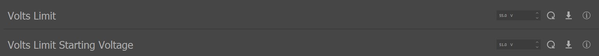

.. include:: ../text_colors.rst
.. toctree::

.. _protect_against_regen:

*************************************************************************
Configuring Your Module to Protect Against Regeneration Voltage Spikes
*************************************************************************

What are Regenerative Voltage Spikes
=======================================
Regeneration voltage occurs when the commanded module voltage is less than the module's back-EMF voltage. When this occurs, the motor's kinetic 
energy is converted directly to electrical energy, and produces a current flowing out of the motor and into the power source.

How Can Regeneration Affect Your Module
=========================================
In the case that the module's power source can absorb the regenerated current such as a battery, capacitor, etc., then the overall system voltage will remain roughly 
constant. When the overall system voltage remains roughly constant, there is no risk of damage to your module due to regeneration voltage spikes. 
In the case that the power supply (such as a benchtop power supply) cannot absorb the regenerated energy, however, the overall system voltage will increase. 
These spikes can result in voltages above the module's **and** your supply's maximum rated operating voltage. When this happens, you can permanently damage the module, 
the power supply, or both.

Protecting Against Dangerous Regeneration Voltage Spikes
===========================================================
Regenerative voltage spikes pose a serious threat to both your modules and your power supply. As such, all Vertiq modules are able to self-limit the amount of 
regeneration voltage produced. Vertiq modules have two main parameters to protect against dangerous regeneration voltage spikes. They are available through IQ Control Center's advanced tab as 
*Volts Limit* and *Volts Limit Starting Voltage*.

For example, by default on Vertiq 81-XX family modules (rated to 14S), you will see:

In short, these two values work together in order to limit the rate at which your module will slow down or apply a braking force. In doing so, the module limits the amount of 
negative supply current produced, reducing the produced regenerative voltage.

.. note::
    These configuration parameters define **system voltages**. For example, if your module has a maximum voltage rating of 14S (or 58.8V), but your power supply has a 
    maximum rating of 30V, the values of Volts Limit Starting Voltage and Volts Limit must be set according to the absolute 30V maximum.

    By default, all Vertiq modules are configured with the module assumed as the lowest maximum voltage limit. In order to protect your power supply and module, 
    please ensure that your configured voltage limits are set according to the **system's lowest maximum voltage rating**.

* **Volts Limit Starting Voltage** defines the value (in volts) at which the module will begin limiting regeneration. The value of Volts Limit Starting Voltage must always be at least 1V below Volts Limit.
* **Volts Limit** defines the absolute maximum supply voltage the module will apply. In some extreme instances, your module may apply a voltage higher than the configured Volts Limit. In order to handle this properly, ensure that there is a buffer between the absolute maximum allowable system voltage and the value of Volts Limit. For example, if your system can handle a maximum of 30V, your Volts Limit may be 27V.