.. include:: ../text_colors.rst
.. toctree::

.. _hobby_fc_tutorial:

***********************************************
PWM and DSHOT Control with a Flight Controller
***********************************************

This tutorial is meant to walk you through the process of performing basic setup and testing for controlling a Vertiq module
with a flight controller using :ref:`Standard PWM <hobby_standard_pwm>` or :ref:`DSHOT <hobby_dshot>`. This tutorial covers only the basics of testing 
that the flight controller can make the module spin with the appropriate protocol, not the setup of any additional flight controller peripherals like an RC controller
or a GPS. This tutorial takes you from a totally fresh module and flight controller, to a module that can be controlled
with the :ref:`Standard PWM <hobby_standard_pwm>` or :ref:`DSHOT <hobby_dshot>` protocols from the flight controller.

This tutorial covers setup and testing on `ArduCopter <https://ardupilot.org/copter/>`_ using `Mission Planner <https://ardupilot.org/planner/>`_ and 
`PX4 <https://px4.io/>`_ using `QGroundControl <http://qgroundcontrol.com/>`_. It covers using both the :ref:`Standard PWM <hobby_standard_pwm>` additional :ref:`DSHOT <hobby_dshot>` 
protocols, since the setup process is largely similar for both protocols. In the places where there are differences, the proper steps for both types of protocol are explained.

These instructions are applicable to any Vertiq module using speed firmware. Though they have different form factors and some different configuration parameters available, 
the configuration and setup for basic control with Standard PWM or DSHOT is the same for all Vertiq speed modules. This example uses a Vertiq 81-08 for demonstration purposes, 
but it is not specific to the 81-08.

Hardware Setup
==============
This example uses a Vertiq 81-08 and a Pix32 from Holybro as the flight controller. Since this tutorial is
focused specifically on setting up the Vertiq module, the only additional peripheral that is used along with the flight controller is a safety switch.

The Vertiq 81-08 is powered through its XT-60 connector from a benchtop power supply. For more information on how to properly power your module, refer to its
datasheet on the `Vertiq website <https://www.vertiq.co/>`_.

When setting the configuration parameters on the module through Control Center, it should be connected to a PC with a USB-to-UART converter. 
For more details on how to use the Control Center with a module, refer to :ref:`control_center_start_guide`.

When testing with the flight controller, the pins of the 81-08 must be connected to the
appropriate output pins of the flight controller. The exact position or labeling of the output pins on your flight controller will vary depending on the specific
flight controller you are using, refer to the flight controller's documentation for more information. The top pin of the 81-08, shown below with a white wire attached to
it, should be connected to the signal output pin on your flight controller that is sending throttle commands. The bottom pin of the 81-08 should be connected to ground. 
For this specfic example using a Pix32, the signal pin was attached to MAIN OUT 1 on the Pix32 when using Standard PWM, and AUX OUT 1 when using DSHOT (see the warning below for more details on 
DSHOT hardware setup).

.. warning:: If you are using DSHOT and certain flight controllers, including Pixhawks, **you may need to use a different set of outputs than when using Standard PWM. These outputs may be labeled as AUX or FMU PWM**. 
    This is because not all outputs on all flight controllers support using DSHOT. See the `Mixing ESC Protocols <https://ardupilot.org/copter/docs/common-brushless-escs.html#mixing-esc-protocols>`_ 
    section of the Arducopter DSHOT setup instructions and the `PX4 DSHOT documentation <https://docs.px4.io/master/en/peripherals/dshot.html#wiring-connections>`_ for more details. 
    Refer to your flight controller's documentation for details on what protocols its outputs support.

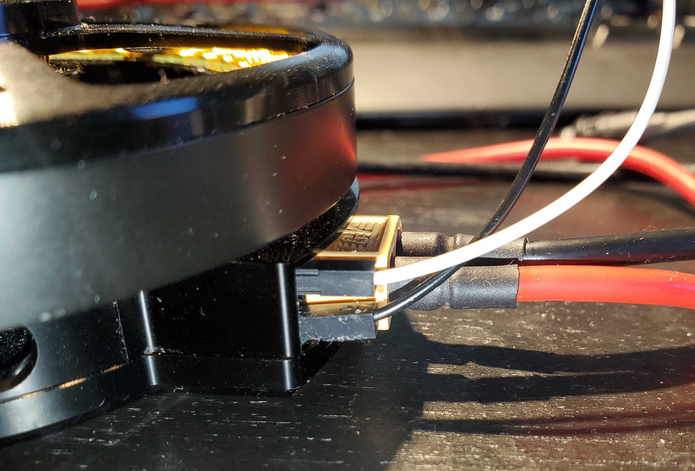

    Connection to Flight Controller (White = Signal, Black = Ground)

For more detail on why these connections are used with the 81-08 in this example, refer to the pinout from the 81-08 module's datasheet below.

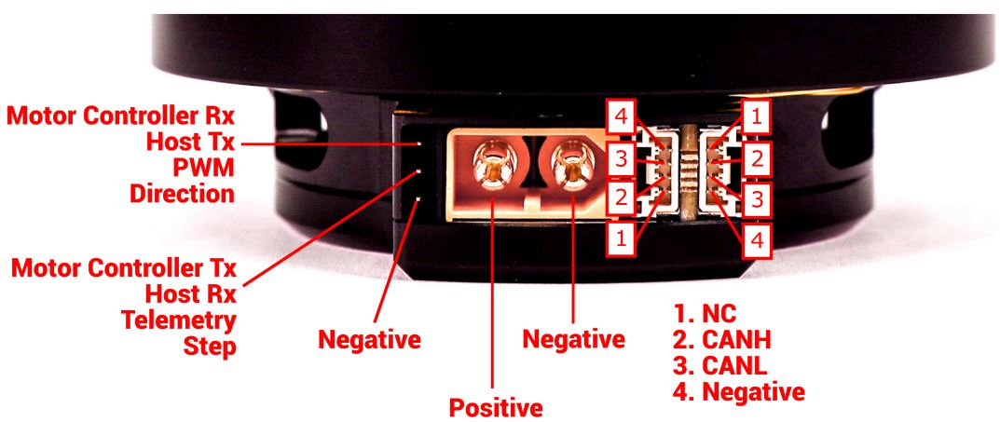

    81-08 Pinout

Pictures of the full setup with the 81-08 connected to the Pix32 flight controller are shown below.

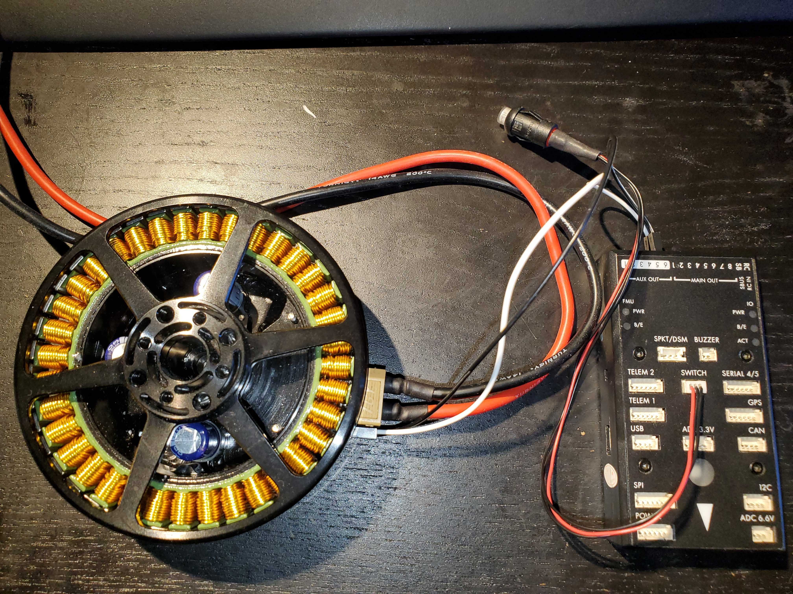

    Full 81-08 Hardware Setup

Firmware and Software Versions
==============================

This tutorial was tested with IQ Control Center version 1.3.4. It should also be applicable to future versions of the Control Center, but there
may be some slight differences in the number of parameters available on tabs or the exact names of parameters and settings. The version of your Control Center
can be seen in the Information tab, as shown in the image below. For more information on how to use the Control Center, refer to :ref:`control_center_start_guide`.

    Control Center Version

.. warning:: Versions of the Control Center prior to 1.2.6 had bugs that made setting the hobby protocol correctly difficult. Ensure that you have upgraded to version 1.2.6 or later
    before continuing with this setup.

For module firmware, you can check the firmware version and style on your module by connecting to it with the Control Center and referring to the Information section, as shown in the image below. 
For more information on how to use the Control Center to check and update firmware, refer to :ref:`control_center_start_guide`. You can check for updated firmware under the `Products <https://www.vertiq.co>`_ section of the Vertiq website.  

For the Vertiq 81-08, this tutorial was tested using speed firmware version 0.0.7. Future firmware versions should also be compatible, but if you are using an 81-08 it is recommended that your 
81-08 is on at least version 0.0.7 when following this tutorial. The image below shows the firmware version of the module in Control Center.

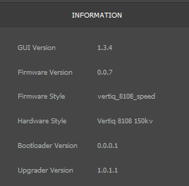

    81-08 Firmware Version

.. warning:: Versions of the 81-08 firmware prior to version 0.0.5 had bugs that made calibrating and selecting the hobby protocol difficult. If you are using an 81-08 and are trying to follow
  this tutorial with a firmware version older than 0.0.5, you may have difficulties selecting the hobby protocol.

Reverting to Defaults (Optional)
================================

If you have previously used or set any configurations on the module, it may be useful to revert it to its default state before continuing with this tutorial. This ensures
that you start with a fresh module, and there should be no lingering conflicts from previous configurations. **Note that these instructions are only correct for Control Center
version 1.2.6 and greater. Earlier versions used a different factory defaulting workflow.**

To reset the module, first connect to it with Control Center. Then navigate to the Advanced tab, and click Yes when prompted if you are sure that you want to access the Advanced
settings. 

Scroll down until you see the *Revert to Factory Default Key 1* and *Revert to Factory Default Key 2* parameters. These keys need to be set properly before the module can be
defaulted. This is meant to protect against unintentional defaulting. Set *Revert to Factory Default Key 1* to 12345678 and *Revert to Factory Default Key 2* to 11223344.
This will prime the module for defaulting. See the figure below for an example of setting these keys.

    Revert to Factory Defaults Keys

Then, find the *Revert to Factory Defaults* configuration parameter and click the set arrow. The module should disconnect and reboot. When you re-connect, 
it should be in its factory fresh state. For more information on how to connect to the module in Control Center and to set parameters, refer 
to :ref:`control_center_start_guide`. 

.. _hobby_fc_tutorial_motor_configuration:

Module Configuration
=====================
.. warning:: Before setting any parameters, ensure that the module does NOT have a propeller attached and
     is held in place securely. If the module is unsecured it could move unexpectedly when it starts to spin. 
     This could damage the module, its connectors, or any nearby observers.

Now that the module is set up, you can begin configuring it with Control Center. The General tab and the Tuning tab are the only tabs with parameters that need to be configured.
If you are unfamiliar with setting parameters through the Control Center, refer to :ref:`control_center_start_guide`.

General Tab
***********
First, there are a few parameters to set in the General tab. Not all of the parameters in this tab are important, and only the relevant ones are
highlighted here. If a parameter is not mentioned, you can safely leave it at its default. The correct settings and purpose of each parameter is 
described in detail in the sections below. **Most parameters are the same in Standard PWM and DSHOT setups, but ones that differ have sections for both setups**:

Communication
##############
This parameter controls what type of :ref:`Hobby Protocols <hobby_protocol>` the module will listen for. The module is capable of listening to a wide variety of hobby protocols,
which can be selected from the drop-down box. Once the module receives a command in its selected hobby protocol, it will only listen for that type of command until power cycled, so you will
not be able to connect with Control Center until you power cycle the module. For example, if the module receives a PWM message when it is set to accept them, it will only listen to PWM messages until it is reset. 
If left in Autodetect mode, the module should listen for all of the supported Hobby protocols to try to determine which one you are using. 

The module may have difficulty automatically discovering the protocol, however, depending on the flight controller configurations and can be affected by noise on the communication lines.
In those cases, it is best to set the module to only listen for a specific type of protocol. For this reason, we will explicitly set the hobby protocol 
to use in this setup. The proper value for this configuration depends on if you are using :ref:`Standard PWM <hobby_standard_pwm>` or :ref:`DSHOT <hobby_dshot>`:

  * **Standard PWM Setup**: Set *Communication* to *Standard PWM* to receive :ref:`Standard PWM <hobby_standard_pwm>` messages in version 1.2.6 and later of the Control Center. In Version 1.2.5 and earlier, you will need to select OneShot125
    due to a Control Center bug. See the bug warning below for details.
  * **DSHOT Setup**: Set *Communication* to *DSHOT600* to receive :ref:`DSHOT <hobby_dshot>` messages in version 1.2.6 and later of the Control Center. In Version 1.2.5 and earlier, you will need to select DSHOT1200 due to a Control Center bug. See the bug warning below for details.

The image below shows what the *Communication* parameter should look like in Control Center for a Standard PWM setup.

    Communication Parameter

.. warning:: **Known Bug:** In versions 1.2.5 and earlier versions of the Control Center, there is a bug in the dropdown menu for the Communication parameter. The numbering for options besides Autodetect was improperly configured.
    If you select a protocol from the list other than Autodetect, the module will actually be listening for the next protocol up in the list instead of what you selected. So in order to listen for PWM, you should select OneShot125.
    This is addressed in versions 1.2.6 and later of the Control Center.

FC 2D/3D Mode
##############
This parameter tells the module if the flight controller wants it to operate in 2D mode (spinning in one direction) or 3D mode (able to spin in both directions). For more details on 
these modes and how to configure the module's spinning behaviors, see the :ref:`manual_throttle` section of the Feature Reference Manual.
**For this tutorial, 2D mode will be used for the sake of simplicity**. Set the *FC 2D/3D Mode* parameter to *2D* as shown below.

    FC 2D/3D Mode Parameter

.. warning:: **Known Bug:** This parameter can be difficult to set in versions of the Control Center prior to 1.2.7, sometimes requiring multiple attempts. It is recommended to update your Control Center
  to the latest version to avoid this problem.

Mode
#####
This parameter determines how the module interprets a setpoint command, i.e., what does it mean for the module to go to 50% or 100%? Is that meant to be a fraction of the battery voltage, a specific drive voltage, or a velocity?
The list below provides a brief introduction to each of the 3 possible modes:

  * **PWM**: This mode means that the module will apply a fraction of the battery voltage as its drive voltage when given a setpoint. For example, if your battery voltage is 20V, and you send a 50% command, then the module will apply a 10V drive voltage. 
    
    * Despite the similar naming, this mode has nothing to do with using the Standard PWM hobby protocol
  
  * **Voltage**: This mode interprets the commands as a fraction of the maximum voltage set in the Tuning tab. So, if your maximum voltage was set at 8V, and you sent a 25% throttle command, the module would apply a drive voltage of 2V.
  * **Velocity**: This mode interprets the command as a fraction of the maximum velocity set in the Tuning tab. So, if your maximum velocity was set at 100 rad/s, and you sent a 25% throttle command, the module would try to spin at 25 rad/s.

The meaning of this parameter is covered in greater detail in the :ref:`throttle_mode_maximums_directions` section of the Feature Reference Manual. 

For this example, we will **put the module in Voltage mode**. To do this, set the *Mode* parameter to *Voltage* in Control Center, as shown below.

    Mode Parameter

Motor Direction
################
This sets what direction the module considers to be the positive direction for throttle commands from a flight controller.  When the *Motor Direction* parameter is
set to either of the 2D directions (*2D clockwise* or *2D counter clockwise*), the module will always spin in the specified direction on a throttle command. For example,
if the *Motor Direction* was set to *2D counter clockwise*, the module would always spin counter-clockwise in response to a throttle command. Configuring the direction of the
module and mapping throttle commands to directions is covered in greater detail in the :ref:`manual_throttle` section of the Feature Reference Manual.

For this example, the module should always spin **counter-clockwise**. To configure that, set the *Motor Direction* to *2D counter clockwise* in Control Center, as shown below.

    Motor Direction Parameter
  
Tuning Tab
**********
The Tuning tab also has parameters that must be set for this example. Similarly to the General tab, the majority of the parameters on this tab are not relevant for this test setup and can be left at their defaults.
The sections below describe important Tuning tab parameters as well as their values for the case of this example. They are the same for both DSHOT and PWM setups.

Max Volts
##########
This parameter determines the maximum drive voltage of the module when operating in Voltage mode. All setpoints will be interpreted as a fraction of this maximum voltage. So if *Max Volts* is 24V, then a 50% 
command will drive the module with 12V. To use Voltage mode, this needs to be set to the desired maximum. For safety reasons, *Max Volts* is **set to 10V** for this test setup, as shown in the image below. 
This keeps the speed of the module relatively low. When using the module on an actual drone you will likely want to increase this to match your battery voltage. For more information on this parameter and
the modes available on the module, refer to the :ref:`throttle_mode_maximums_directions` section of the Feature Reference Manual.

    Max Volts Parameter

Timeout
########
This determines the length of the module's timeout. If it does not hear any messages within that time, it will timeout and play its timeout song. If this is below, 1s, it can be difficult to test with the Control Center. 
So for this example, the **timeout should be set to 1.5s**. To do this, set the *Timeout* parameter to 1.5s, as shown in the image below. Depending on how frequently your flight controller sends throttle commands, 
you may want to decrease the timeout when using the modules on a drone. For more information on the timeout feature of Vertiq modules, refer to the :ref:`manual_timeout` section of the Feature Reference Manual.

    Timeout Parameter

Testing the Module
*******************
.. warning:: Ensure that the module is secured and there is no propeller attached before performing any testing.

To test that the module is configured to spin and take throttle commands from the flight controller, open the Testing tab in Control Center and look for the *ESC Input* parameter. This parameter commands the module to spin in the same way 
that a :ref:`hobby protocol <hobby_protocol>` used by a flight controller would, i.e. it sends an :ref:`IQUART throttle command <manual_throttle>`, so it is the best way to test if 
the module is ready to connect with the flight controller. So setting this to 0.5 will send the module a 50% throttle command with the configuration specified in this example. 
**Make sure the module is secured before attempting to spin it, as it may move dangerously if unsecured**. 

**However, because this test is meant to simulate commands from a flight controller, the** *ESC Input* **parameter is affected by the** :ref:`manual_advanced_arming` **feature. That means that setting this parameter 
will not cause the module to spin until the module has armed.** By default, Vertiq speed modules require 10 consecutive throttle commands between 0% and 7.5% to arm. So to arm your module using the
*ESC Input* parameter, set the *ESC Input* to 0.05 to send a 5% throttle command as shown below, and click the set arrow 10 times. On the 10th time you click the set arrow, the module should play 
its 2 note arming song, and begin spinning. 

    ESC Input Parameter For 5% Throttle Command

Now that the module is armed, any new throttle commands sent using the *ESC Input* parameter will change how it spins.
For example, setting *ESC Input* to 0.1 should set the module to spin with a drive voltage of 1V. This is because the module is in Voltage mode with a *Max Volts* of 10V, so a 
10% throttle command commands 1V. Confirm that the module is spinning counter-clockwise, matching the direction that was configured previously.

For more information on how to configure the module to properly interpret throttle commands, see the :ref:`manual_throttle` section of the Feature Reference 
Manual. For more information on arming and disarming the module, refer to the :ref:`manual_advanced_arming` section of the Feature Reference Manual.

If the module is spinning as expected, set the *Coast* parameter to stop the module. With your module configured to spin, you must now set up your flight controller to send proper commands.

Ardupilot and Mission Planner Configuration and Testing
=======================================================
This tutorial was tested using Mission Planner 1.3.80 and ArduCopter v4.3.6, as shown in the figure below. These instructions assume you are starting from the default parameters, and cover how to test that the
flight controller and module can communicate with no additional flight controller peripherals. See the `Hardware Setup`_ section for more details on the hardware and connections.

.. figure:: ../_static/tutorial_images/pwm_flight_controller/mp_version.png
    :align: center

    Mission Planner and Arducopter Version

Setting Frame Type
******************
The first step is to provide ArduCopter with a frame type. On a fully assembled drone, this should match the drone's physical layout, but for this test the specific frame you set is
unimportant. To set the frame type, select "Setup" from the top bar in Mission Planner, and then expand "Mandatory Hardware" on the sidebar. Select "Frame Type," and a frame selection
screen should appear. This tutorial was tested with the "X" quadcopter frame, under the first frame option, as shown below.

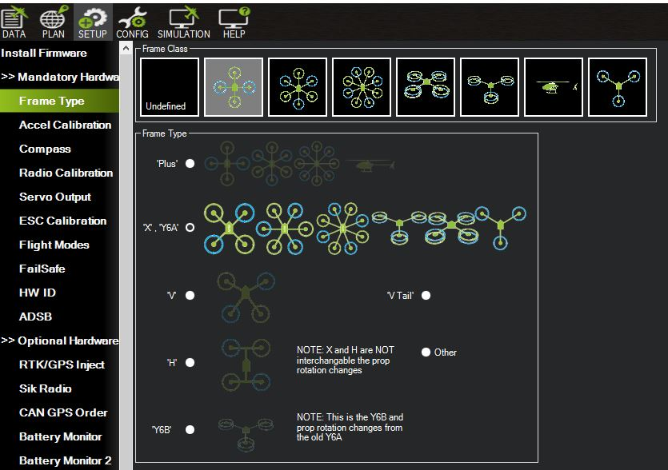

    Mission Planner Frame Type Selection

Setting ArduCopter PWM Parameters
*********************************
.. note:: This section is only relevant if you want to use the Standard PWM protocol to control the modules. Otherwise, continue to `Setting ArduCopter DSHOT Parameters`_ below

There are several parameters that need to be set properly to make sure the flight controller can communicate with the module using :ref:`Standard PWM <hobby_standard_pwm>`. Connect to your flight controller with Mission Planner, select "Config" from
the top toolbar, and then select "Full Parameter List" from the sidebar. On the right of the parameter list is a search box you can use to search for each parameter. Confirm that
the following parameters are set to the proper values and change them if necessary:

* **MOT_PWM_TYPE = 0**
  
  * This selects the output PWM Type. 0 sets it to standard PWM. See the `ArduCopter documentation <https://ardupilot.org/copter/docs/parameters.html>`_ for more details.
  
* **MOT_PWM_MAX = 2000**
  
  * This sets the max PWM value in microseconds that will be output to the module. By default, Vertiq modules use a range of 1000us to 2000us with Standard PWM.
  
* **MOT_PWM_MIN = 990**
  
  * This sets the minimum PWM value in microseconds that will be output to the module. By default, Vertiq modules use a range of 1000us to 2000us with Standard PWM, but setting this to 990us helps ensure the module will not spin on a 0% throttle.
  
* **SERVO_DSHOT_ESC = 0**
  
  * This disables DSHOT commands. These settings cover a setup using Standard PWM, so DSHOT should be disabled.
  
Reboot your flight controller to make sure the new parameters take effect. The important parameters and their proper values in the Mission Planner parameter list are shown in the figure below.

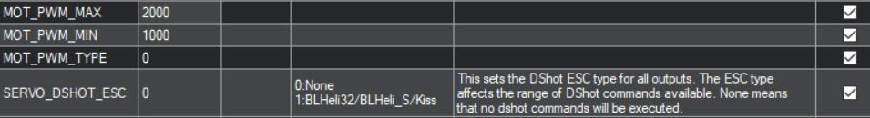

    Important ArduCopter Standard PWM Parameters in Mission Planner

Setting ArduCopter DSHOT Parameters
***********************************
.. note:: This section should only be used if you want to use the DSHOT protocol to control the modules. Otherwise, use `Setting ArduCopter PWM Parameters`_ above.

ArduCopter needs to be configured properly to use :ref:`DSHOT <hobby_dshot>` as its protocol for controlling the modules. To set these parameters, connect to your flight controller and select "Full Parameter List" under the "Config"
section of Mission Planner. Search for the parameters listed below and make sure they are set to the appropriate values:

* **MOT_PWM_TYPE = 6**
  
  * This selects the output PWM Type. 6 sets it to DSHOT600. See the ArduCopter documentation for more details.

* **SERVO_DSHOT_ESC = 0**
  
  * This controls what type of additional ESC commands will be sent from the flight controller. These additional commands include things like beeping, LED control, and other potentially useful but non-essential
    extra commands that can be sent over DSHOT. This does not need to be enabled in order to send the module throttle commands over DSHOT, so we are leaving it disabled for simplicity. See the ArduCopter documentation for more details.
  
* **SERVO_DSHOT_RATE = 0**
  
  * This sets the output rate for DSHOT outputs. Leaving it at 0 leaves the output rate at 1 kHz. See the ArduCopter documentation for more details.

Reboot your flight controller to make sure the new parameters take effect. The important parameters and their proper values in the Mission Planner parameter list are shown in the figure below.

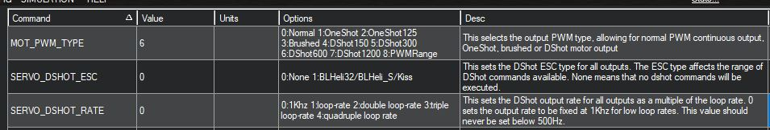

    Important ArduCopter DSHOT Parameters in Mission Planner

Re-Configuring ArduCopter DSHOT Outputs
#######################################
.. note:: Only needed on some flight controllers, see the `ArduCopter <https://ardupilot.org/copter/docs/common-brushless-escs.html#mixing-esc-protocols>`_ and `PX4 <https://docs.px4.io/master/en/peripherals/dshot.html#wiring-connections>`_ documentation for more details on which

Depending on the type of flight controller hardware you have, you may need to re-configure which outputs you are using to a DSHOT compatible output. 
The reason for this and the types of flight controllers it affects are discussed in `Mixing ESC Protocols <https://ardupilot.org/copter/docs/common-brushless-escs.html#mixing-esc-protocols>`_ 
and in this `Ardupilot forum post <https://discuss.ardupilot.org/t/flight-controllers-dshot-and-escs/53608>`_. This issue applies to the Pix32 that was used for this tutorial, and also
applies to the popular Cube Orange flight controller.

For affected flight controllers, their main outputs can put out PWM, but not DSHOT. One way to check for this issue is to check the "Messages" section of the "Data" tab in Mission Planner on reboot.
This will display what kinds of protocols are actually going to be output on each pin based on the configuration. Set your flight controller for DSHOT as discussed above, reboot it, connect to it,
and check the "Messages" section. If you see a message like the one below that lists "RCOut: PWM 1-12," that means your flight controller outputs will still only output PWM, and you must connect the module to
a DSHOT compatible output instead.

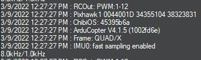

    Message Showing Outputs are PWM Only

You need to move the module from a main output to an AUX output (these may also be labeled as FMU PWM outputs). For the Pix32 used to test this example, the module was moved from MAIN OUT 1 to AUX OUT 1. 
Exactly which pins to use and how they are labeled will vary depending on your flight controller. Refer to the flight controller's documentation for more information. Newer Pixhawk models may label these
outputs as FMU PWM OUT instead of AUX OUT. The physical connection of the signal and ground wire to the flight controller for the Pix32 is shown below.

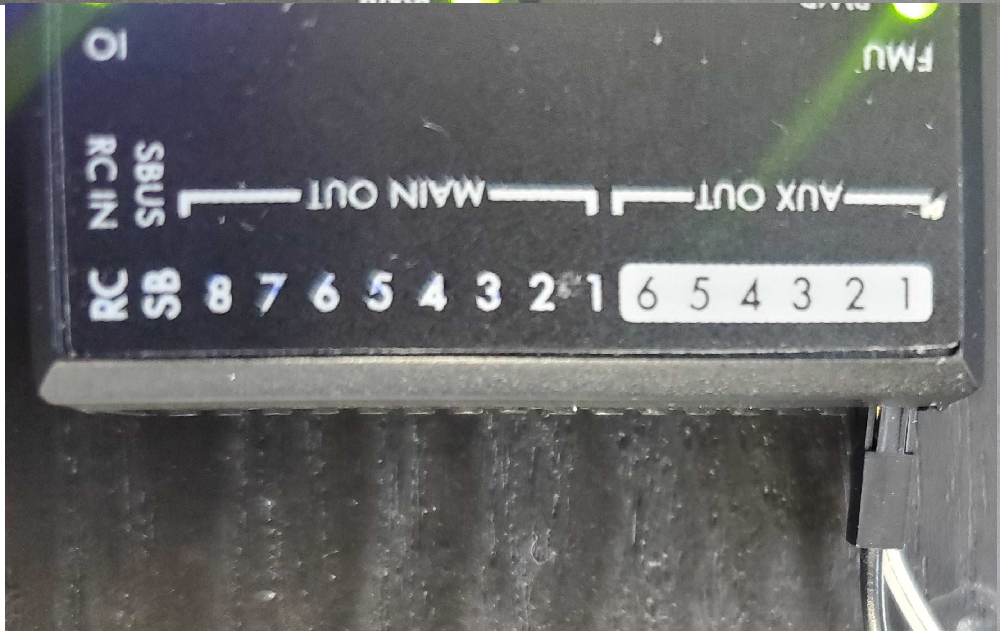

    Connecting to AUX OUT 1

Next, you need to tell ArduCopter to use AUX OUT 1 (or the equivalent pin on your flight controller) as the output for Motor 1 on your vehicle. ArduCopter uses SERVOX_FUNCTION variables to assign a function to each
output. For the Pix32, AUX OUT 1 is controlled by SERVO9_FUNCTION. **Set SERVO9_FUNCTION = 33 to output the throttle commands for Motor 1 on AUX OUT 1.** See the `ArduCopter documentation <https://ardupilot.org/copter/docs/parameters.html>`_ for details on what
settings to use for different functions. The figure below shows the proper setting for this parameter to assign DSHOT to AUX OUT 1 on the Pix32.

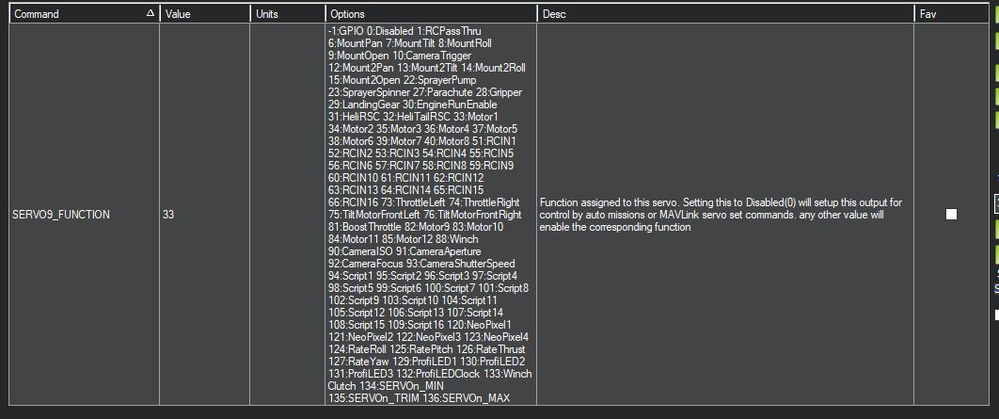

    Setting AUX OUT 1 as the Motor 1 Output

Reboot the flight controller and connect to it again. This time in the "Messages" section you should see that RCOUT also has DS600 on its outputs, as shown below.

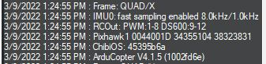

    Message Showing Outputs Are Using DSHOT

Configuring the Safety Switch
*******************************
By default, ArduCopter will not allow you to test spinning your modules unless a safety switch attached to your flight controller is armed. If you have a safety switch connected to your flight
controller, then you can move on to testing the module. **If you do not have a safety switch but would stil like to test your modules, this section will cover how to override the requirement 
for a safety switch**.

The `ArduCopter documentation <https://ardupilot.org/copter/docs/common-safety-switch-pixhawk.html>`_ provides details on how to configure the safety switch. To disable the switch,
Set **BRD_SAFETYENABLE (also called BRD_SAFETY_DEFLT on newer firmwares) to 0**. The image below shows BRD_SAFETYENABLE set to this value in Mission Planner. If your module is
powered on and attached to the flight controller when you change this parameter, you may hear the module arm. That is because the flight controller will begin sending 0% throttle commands
on its outputs once this is changed.

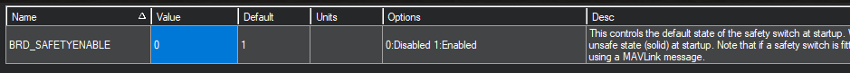

    Disabling the Safety Switch with the BRD_SAFETYENABLE Parameter

Testing the Module with Mission Planner
*****************************************
.. warning:: Double check that the module is secured and there is no propeller attached before performing any testing.

Now we can use Mission Planner's built-in motor testing tools to make sure the flight controller can control the module.

1. Start with the module powered off, but connected to the flight controller.
2. Select "Setup" from the top toolbar, and then expand "Optional Hardware" on the sidebar.
3. Select "Motor Test" from the "Optional Hardware" options. See the image below as an example of what the Motor Test screen should look like at this point.

  .. figure:: ../_static/tutorial_images/pwm_flight_controller/mp_motor_test.png
    :align: center

    Motor Test Screen in Mission Planner

4. Power on the module and wait for it to complete its startup song.

  * If you have disabled the safety switch and are using Standard PWM, the module should play its arming song after startup when attached to the flight controller.

5. Arm your safety switch if you have one.
   
  * If using Standard PWM, the module should play its two-note arming song as the flight controller starts sending 0% throttle commands once the safety switch is armed
  * On DSHOT, the module will not arm yet.
  
6. Set the "Throttle %" to 5% and the "Duration" to 5s, and click "Test All Motors".
7. The module should spin slowly for 5 seconds, and then stop.
   
  * On Standard PWM, the module will spin and stop without any additional arming or disarming noises
  * On DSHOT, the module will arm when you send the command, spin for the duration, and then stop and disarm again, since DSHOT sends a specific disarm command at the end of the test.
   
8. Try some other throttle levels to see the module running at different speeds.
   
  * For DSHOT, you cannot command a high throttle level immediately as the module will disarm after each command, and only re-arms on a throttle command close to 0%. So for DSHOT testing,
    increase the duration and send a low level throttle command to arm the module, and before that command ends and the module disarms, send another higher throttle command.  

See the `Successful Test Videos`_ section below for a video of this whole process. It demonstrates what sounds you should expect to hear from the module, as well as the module 
successfully spinning with Arducopter and Mission Planner.

PX4 and QGroundControl Configuration and Testing
================================================
This tutorial was tested using QGroundControl 4.2.4 and PX4 version 1.13.3, as shown in the figures below. 
These instructions assume you are starting from default parameters, and cover how to test that the flight controller and module can communicate with no additional flight controller peripherals. 
See the `Hardware Setup`_ section for more details on the hardware and connections.

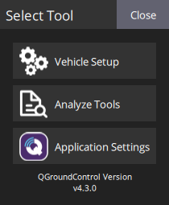

    QGroundControl Software Version Used for This Tutorial

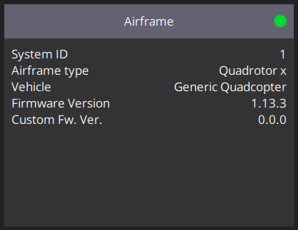

    PX4 Firmware Version Used for This Tutorial

Setting Frame Type
******************
The first step is to choose an airframe. Normally, this would be determined by the layout of your vehicle, but with only a single module, the exact airframe used isn't particularly important. 
For simplicity, this tutorial uses a Generic x Quadcopter, as shown in the figure below. To setup the airframe in QGroundControl follow the steps below.

* Click on the QGroundControl logo in the upper left of the interface, and select "Vehicle Setup".
* Select "Airframe" from the sidebar.
* Scroll through the airframes until you find "Quadrotor x". Leave this set to "Generic Quadcopter", and click on the "Quadrotor x" box. It should be highlighted in yellow.
* Scroll back up and hit "Apply and Restart".

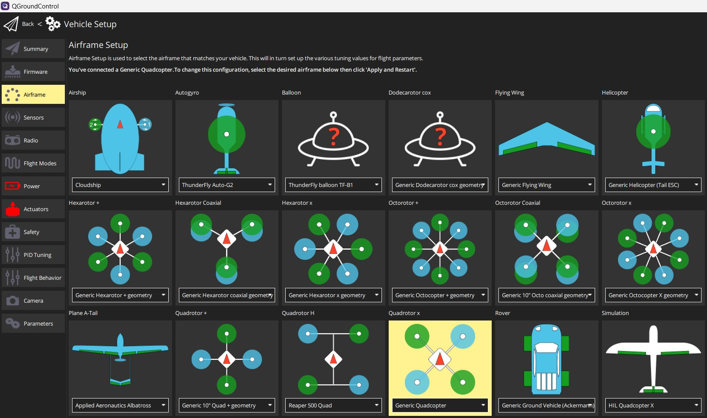

    QGroundControl Airframe Setup

Setting PX4 PWM Parameters
**************************
Several parameters must be set properly to make sure the flight controller can communicate with your module using PWM. Connect to your flight controller with QGroundControl, and under "Vehicle Setup" select
"Parameters." Use the search bar to look for the following parameters, and set them to the correct values if necessary:

* **PWM_MAIN_MIN = 990** 
  
  * This sets the minimum PWM value in microseconds that will be output to the module. By default, Vertiq modules use a range of 1000us to 2000us, but setting this to 990us helps ensure the module will not spin on a 0% throttle. See the image below to see what this parameter looks like in QGroundControl.

  .. figure:: ../_static/tutorial_images/pwm_flight_controller/qgc_main_min.png
      :align: center

      PWM_MAIN_MIN Parameter in QGroundControl

* **PWM_MAIN_MAX = 2000**
  
  *  This sets the max PWM value in microseconds that will be output to the module. By default, Vertiq modules use a range of 1000us to 2000us. See the image below to see what this parameter looks like in QGroundControl.
  
  .. figure:: ../_static/tutorial_images/pwm_flight_controller/qgc_main_max.png
      :align: center

      PWM_MAIN_MAX Parameter in QGroundControl

* **DSHOT_CONFIG = Disable (0)**
  
  * This disables DSHOT from running, which allows normal PWM to run. This should be set to Disable by default, so most likely it will not be necessary to change it. See the image below to see what this parameter looks like in QGroundControl.

  .. figure:: ../_static/tutorial_images/pwm_flight_controller/qgc_dshot_config.PNG
      :align: center

      DSHOT_CONFIG Parameter in QGroundControl

Reboot the flight controller by selecting "Reboot Vehicle" from the "Tools" menu in the upper right.

Setting PX4 DSHOT Parameters
****************************
There is only one parameter that needs to be set properly to make sure the flight controller can communicate with your module using DSHOT. Connect to your flight controller with QGroundControl, and under "Vehicle Setup" select
"Parameters." Use the Search bar to look for the following parameter, and set it to the correct value:
  
* **DSHOT_CONFIG = DShot600**
  
  * This sets the flight controller to use DSHOT600, which matches the speed we set on the module.

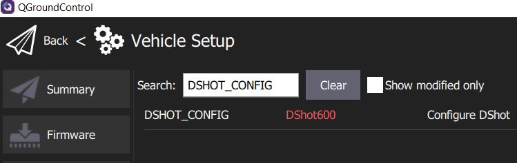

    DSHOT_CONFIG Parameter set for DSHOT600
  
Reboot the flight controller by selecting "Reboot Vehicle" from the "Tools" menu in the upper right.

Re-Configuring PX4 DSHOT Outputs
################################
.. note:: These steps are necessary on only some flight controllers. See the `ArduCopter <https://ardupilot.org/copter/docs/common-brushless-escs.html#mixing-esc-protocols>`_ and `PX4 <https://docs.px4.io/master/en/peripherals/dshot.html#wiring-connections>`_ documentation for more details on if your flight controller is included.

Depending on the type of flight controller hardware you have, you may need to re-configure which outputs you are using to a DSHOT compatible output. 
The reason for this and the affected flight controllers are discussed in the `PX4 DSHOT documentation <https://docs.px4.io/master/en/peripherals/dshot.html#wiring-connections>`_. 
This issue applies to the Pix32 that was used for this tutorial, and also applies to the popular Cube Orange flight controller. 
The main outputs of these flight controllers can output PWM, but not DSHOT. 

If your flight controller is affected by this, **move the signal and ground wires from MAIN 1 OUT to AUX 1 OUT, or the equivalent for your flight controller hardware**, as shown in `Re-Configuring ArduCopter DSHOT Outputs`_.

PX4 provides a simple workaround for this issue. Changing the SYS_USE_IO parameter to 0 forces the AUX or FMU PWM ports to act as if they were main ports. See the PX4 documentation linked above for more details
on this and how it affects using other ports with an airframe. If you have a flight controller affected by this issue, **set SYS_USE_IO = 0 to use the AUX or FMU PWM ports instead of the main ports**.
The figure below shows how the parameter should be configured.

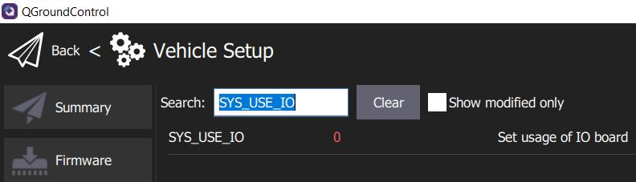

    SYS_USE_IO Set to Re-Configure AUX Outputs as Main Outputs

Reboot the flight controller by selecting "Reboot Vehicle" from the "Tools" menu in the upper right.

Testing the Module with QGroundControl
****************************************
.. warning:: Double check that the module is secured and there is no propeller attached before performing any testing.

Now we can use the motor testing tools in QGroundControl to confirm that the flight controller can control the module.

1. Power off the module, and connect it to the flight controller.
2. In QGroundControl under "Vehicle Setup," select the "Motors" section.
3. Arm the safety switch on your flight controller if necessary. 
4. Turn on the module, and wait for it to complete the 5=beep startup song.
5. Enable the module sliders with the toggle underneath the sliders.
6. Move the Motor 1 slider bar just slightly above its start position to give the module a throttle command near 0%. The module should play its two note arming song, and may spin slowly.
  
    * For Standard PWM, after each move of the slider, the module will spin for the timeout duration (1.5s). After the timeout period. it will stop spinning and timeout until the next command. The timeout will cause
      the module to disarm. It will only re-arm on a throttle command close to 0%, so you cannot go straight to high throttle commands after the module times out. You should start by sending
      a low level throttle command to arm the module, and before that command ends and the module disarms, send another higher throttle command. 
      For more information on arming and disarming the module, refer to the :ref:`manual_advanced_arming` section of the Feature Reference Manual.
    * For DSHOT, you cannot go straight to a high throttle level, as the module will disarm after each command, and only re-arms on a throttle command close to 0%. Follow the procedure
      outlined above for re-arming when using Standard PWM after the module disarms. The module will never timeout while testing with DSHOT, due to DSHOT's explicit disarming procedure.
  
7. Move the Motor 1 slider around, and observe how the module changes speed. 

The figure below demonstrates what the Motor tab should look like in QGroundControl when running a test.

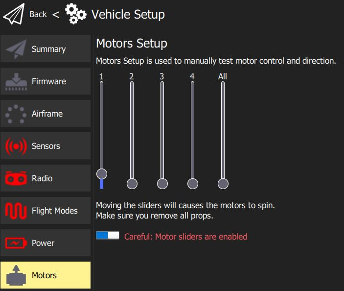

    QGroundControl Motor Testing

See the `Successful Test Videos`_ section below for a video of a similar test process using ArduCopter and Mission Planner. The video demonstrates what sounds you should expect from the module, and it successfully
spinning as controlled by a flight controller.

Successful Test Videos
======================

PWM Test
********
The video below demonstrates the module being successfully controlled using PWM with Mission Planner through a flight controller running ArduCopter. Note the startup song at the beginning and the
arming song after the safety switch is armed. **Note that in the video below the module is secured with velcro on the bottom, be sure you also secure your modules before attempting to spin them.**

.. raw:: html

    
    <video class='center_vid' controls><source src="../_static/tutorial_images/pwm_flight_controller/mp_pwm_test.mp4" type="video/mp4"></video>

DSHOT Test
**********
The video below demonstrates the module being successfully controlled using PWM with Mission Planner through a flight controller running ArduCopter. Note the startup song at the beginning
and the arming and disarming songs during testing. The module disarms after each test, so it needs to be re-armed with a low throttle command before testing higher throttles. **Note that in 
the video below the module is secured with velcro on the bottom, be sure you also secure your modules before attempting to spin them.**

.. raw:: html

    
    <video class='center_vid' controls><source src="../_static/tutorial_images/pwm_flight_controller/mp_dshot_test.mp4" type="video/mp4"></video>