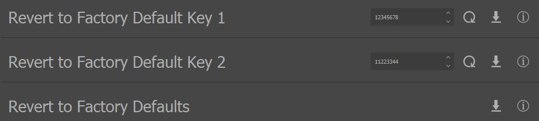
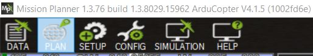
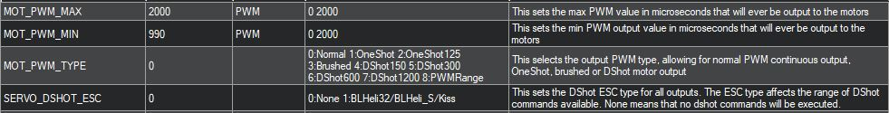
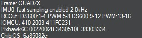

.. include:: ../text_colors.rst
.. toctree::

.. _hobby_fc_tutorial:

***********************************************
PWM and DSHOT Control with a Flight Controller
***********************************************

This tutorial is meant to walk you through the process of doing basic setup and testing for controlling a Vertiq motor
with a flight controller. This covers only the basics of testing that the flight controller can make the motor spin
with the appropriate protocol, not the setup of any additional flight controller peripherals like an RC controller
or a GPS. This tutorial should take you from a totally fresh motor and flight controller, to a motor that can be controlled
in Voltage mode with the PWM protocol or the DSHOT protocols from the flight controller.

This tutorial covers setup and testing on **Ardupilot using Mission Planner** and **PX4 using QGroundControl**. It covers using
the **PWM** or **DSHOT** protocol, since the setup process is largely similar for both protocols. In the places where there are differences,
the proper steps for both types of protocol have been recorded.

These instructions are applicable to both the **Vertiq 8108** and the **Vertiq 2306** with speed firmware. Though they have
different form factors and some different configuration parameters available, all of the configurations and setup for
PWM or DSHOT are the same between them. The images of hardware and from the Control Center used are from an 8108, but the
procedure is applicable to the 2306 as well.

Hardware Setup
==============
This example uses a Vertiq 8108 as the motor and a Pix32 from Holybro as the flight controller. Since this tutorial is
focused only on the motor, the only additional perpheral we are using along with the flight controller is a safety switch.

The 8108 is powered through its XT-60 connector from a benchtop power supply. If using a 2306, you must supply power directly to its power and ground wires 
as it does not include an XT-60 socket. When setting the configuration parameters on the motor through Control Center, it is connected to a PC with a USB-to-UART converter. 
For more details on how to use the Control Center with a motor, refer to :ref:`control_center_tutorial`.

When testing with the flight controller, the 8108 is connected to the controller with two female-to-female jumper wires connecting to the 
Main Out 1 pins of the Pix32. The exact position or labeling of the output pins on your flight controller is likely to be different
if you are not using the Pix32, refer to your flight controller documentation. The signal output pin of Main Out 1 is connected to the top pin of
the 8108, and the ground pin of Main Out 1 is connected to the communication ground of the 8108. The images below shows the wires connected to
the setup, where white is the signal wire and black is the ground wire.

.. warning:: If you are using DSHOT and certain flight controllers, including Pixhawks, **you may need to use the AUX 1 output instead of the MAIN 1 output**. This is
    because not all outputs on all flight controllers support using DSHOT. See the `Mixing ESC Protocols <https://ardupilot.org/copter/docs/common-brushless-escs.html#mixing-esc-protocols>`_ 
    section of the Arducopter DSHOT setup instructions and the `PX4 DSHOT documentation <https://docs.px4.io/master/en/peripherals/dshot.html#wiring-connections>`_ for more details. 
    Refer to your flight controllers documentation for details on what protocols its outputs support.

    Connection to Flight Controller (White = Signal, Black = Ground)

When connecting a 2306 to a flight controller, the Host TX/PWM input (typically a white wire), should be connected to the signal pin of the flight controller output, and the ground input (typically a black wire)
should be connected to the ground pin of the output. See the 2306 setup picture below.

For more detail on why these connections are used, refer to the pinouts from the modules' datasheet below.

    8108 Pinout

.. figure:: ../_static/tutorial_images/pwm_flight_controller/2306_pinout.JPG
    :align: center
    :width: 50%

    2306 Pinout

Pictures of the full setup for an 8108 or a 2306 connected to a flight controller are shown below.

    Full 8108 Hardware Setup

.. figure:: ../_static/tutorial_images/pwm_flight_controller/2306_hardware_setup.jpg
    :align: center
    :width: 50%

    Full 2306 Hardware Setup

Firmware and Software Versions
==============================

This tutorial was written for IQ Control Center version 1.2.6. It should also be applicable to future versions of the Control Center, but there
may be some slight differences in the number of parameters available on tabs or the exact names of parameters and settings. The version of your Control Center
can be seen in the Information tab, as shown in the image below. For more information on how to use the Control Center, refer to :ref:`control_center_tutorial`.

.. figure:: ../_static/tutorial_images/pwm_flight_controller/control_center_version.JPG
    :align: center

    Control Center Version

.. warning:: Versions of the Control Center prior to 1.2.6 had bugs that made setting the hobby protocol correctly difficult. Ensure that you have upgraded to version 1.2.6 or later
    before continuing with this setup.

For motor firmware, you can check the firmware version and style on your motor by connecting to it with the Control Center and referring to the Information section, as shown in the image below. 
For more information on how to use the Control Center to check and update firmware, refer to :ref:`control_center_tutorial`. You can check for updated firmware under the `Products <https://www.vertiq.co>`_ section of the Control website.  

For the Vertiq 8108, this tutorial was tested with an 8108 using speed firmware version 5. Future firmware versions should also be compatible, but ensure that your 8108 is on at least
version 5 when following this tutorial. 

    8108 Firmware Version

.. warning:: Versions of the 8108 firmware prior to version 5 had bugs that made calibrating and selecting the hobby protocol difficult. Ensure that you have upgraded to version 5 or later
    before continuing with this setup.

For the Vertiq 2306, this tutorial was tested with a 2306 using speed firmware version 26. Future firmware versions should also be compatible, but ensure that your 8108 is on at least
version 26 when following this tutorial. 

.. figure:: ../_static/tutorial_images/pwm_flight_controller/2306_fw_version.JPG
    :align: center

    2306 Firmware Version

.. warning:: Versions of the 2306 firmware prior to version 26 had bugs that made calibrating and selecting the hobby protocol difficult. Ensure that you have upgraded to version 26 or later
    before continuing with this setup.

Reverting to Defaults (Optional)
================================

If you have previously used or set any configurations on the motor, it may be useful to revert it to its default state before continuing with this tutorial. This ensures
that you start with a fresh motor and there should be no lingering issues from previous configurations. **Note that these instructions are only correct for Control Center
version 1.2.6 and greater, Vertiq 8108 version 5 and greater, and Vertiq 2306 version 26 and greater. Earlier versions used a different factory defaulting workflow.**

To reset the motor, first connect to it with Control Center. Then navigate to the Advanced tab, and click Yes when prompted if you are sure that you want to access the Advanced
settings. 

Scroll down until you see the the "Revert to Factory Default Key 1" and "Revert to Factory Default Key 2" parameters. These keys need to be set properly before the motor can be
defaulted. This is meant to protect against unintentional defaulting. Set "Revert to Factory Default Key 1" to 12345678 and "Revert to Factory Default Key 2" to 11223344.
This will prime the motor for defaulting. See the figure below for an example of setting these keys.

    Revert to Factory Defaults Keys

Then, find the "Revert to Factory Defaults" configuration parameter and click the set arrow. The motor should disconnect and reboot. When you re-connect, 
it be have defaulted to its factory fresh state. For more information on how to connect to the motor in Control Center and to set parameters, refer 
to :ref:`control_center_tutorial`. 

Motor Configuration
===================
.. warning:: Before setting any parameters, ensure that the motor does NOT have a propeller attached and
     is held in place securely. If the motor is unsecured it could move unexpectedly when it starts to spin. 
     This could damage the motor, its connectors, or any nearby observers.

Now that the motor is setup, we can begin configuring it with Control Center. The General tab and the Tuning tab are the only ones with parameters that need to be configured.
If you are unfamiliar with setting parameters through the Control Center, refer to :ref:`control_center_tutorial`.

General Tab
***********
First, there are a few parameters to set in the General tab. Not all of the parameters in this tab are important, and only the relevant ones are
highlighted here. If a parameter is not mentioned, you can safely leave it at its default. The correct settings and purpose of each parameters are 
described in greater detail below. The figure below provides a quick overview of what the settings in Control Center should look like when you're done setting up for PWM, with
the important parameters indicated with a red dot. Note that the figure is from an 8108, you may have less total parameters in the General tab on a 2306, but the 
important parameters should be the same between both sizes.

.. figure:: ../_static/tutorial_images/pwm_flight_controller/pwm_general.JPG
    :align: center

    General Configuration for PWM, Red Dots on Important Parameters

The list below provides a description of the important parameters and details on what they should be set to. **Most paramaters are the same in PWM and DSHOT setups, but ones that differ have
sections for both setups**:

* **Communication**: This parameter controls what type of Hobby Communication protocol the motor will listen for. The motor is capable of listening to a wide variety of hobby protocols,
  which can be selected from the drop-down box. Once a motor hears a command in its selected hobby protocol, it will only listen for that type of command until power cycled, so you will
  not be able to connect with Control Center until you power cycle the motor. For example, if the motor hears a PWM message when it is set to accept them, it will only listen to PWM messages until it is reset. 
  If left in Autodetect mode, the motor should listen for all of the supported Hobby protocols to try to determine which one you are using. The motor can sometimes have trouble automatically discovering the protocol though 
  depending on the flight controller. In those cases, it is best to set the motor to only listen for a specific type of protocol. For this reason, we will explicitly set the protocol to listen to in this setup. The proper value
  for this configuration depends on if you are using PWM or DSHOT
  
  * **PWM Setup**: Set the Communication protocol to **Standard PWM** to listen to PWM messages in version 1.2.6 and later of the Control Center. In Version 1.2.5 and earlier, you will need to select OneShot125
    due to a Control Center bug. See the bug warning below for details.
  * **DSHOT Setup**: Set this to **DSHOT600** in version 1.2.6 and later of the Control Center. In Version 1.2.5 and earlier, you will need to select DSHOT1200 due to a Control Center bug. See the bug warning below for details.

  .. warning:: **Known Bug:** In version 1.2.5 and earlier versions of the Control Center, there is a bug in the dropdown menu for the Communication parameter. The numbering for options besides Autodetect has been improperly configured.
      If you select a protocol from the list other than Autodetect, the motor will actually be listening for the next protocol up in the list instead of what you selected. So in order to listen for PWM, you should select OneShot125.
      This is addressed in version 1.2.6 and later of the Control Center.

* **FC 2D/3D Mode**: This parameter tells the motor if the flight controller wants it to operate in 2D mode (spinning in one direction) or 3D mode (able to spin in both directions). This depends on your flight controller, but for this 
  test setup, **set this to 2D mode**.

    .. warning:: **Known Bug:** This parameter can be difficult to set in the current versions of the module firmware and Control Center software. It has been observed to sometimes not accept a new setting from the Control Center.
        Be sure to hit the refresh button on this parameter after setting it to check that it was set properly. If it was not, try setting it again and refreshing until it is set as expected.

* **Mode**: This determines how the motor interprets a setpoint command, i.e., what does it mean for the motor to go to 50% or 100%? Is that meant to be a fraction of the battery voltage, a specific drive voltage, or a velocity?
  There are 3 modes:

  * PWM: This mode means that the motor will apply a fraction of the battery voltage as its drive voltage when given a setpoint. For example, if your battery voltage is 20V, and you send a 50% command, then the motor will apply a 10V drive voltage. 
    
    * Despite the similar naming, this mode has nothing to do with using the Hobby PWM Communication Protocol
  
  * Voltage: This mode interprets the commands as a fraction of the maximum voltage set in the Tuning tab. So if your maximum voltage was set at 8V, and you sent a 25% throttle command, the motor would apply a drive voltage of 2V.
  * Velocity: This mode interprets the command as a fraction of the maximum velocity set in the Tuning tab. So if your maximum velocity was set at 100 rad/s, and you sent a 25% throttle command, the motor would try to spin at 25 rad/s.
  
  For this setup, you should **set this to Voltage mode**.

* **Motor Direction**: This sets what direction the motor considers to be the positive direction for throttle commands from a flight controller. 
  So in 2D mode, like we are for this example, the motor will always spin this way on a throttle command.  The use of 2D or 3D should match the "FC 2D/3D Mode" parameter, 
  which defaults to 2D. **Set this to 2D Counter Clockwise**. 
  
Any other parameters in this tab can be safely left at their default values.

Tuning Tab
**********
The Tuning tab has some important parameters as well. Similar to the General tab, the majority of the parameters on this tab are not relevant for this test setup and be can be left at their defaults. The figure
below provides a quick overview of the correct settings to have on this tab and highlights the important parameters with a red dot. The list below the figure provides greater detail on these important parameters.

.. figure:: ../_static/tutorial_images/pwm_flight_controller/pwm_tuning.JPG
    :align: center

    Tuning Configuration, Red Dots on Important Parameters 

The list below provides a description of the important parameters and details on what they should be set to. They are the same in both DSHOT and PWM setups.:

* **Max Volts**: This determines the maximum drive voltage of the motor when operating in Voltage mode. All setpoints will be interpreted as a fraction of this maximum voltage. So if Max Volts is 24V, then a 50% 
  command will drive the motor with 12V. To use Voltage mode, this needs to be set to the desired maximum. For safety reasons, Max Volts is **set to 10V** for this test setup. This keeps the speed of the motor
  relatively low. When using the motor on an actual drone you will likely want to increase this to match your battery voltage.
* **Timeout**: This determines the length of the motor's timeout. If it does not hear any messages within that time, it will timeout and beep. If this is below, 1s, it can be difficult to test with the Control Center. 
  So for the test setup the **Timeout is set to 1.5s**. Depending on how frequently your flight controller sends throttle commands, you may want to decrease this when using the motors on a drone.

Testing the Motor
*****************
.. warning:: Double check that the motor is secured and there is no propeller attached before performing any testing.

To test that motor is configured to spin and take throtle commands from the flight controller, open the Testing tab. The ESC Input parameter simulates the motor receiving a 
throttle command, so it is the best way to test if the motor is ready to connect with the flight controller. **Make sure the motor is secure before attempting to spin it, as
it will "jump" if unsecured**. Set the ESC Input to 0.1. The motor should start spinning. Next, set the ESC Input to 0.2. Finally, The motor should start spinning more quickly. Check
that the motor is spinning counter-clockwise. Finally, set the ESC Input to 0.6. The motor should speed up and continue spinning counter-clockwise. 

When you are done with the testing, set the Coast parameter to stop the motor. Now, you can move on to setting up the flight controller.

Ardupilot and Mission Planner Configuration and Testing
=======================================================
This tutorial was tested using Mission Planner 1.3.76 and ArduCopter v4.1.5, as shown in the figure below. The instructions assume you are starting from default parameters, and cover how to test that the
flight controller and motor can communicate with no additional flight controller peripherals. See the `Hardware Setup`_ section for more details on the hardware and connections.

    Mission Planner and Arducopter Version

Setting Frame Type
******************
The first step is to provide ArduCopter with a frame type. On a real drone, this should match the physical layout of the drone, but for this test the specific frame we set is
unimportant. To set the frame type, select "Setup" from the top bar in Mission Planner, and then expand "Mandatory Hardware" on the sidebar. Select "Frame Type", and a frame selection
screen should appear. This tutorial was tested with the "X" quadcopter frame, under the first frame option, as shown below, but other frame types would work as well.

.. figure:: ../_static/tutorial_images/pwm_flight_controller/mp_frame.JPG
    :align: center

    Mission Planner Frame Type Selection

Setting ArduCopter PWM Parameters
*********************************
.. note:: This section should only be used if you want to use the PWM protocol to control the motors. Otherwise, continue to `Setting ArduCopter DSHOT Parameters`_ below

There are several parameters that need to be set properly to make sure the flight controller can communicate with the motor using PWM. Connect to your flight controller with Mission Planner, select "Config" from
the top toolbar, and then select "Full Parameter List" from the sidebar. On the right of the parameter list is a search box you can use to search for each parameter. Confirm that
the following parameters are set to the proper value and change them if necessary:

* **MOT_PWM_TYPE = 0**
  
  * This selects the output PWM Type. 0 Sets it to standard PWM. See the ArduCopter documentation for more details
  
* **MOT_PWM_MAX = 2000**
  
  * This sets the max PWM value in microseconds that will be output to the motor. By default, Vertiq motors use a range of 1000us to 2000us.
  
* **MOT_PWM_MIN = 990**
  
  * This sets the minimum PWM value in microseconds that will be output to the motor. By default, Vertiq motors use a range of 1000us to 2000us, but setting this to 990us helps ensure the motor will not spin on a 0% throttle.
  
* **SERVO_DSHOT_ESC = 0**
  
  * This disables DSHOT commands. DSHOT is a different hobby protocol,  and we don't want it trying to send any commands
  
Reboot your flight controller to make sure the new parameters take effect. The important parameters and their proper values in the Mission Planner parameter list are shown in the figure below.

    Important ArduCopter PWM Parameters in Mission Planner

Setting ArduCopter DSHOT Parameters
***********************************
.. note:: This section should only be used if you want to use the DSHOT protocol to control the motors. Otherwise, use `Setting ArduCopter PWM Parameters`_ above

ArduCopter needs to be configured properly to use DSHOT as its protocol for controllign the motors. To set these parameters, connect to your flight controller and select "Full Parameter List" under the "Config"
section of Mission Planner. Search for the parameters listed below and make sure they are set to the appropriate values:

* **MOT_PWM_TYPE = 6**
  
  * This selects the output PWM Type. 6 Sets it DSHOT600. See the ArduCopter documentation for more details

* **SERVO_DSHOT_ESC = 0**
  
  * This controls what type of additonal ESC commands will be sent from the flight controller. These additional commands include things like beeping, LED control, and other potentially useful but non-essential
    extra commands that can be sent over DSHOT. But this does not need to be enabled in order to send the motor throttle commands over DSHOT, so we are leaving it disabled for simplicity. See the ArduCopter documentation for more details
  
* **SERVO_DSHOT_RATE = 0**
  
  * This sets the output rate for DSHOT outputs. Leaving it at 0 leaves the output rate at 1 kHz. See the ArduCopter documentation for more details

Reboot your flight controller to make sure the new parameters take effect. The important parameters and their proper values in the Mission Planner parameter list are shown in the figure below.

.. figure:: ../_static/tutorial_images/pwm_flight_controller/mp_dshot_params.JPG
    :align: center

    Important ArduCopter DSHOT Parameters in Mission Planner

Re-Configuring ArduCopter DSHOT Outputs
#######################################
.. note:: Only needed on some flight controlllers, see the `ArduCopter <https://ardupilot.org/copter/docs/common-brushless-escs.html#mixing-esc-protocols>`_ and `PX4 <https://docs.px4.io/master/en/peripherals/dshot.html#wiring-connections>`_ documentation for more details on which

Depending on the type of flight controller hardware you have, you may need to re-configure which outputs you are using to a DSHOT compatible output. 
The reason for this and the types of flight controllers it affects are discussed in `Mixing ESC Protocols <https://ardupilot.org/copter/docs/common-brushless-escs.html#mixing-esc-protocols>`_ 
and in this `Ardupilot forum post <https://discuss.ardupilot.org/t/flight-controllers-dshot-and-escs/53608>`_. This issue applies to the Pixhawk that was used for this tutorial, and also
applies to the popular Cube Orange flight controller.

The MAIN outputs of these flight controllers can put out PWM, but not DSHOT. One way to check for this issue is to check the "Messages" section of the "Data" tab in Mission Planner on reboot.
This will display what kinds of protocols are actually going to be output on each pin based on the configuration. Set your flight controller for DSHOT as discussed above, reboot it, connect to it,
and check the "Messages" section. If you see a message like the one below that lists "RCOut: PWM 1-12", that means your outputs are only going to put out PWM still, and you need to move the motor to
a DSHOT compatible output.

    Message Showing Outputs are PWM Only

You need to move the motor output from a MAIN output to an AUX output. In this case, we will move from MAIN OUT 1 to AUX OUT 1. The physical connection of the signal and ground wire to the flight 
controller is shown below.

    Connecting to AUX 1 OUT

Next, you need to tell ArduCopter to use AUX 1 as the output for Motor 1 on your vehicle, instead of the default of MAIN 1. ArduCopter uses SERVOX_FUNCTION variables to assign a function to each
output. For the Pixhawk, AUX 1 is controlled by SERVO9_FUNCTION. **Set SERVO9_FUNCTION = 33 to output the throttle commands for Motor 1 on AUX 1.** See the ArduCopter documentation for details on what
settings to use for different functions. The figure below shows the proper setting for this parameter.

    Setting AUX 1 as the Motor 1 Output

Reboot the flight controller and connect to it again. This time in the "Messages" section you should see that RCOUT also has DS600 on its outputs, as shown below.

    Message Showing Outputs Are Using DSHOT

Testing the Motor with Mission Planner
**************************************
.. warning:: Double check that the motor is secured and there is no propeller attached before performing any testing.

Now we can use Mission Planner's built-in motor testing tools to make sure the flight controller can control the motor.

1. Start with the motor powered off, but connected to the flight controller.
2. Select "Setup" from the top toolbar, and then expand "Optional Hardware" on the sidebar
3. Select "Motor Test" from the "Optional Hardware" options.
4. Power on the motor and wait for it to complete its startup song.
5. Arm your safety switch if you have one.
   
  * If using PWM, the motor should play its two-note arming song as the flight controller starts sending 0% throttle commands once the safety switch is armed
  * On DSHOT, the motor will not arm yet.
  
6. Set the "Throttle %" to 3% and the "Duration" to 5s, and click "Test All Motors" 
7. The motor should spin slowly for 5 seconds, and then stop.
   
  * On PWM, the motor will spin and stop without any additional arming or disarming noises
  * On DSHOT, the motor will arm when you send the command, spin for the duration, and then stop and disarm again, since DSHOT sends a specific disarm command at the end of the test.
   
8. Try some other throttle levels to see the motor running at different speeds
   
  * For DSHOT, you cannot go straight to a high throttle level, as the motor will disarm after each command, and only re-arms on a throttle command close to 0%. So for DSHOT testing
    increase the duration and send a low level throttle command to arm the motor, and before that command ends and the motor disarms, send another higher throttle command.  

See the `Successful Test Videos`_ section below for a video of this whole process, which demonstrates what sounds you should expect from the motor and it successfully
spinning with Arducopter and Mission Planner.

PX4 and QGroundControl Configuration and Testing
================================================
This tutorial was tested using the stable version of QGroundControl from April 30, 2021 and PX4 versopm 1.12.3, as shown in the figures below. 
The instructions assume you are starting from default parameters, and cover how to test that the flight controller and motor can communicate with no additional flight controller peripherals. See the `Hardware Setup`_ section for more details on the hardware and connections.

.. figure:: ../_static/tutorial_images/pwm_flight_controller/qgc_software.JPG
    :align: center

    QGroundControl Sotfware Version

.. figure:: ../_static/tutorial_images/pwm_flight_controller/qgc_firmware.JPG
    :align: center

    PX4 Firmware Version

Setting Frame Type
******************
The first step is to setup an airframe for the "vehicle". Normally this would be determined by the layout of your airframe, but since this is just a test with a single motor,
the exact airframe used isn't particularly important. For simplicity, this tutorial uses a Generic X Quadcopter, as shown in the figure below. To setup the airframe in 
QGroundControl follow the steps below.

* Click on the QGroundControl logo in the upper left of the interface, and select "Vehicle Setup"
* Select "Airframe" from the sidebar
* Scroll through the airframes until you find "Quadrotor X". Leave this set to "Generic Quadcopter", and click on the "Quadrotor X" box. It should be highlighted in yellow
* Scroll back up and hit "Apply and Restart"

.. figure:: ../_static/tutorial_images/pwm_flight_controller/qgc_frame.JPG
    :align: center

    QGroundControl Airframe Setup

Setting PX4 PWM Parameters
**************************
There are several parameters that need to be set properly to make sure the flight controller can communicate with your motor using PWM. Connect to your flight controller with QGroundControl, and under "Vehicle Setup" select
"Parameters". Use the Search bar to look for the following parameters, and set them to the correct values if necessary:

* **PWM_MAIN_MIN = 990** 
  
  * This sets the minimum PWM value in microseconds that will be output to the motor. By default, Vertiq motors use a range of 1000us to 2000us, but setting this to 990us helps ensure the motor will not spin on a 0% throttle.

* **PWM_MAIN_MAX = 2000**
  
  *  This sets the max PWM value in microseconds that will be output to the motor. By default, Vertiq motors use a range of 1000us to 2000us.
  
* **DSHOT_CONFIG = Disable (0)**
  
  * This disables DSHOT from running, which allows normal PWM to run

Then reboot the flight controller by selecting "Reboot Vehicle" from the "Tools" menu in the upper right.

Setting PX4 DSHOT Parameters
****************************
There is only one parameter that needs to be set properly to make sure the flight controller can communicate with your motor using DSHOT. Connect to your flight controller with QGroundControl, and under "Vehicle Setup" select
"Parameters". Use the Search bar to look for the following parameter, and set it to the correct value:
  
* **DSHOT_CONFIG = DShot600**
  
  * This sets the flight controller to use DSHOT600, which matches the speed we set on the motor.

    DSHOT_CONFIG Parameter set for DSHOT600
  
Then reboot the flight controller by selecting "Reboot Vehicle" from the "Tools" menu in the upper right.

Re-Configuring PX4 DSHOT Outputs
################################
.. note:: Only needed on some flight controlllers, see the `ArduCopter <https://ardupilot.org/copter/docs/common-brushless-escs.html#mixing-esc-protocols>`_ and `PX4 <https://docs.px4.io/master/en/peripherals/dshot.html#wiring-connections>`_ documentation for more details on which

Depending on the type of flight controller hardware you have, you may need to re-configure which outputs you are using to a DSHOT compatible output. 
The reason for this and the types of flight controllers it affects are discussed in the `PX4 DSHOT documentation <https://docs.px4.io/master/en/peripherals/dshot.html#wiring-connections>`_ . 
This issue applies to the Pixhawk that was used for this tutorial, and also applies to the popular Cube Orange flight controller. 
Essentially, The MAIN outputs of these flight controllers can put out PWM, but not DSHOT. 

If your flight controller is affected by this, **move the signal and ground wires from MAIN 1 OUT to AUX 1 OUT**, as shown in `Re-Configuring ArduCopter DSHOT Outputs`_.

PX4 provides a fairly easy way to get around this. Changing the SYS_USE_IO parameter to 0 forces the AUX ports to act as if they were MAIN ports. See the PX4 documentation linked above for more details
on this and how it affects using other ports with an airframe. If you have a flight controller affected by this issue, **set SYS_USE_IO = 0 to use the AUX ports instead of the MAIN ports**.
The figure below shows how the parameter should be configured.

    SYS_USE_IO Set to Re-Configure AUX Outputs as MAIN Outputs

Then reboot the flight controller by selecting "Reboot Vehicle" from the "Tools" menu in the upper right.

Testing the Motor with QGroundControl
*************************************
.. warning:: Double check that the motor is secured and there is no propeller attached before performing any testing.

Now we can use the motor testing tools in QGroundControl to confirm that the flight controller can control the motor.

1. Power off the motor, and connect it to the flight controller
2. In QGroundControl under "Vehicle Setup", select the "Motors" section
3. Arm the safety switch on your flight controller if necessary. 
4. Power up the motor, wait for it to complete the startup song.
5. Enable the motor sliders with the toggle underneath the sliders.
6. Move the Motor 1 slider bar just slightly above its start position, to give the motor a throttle command near 0%. The motor should play its two note arming song, and may spin slowly.
   
   * On DSHOT, the motor will disarm and play its disarming song after this command ends. You will need to send another low throttle command to re-arm it if you want it to spin again
  
7. Move the Motor 1 slider around, and observe how the motor changes speed. 

    * For PWM, After each move of the slider the motor should spin for the timeout duration (1.5s) and then stop spinning and timeout until the next command.
    * For DSHOT, you cannot go straight to a high throttle level, as the motor will disarm after each command, and only re-arms on a throttle command close to 0%. So for DSHOT testing 
      start by sending a low level throttle command to arm the motor, and before that command ends and the motor disarms, send another higher throttle command. The motor will never timeout
      since DSHOT disarms the motor after each test.

The figure below demonstrates what the Motor tab should look like in QGroundControl when running a test.

    QGroundControl Motor Testing

See the `Successful Test Videos`_ section below for a video of a similar test process using ArduCopter and Mission Planner, which demonstrates what sounds you should expect from the motor and it successfully
spinning with a flight controller.

Successful Test Videos
======================

PWM Test
********
The video below demonstrates the motor being successfully controlled using PWM with Mission Planner through a flight controller running ArduCopter. Note the startup song at the beginning and the
arming song after the safety switch is armed. **Note that in the video below the motor is secured with velcro on the bottom, be sure you also secure your motors before attempting to spin them.**

.. raw:: html

    
    <video class='center_vid' controls><source src="../_static/tutorial_images/pwm_flight_controller/mp_pwm_test.mp4" type="video/mp4"></video>

DSHOT Test
**********
The video below demonstrates the motor being successfully controlled using PWM with Mission Planner through a flight controller running ArduCopter. Note the startup song at the beginning
and the arming and disarming songs during testing. The motor disarms after each test, so it needs to be re-armed with a low throttle command before testing higher throttles. **Note that in 
the video below the motor is secured with velcro on the bottom, be sure you also secure your motors before attempting to spin them.**

.. raw:: html

    
    <video class='center_vid' controls><source src="../_static/tutorial_images/pwm_flight_controller/mp_dshot_test.mp4" type="video/mp4"></video>