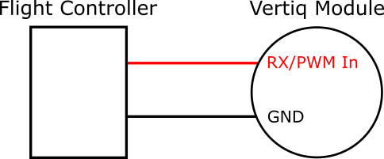
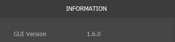
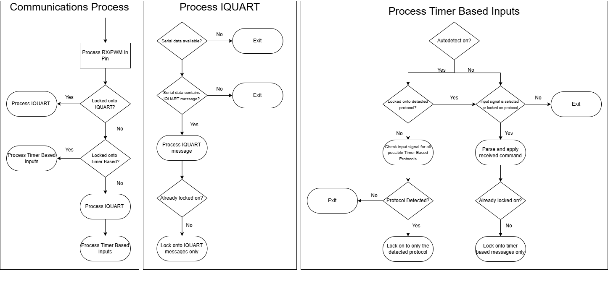
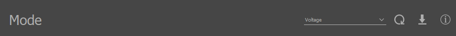
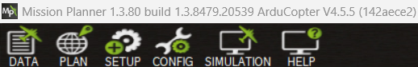
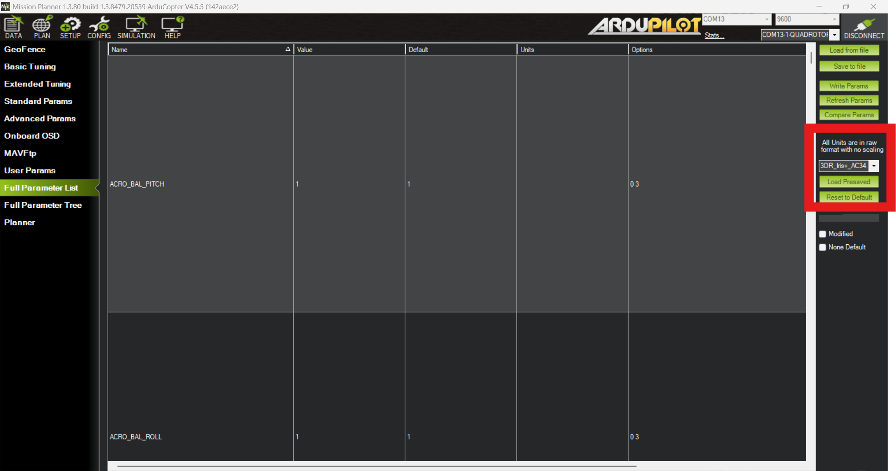
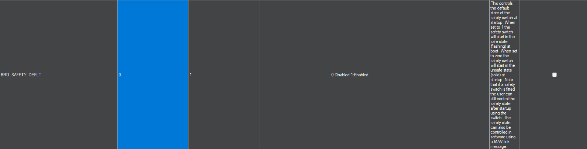
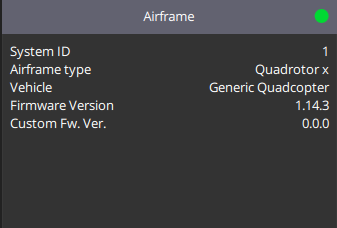
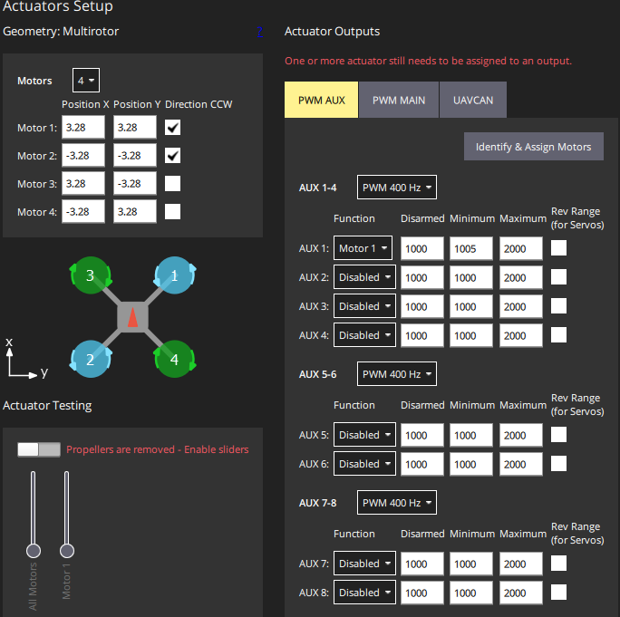
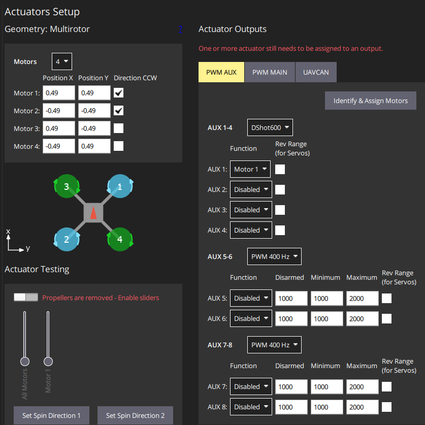

.. include:: ../text_colors.rst
.. toctree::

.. _hobby_fc_tutorial:

***********************************************
PWM and DSHOT Control with a Flight Controller
***********************************************

This tutorial is meant to walk you through the process of performing basic setup and testing for controlling a Vertiq module
with a flight controller using :ref:`Standard PWM <hobby_standard_pwm>` or :ref:`DSHOT <hobby_dshot>`. This tutorial covers only the basics of testing 
that the flight controller can spin your modules with the appropriate protocol, and not the setup of any additional flight controller peripherals like an RC controller
or a GPS. This tutorial takes you from a totally fresh module and flight controller to a :ref:`Standard PWM <hobby_standard_pwm>` or :ref:`DSHOT <hobby_dshot>` controllable module 
through a flight controller.

This tutorial covers setup and testing on `ArduCopter <https://ardupilot.org/copter/>`_ using `Mission Planner <https://ardupilot.org/planner/>`_ and 
`PX4 <https://px4.io/>`_ using `QGroundControl <http://qgroundcontrol.com/>`_. It covers using both the :ref:`Standard PWM <hobby_standard_pwm>` and :ref:`DSHOT <hobby_dshot>` 
protocols since each setup process is largely similar. In the places where there are differences, the proper steps for both protocols are explained.

These instructions are applicable to any Vertiq module using speed firmware. Though they have different form factors and some different configuration parameters available, 
the configuration and setup for basic control with Standard PWM or DSHOT is the same for all Vertiq speed modules. This example uses a :ref:`Vertiq 81-08 G2 <vertiq_81xx_family>` for demonstration purposes, 
but it is not specific to the 81-08.

Hardware Setup
==============
This example uses a Vertiq 81-08 G2 and a `Pixhawk 6C <https://docs.holybro.com/autopilot/pixhawk-6c/pixhawk-6c-ports#telem-2-port>`_ as the flight controller. Since this tutorial is
focused specifically on setting up the Vertiq module, the only additional peripheral that is used along with the flight controller is a safety switch.

The module is powered through its XT-60 connector from a bench-top power supply. For more information on how to properly power your module, refer to its
family page.

When setting the module's configuration parameters through the Control Center, it should be connected to a PC with a USB-to-UART converter. 
For more details on how to use the Control Center with a module, refer to :ref:`control_center_start_guide`.

When testing with the flight controller, the module's pins must be connected to the flight controller's appropriate output pins. The exact position or labeling of 
the flight controller's output pins will vary depending on the specific hardware you are using. Refer to your flight controller's documentation for more information. 
Your module's RX pin should be connected to the flight controller's signal output pin sending throttle commands. 
Your module's ground connection should be connected with the flight controller's. For information about your module's RX and GND connections, see the module's family page.
For this specific example using a Pixhawk 6C, the signal pin is FMU PWM OUT (AUX OUT) 1 for both standard PWM and DSHOT.

.. warning:: If you are using DSHOT and certain flight controllers, including Pixhawks, **you may need to use a different set of outputs than when using Standard PWM. These outputs may be labeled as AUX or FMU PWM**. 
    This is because not all outputs on all flight controllers support using DSHOT. See the `Mixing ESC Protocols <https://ardupilot.org/copter/docs/common-brushless-escs.html#mixing-esc-protocols>`_ 
    section of the Arducopter DSHOT setup instructions and the `PX4 DSHOT documentation <https://docs.px4.io/main/en/peripherals/dshot.html>`_ for more details. 
    Refer to your flight controller's documentation for details on what protocols its outputs support.

For more details on the wiring for your module, refer to the module's family page. In the *Communication* section of *Pinout and Connectors*, locate the RX/PWM In 
pin. This is the PWM/DSHOT input for all Vertiq modules. In general, connection with your module will look as follows:

Firmware and Software Versions
==============================

This tutorial was tested with IQ Control Center version 1.6.0. It should also be applicable to future versions of the Control Center, but there
may be some slight differences in the number of parameters available on tabs or the exact names of parameters and settings. The version of your Control Center
can be seen in the Information tab, as shown in the image below. For more information on how to use the Control Center, refer to :ref:`control_center_start_guide`.

    Control Center Version

This tutorial is applicable to all Vertiq modules running speed firmware.

Reverting to Defaults (Optional)
================================

If you have previously changed any configurations on the module, it may be useful to revert it to its default state before continuing with this tutorial. This ensures
that there will be no lingering conflicts from previous configurations, and this tutorial will work as expected.

To do so, please follow the instructions found at :ref:`reset_to_defaults_manual`.

.. _hobby_fc_tutorial_motor_configuration:

Module Configuration
=====================
.. warning:: Before setting any parameters, ensure that the module does NOT have a propeller attached and
     is held in place securely. If the module is unsecured it could move unexpectedly when it starts to spin. 
     This could damage the module, its connectors, or any nearby observers.

.. note::
  
  If you are unfamiliar with setting parameters through the Control Center, refer to :ref:`module_config_with_control_center` before completing this section.

General Tab
***********
First, there are a few parameters to set in the General tab. Not all of the parameters in this tab are important, and only the relevant ones are
highlighted here. If a parameter is not mentioned, you can safely leave it at its default. The correct settings and purpose of each parameter is 
described in detail in the sections below. **Most parameters are the same in Standard PWM and DSHOT setups, but ones that differ have sections for both protocols**:

Communication
##############
This parameter controls what type of :ref:`Hobby Protocols <hobby_protocol>` the module will listen for. The module is capable of listening to a wide variety of hobby protocols,
which can be selected from the drop-down box. **Once the module receives a command in its selected hobby protocol, it will only listen for that type of command until power cycled, so you will
not be able to connect with Control Center until you power cycle the module.** For example, if the module receives a PWM message when it is set to accept them, it will only listen to PWM messages until it is restarted. 
If left in Autodetect mode, the module listens for all of the supported Hobby protocols to try to determine which one you are using. 

The communication parsing process is summarized by the following:

Depending on the flight controller's configurations and noise on the communication lines, the module may have difficulty automatically discovering the protocol while using autodetection. 
In these cases, it is best to set the module to only listen for a specific type of protocol. As such, we will explicitly set the hobby protocol 
to use in this setup. The proper value for this configuration depends on if you are using :ref:`Standard PWM <hobby_standard_pwm>` or :ref:`DSHOT <hobby_dshot>`:

  * **Standard PWM Setup**: Set *Communication* to *Standard PWM* to receive :ref:`Standard PWM <hobby_standard_pwm>` messages
  * **DSHOT Setup**: Set *Communication* to *DSHOT600* to receive :ref:`DSHOT <hobby_dshot>` messages

The image below shows what the *Communication* parameter should look like in Control Center for a Standard PWM setup.

    Communication Parameter

FC 2D/3D Mode
##############
This parameter tells the module if the flight controller wants it to operate in 2D mode (spinning in one direction) or 3D mode (able to spin in both directions). For more details on 
these modes and how to configure the module's spinning behaviors, see the :ref:`manual_throttle` section of the Feature Reference Manual.
**For this tutorial, 2D mode will be used for the sake of simplicity**. Set the *FC 2D/3D Mode* parameter to *2D* as shown below.

    FC 2D/3D Mode Parameter

Mode
#####
This parameter determines how the module interprets a setpoint command, i.e., what should the module do when receiving a 50% or 100% throttle command? Is that meant to be a fraction of the battery voltage, a specific drive voltage, or a velocity?
The list below provides a brief introduction to each of the 3 possible modes:

  * **PWM**: This mode means that the module will apply a fraction of the battery voltage as its drive voltage when given a setpoint. For example, if your battery voltage is 20V, and you send a 50% command, then the module will apply a 10V drive voltage. 
    
    * Despite the similar naming, this mode has nothing to do with using the Standard PWM hobby protocol
  
  * **Voltage**: This mode interprets the commands as a fraction of the **Max Volts** set in the Tuning tab. So, if your maximum voltage was set at 8V, and you sent a 25% throttle command, the module would apply a drive voltage of 2V.
  * **Velocity**: This mode interprets the command as a fraction of the **Max Velocity** set in the Tuning tab. So, if your maximum velocity was set at 100 rad/s, and you sent a 25% throttle command, the module would try to spin at 25 rad/s.

The meaning of this parameter is covered in greater detail in the :ref:`throttle_mode_maximums_directions` section of the Feature Reference Manual. 

For this example, we will **put the module in Voltage mode**. To do this, set the *Mode* parameter to *Voltage* in Control Center, as shown below.

    Mode Parameter

Motor Direction
################
This sets what direction the module considers to be the positive direction for throttle commands from a flight controller.  When the *Motor Direction* parameter is
set to either of the 2D directions (*2D clockwise* or *2D counter clockwise*), the module will always spin in the specified direction on a throttle command. For example,
if the *Motor Direction* was set to *2D counter clockwise*, the module would always spin counter-clockwise in response to a throttle command. Configuring the direction of the
module and mapping throttle commands to directions is covered in greater detail in the :ref:`manual_throttle` section of the Feature Reference Manual.

For this example, the module should always spin **counter-clockwise**. To configure that, set the *Motor Direction* to *2D counter clockwise* in Control Center, as shown below.

    Motor Direction Parameter
  
Tuning Tab
**********
The Tuning tab also has parameters that must be set for this example. Similarly to the General tab, the majority of the parameters on this tab are not relevant for this test setup and can be left at their defaults.
The sections below describe important Tuning tab parameters as well as their values for the case of this example. They are the same for both DSHOT and PWM setups.

Max Volts
##########
This parameter determines the maximum drive voltage of the module when operating in Voltage mode. All setpoints will be interpreted as a fraction of this maximum voltage. So if *Max Volts* is 24V, then a 50% 
command will drive the module with 12V. To use Voltage mode, this needs to be set to the desired maximum. For safety reasons, *Max Volts* is **set to 10V** for this test setup, as shown in the image below. 
This keeps the speed of the module relatively low. When using the module on an actual drone you will likely want to increase this to match your battery voltage. For more information on this parameter and
the modes available on the module, refer to the :ref:`throttle_mode_maximums_directions` section of the Feature Reference Manual.

    Max Volts Parameter

Timeout
########
This determines the length of the module's timeout. If it does not hear any messages within that time, it will timeout and play its timeout song. If this is below, 1s, it can be difficult to test with the Control Center. 
So for this example, the **timeout should be set to 1.5s**. To do this, set the *Timeout* parameter to 1.5s, as shown in the image below. Depending on how frequently your flight controller sends throttle commands, 
you may want to decrease the timeout when using the modules on a drone. For more information on the timeout feature of Vertiq modules, refer to the :ref:`manual_timeout` section of the Feature Reference Manual.

    Timeout Parameter

Testing the Module
*******************
.. warning:: Ensure that the module is secured and there is no propeller attached before performing any testing.

To test that the module is configured to spin and take throttle commands from the flight controller, open the Testing tab in Control Center and look for the *ESC Input* parameter. This parameter commands the module to spin in the same way 
that a :ref:`hobby protocol <hobby_protocol>` used by a flight controller would, i.e. it sends an :ref:`IQUART throttle command <manual_throttle>`, so it is the best way to test if 
the module is ready to connect with the flight controller. So setting this to 0.5 will send the module a 50% throttle command with the configuration specified in this example. 
**Make sure the module is secured before attempting to spin it, as it may move dangerously if unsecured**. 

**However, because this test is meant to simulate commands from a flight controller, the** *ESC Input* **parameter is affected by the** :ref:`manual_advanced_arming` **feature. That means that setting this parameter 
will not cause the module to spin until the module has armed.** By default, Vertiq speed modules require 10 consecutive throttle commands between 0% and 7.5% to arm. So to arm your module using the
*ESC Input* parameter, set the *ESC Input* to 0.05 to send a 5% throttle command as shown below, and click the set arrow 10 times. On the 10th time you click the set arrow, the module should play 
its :ref:`two tone arming song <arming_song>`, and begin spinning. 

    ESC Input Parameter For 5% Throttle Command

Now that the module is armed, any new throttle commands sent using the *ESC Input* parameter will change how it spins.
For example, setting *ESC Input* to 0.1 should set the module to spin with a drive voltage of 1V. This is because the module is in Voltage mode with a *Max Volts* of 10V, so a 
10% throttle command commands 1V. Confirm that the module is spinning counter-clockwise, matching the direction that was configured previously.

For more information on how to configure the module to properly interpret throttle commands, see the :ref:`manual_throttle` section of the Feature Reference 
Manual. For more information on arming and disarming the module, refer to the :ref:`manual_advanced_arming` section of the Feature Reference Manual.

If the module is spinning as expected, set the *Coast* parameter to stop the module. With your module configured to spin, you must now set up your flight controller to send proper commands.

.. note::

  You can find another full module configuration example for Velocity mode at :ref:`flight_controller_config_with_control_center`.

Ardupilot and Mission Planner Configuration and Testing
=======================================================
This tutorial was tested using Mission Planner 1.3.80 and ArduCopter v4.5.5, as shown in the figure below. These instructions assume you are starting from the default parameters, and cover how to test that the
flight controller and module can communicate with no additional flight controller peripherals. See the `Hardware Setup`_ section for more details on the hardware and connections.

    Mission Planner and Arducopter Version

In order to reset your flight controller to default settings with Mission Planner, navigate to "Config," open "Full Parameter List," 
and on the right side, locate *Reset to Default* outlined in red below. Click this, and then follow the directions on the windows that appear.

Setting Frame Type
******************
The first step is to provide ArduCopter with a frame type. On a fully assembled drone, this should match the drone's physical layout, but for this test the specific frame you set is
unimportant. To set the frame type, select "Setup" from the top bar in Mission Planner, and then expand "Mandatory Hardware" on the sidebar. Select "Frame Type," and a frame selection
screen should appear. This tutorial was tested with the "X" quadcopter frame, under the first frame option, as shown below.

    Mission Planner Frame Type Selection

Setting ArduCopter PWM Parameters
*********************************
.. note:: This section is only relevant if you want to use the Standard PWM protocol to control the modules. Otherwise, continue to `Setting ArduCopter DSHOT Parameters`_ below

There are several parameters that need to be set properly to make sure the flight controller can communicate with the module using :ref:`Standard PWM <hobby_standard_pwm>`. Connect to your flight controller with Mission Planner, select "Config" from
the top toolbar, and then select "Full Parameter List" from the sidebar. On the right of the parameter list is a search box you can use to search for each parameter. Confirm that
the following parameters are set to the proper values and change them if necessary:

* **MOT_PWM_TYPE = 0**
  
  * This selects the output PWM Type. 0 sets it to standard PWM. See the `ArduCopter documentation <https://ardupilot.org/copter/docs/parameters.html>`_ for more details.
  
* **MOT_PWM_MAX = 2000**
  
  * This sets the max PWM value in microseconds that will be output to the module. By default, Vertiq modules use a range of 1000us to 2000us with Standard PWM.
  
* **MOT_PWM_MIN = 990**
  
  * This sets the minimum PWM value in microseconds that will be output to the module. By default, Vertiq modules use a range of 1000us to 2000us with Standard PWM, but setting this to 990us helps ensure the module will not spin on a 0% throttle.
  
* **SERVO_DSHOT_ESC = 0**
  
  * This disables DSHOT commands. These settings cover a setup using Standard PWM, so DSHOT should be disabled.
  
Reboot your flight controller to make sure the new parameters take effect. The important parameters and their proper values in the Mission Planner parameter list are shown in the figure below.

.. figure:: ../_static/tutorial_images/pwm_flight_controller/mp_pwm_params.JPG
    :align: center

    Important ArduCopter Standard PWM Parameters in Mission Planner

Setting ArduCopter DSHOT Parameters
***********************************
.. note:: This section should only be used if you want to use the DSHOT protocol to control the modules. Otherwise, use `Setting ArduCopter PWM Parameters`_ above.

ArduCopter needs to be configured properly to use :ref:`DSHOT <hobby_dshot>` as its protocol for controlling the modules. To set these parameters, connect to your flight controller and select "Full Parameter List" under the "Config"
section of Mission Planner. Search for the parameters listed below and make sure they are set to the appropriate values:

* **MOT_PWM_TYPE = 6**
  
  * This selects the output PWM Type. 6 sets it to DSHOT600. See the ArduCopter documentation for more details.

* **SERVO_DSHOT_ESC = 0**
  
  * This controls what type of additional ESC commands will be sent from the flight controller. These additional commands include things like beeping, LED control, and other potentially useful but non-essential
    extra commands that can be sent over DSHOT. This does not need to be enabled in order to send the module throttle commands over DSHOT, so we are leaving it disabled for simplicity. See the ArduCopter documentation for more details.
  
* **SERVO_DSHOT_RATE = 0**
  
  * This sets the output rate for DSHOT outputs. Leaving it at 0 leaves the output rate at 1 kHz. See the ArduCopter documentation for more details.

Reboot your flight controller to make sure the new parameters take effect. The important parameters and their proper values in the Mission Planner parameter list are shown in the figure below.

.. figure:: ../_static/tutorial_images/pwm_flight_controller/mp_dshot_params.JPG
    :align: center

    Important ArduCopter DSHOT Parameters in Mission Planner

Re-Configuring ArduCopter DSHOT Outputs
#######################################
.. note:: 
  
  Only needed on some flight controllers, see the `ArduCopter <https://ardupilot.org/copter/docs/common-brushless-escs.html#mixing-esc-protocols>`_ and `PX4 <https://docs.px4.io/main/en/peripherals/dshot.html>`_ documentation for more details on which

Depending on the type of flight controller hardware you have, you may need to re-configure which outputs you are using to a DSHOT compatible pin. 
The reason for this and the types of flight controllers it affects are discussed in `Mixing ESC Protocols <https://ardupilot.org/copter/docs/common-brushless-escs.html#mixing-esc-protocols>`_ 
and in this `Ardupilot forum post <https://discuss.ardupilot.org/t/flight-controllers-dshot-and-escs/53608>`_. This issue applies to the Pixhawk 6C that was used for this tutorial, and also
applies to the popular Cube Orange flight controller. 

For affected flight controllers, their main outputs can transmit PWM, but not DSHOT. One way to check for this issue is to check the "Messages" section of the "Data" tab in Mission Planner on reboot.
This will display what kinds of protocols are actually going to be output on each pin based on the configuration. Set your flight controller for DSHOT as discussed above, reboot it, connect to it,
and check the "Messages" section. If you see a message like the one below that lists "RCOut: PWM 1-12," that means your flight controller outputs will still only output PWM, and you must connect the module to
a DSHOT compatible output instead.

.. figure:: ../_static/tutorial_images/pwm_flight_controller/mp_messages_pwm.JPG
    :align: center

    Message Showing Outputs are PWM Only

For the Pixhawk used to test this example, the module is connected with FMU PWM OUT (AUX OUT) 1. Exactly which pins to use and how they are labeled will vary depending 
on your flight controller. Refer to the flight controller's documentation for more information.

Next, you need to tell ArduCopter to use AUX OUT 1 (or the equivalent pin on your flight controller) as the output for Motor 1 on your vehicle. ArduCopter uses SERVOX_FUNCTION variables to assign a function to each
output. For the Pixhawk, AUX OUT 1 is controlled by SERVO9_FUNCTION. **Set SERVO9_FUNCTION = 33 to output the throttle commands for Motor 1 on AUX OUT 1.** See the `ArduCopter documentation <https://ardupilot.org/copter/docs/parameters.html>`_ for details on what
settings to use for different functions. The figure below shows the proper setting for this parameter to assign DSHOT to AUX OUT 1 on the Pixhawk 6C.

.. figure:: ../_static/tutorial_images/pwm_flight_controller/mp_servo9.JPG
    :align: center

    Setting AUX OUT 1 as the Motor 1 Output

Reboot the flight controller and connect to it again. This time in the "Messages" section you should see that RCOUT also has DS600 on its outputs, as shown below.

.. figure:: ../_static/tutorial_images/pwm_flight_controller/mp_messages_dshot.JPG
    :align: center

    Message Showing Outputs Are Using DSHOT

.. _safety_switch_config:

Configuring the Safety Switch
*******************************
By default, ArduCopter will not allow you to test spinning your modules unless a safety switch attached to your flight controller is armed. If you have a safety switch connected to your flight
controller, then you can move on to testing the module. **If you do not have a safety switch but would still like to test your modules, this section will cover how to override the requirement 
for a safety switch**.

The `ArduCopter documentation <https://ardupilot.org/copter/docs/common-safety-switch-pixhawk.html>`_ provides details on how to configure the safety switch. To disable the switch,
Set **BRD_SAFETY_DEFLT (also called BRD_SAFETYENABLE on older firmwares) to 0**. The image below shows BRD_SAFETY_DEFLT set to this value in Mission Planner. If your module is
powered on and attached to the flight controller when you change this parameter, you may hear the module arm. That is because the flight controller will begin sending 0% throttle commands
on its outputs once this is changed.

    Disabling the Safety Switch with the BRD_SAFETY_DEFLT Parameter

Testing the Module with Mission Planner
*****************************************
.. warning:: Double check that the module is secured and there is no propeller attached before performing any testing.

Now we can use Mission Planner's built-in motor testing tools to make sure the flight controller can control the module.

1. Start with the module powered off, but connected to the flight controller.
2. Select "Setup" from the top toolbar, and then expand "Optional Hardware" on the sidebar.
3. Select "Motor Test" from the "Optional Hardware" options. See the image below as an example of what the Motor Test screen should look like at this point.

  .. figure:: ../_static/tutorial_images/pwm_flight_controller/mp_motor_test.png
    :align: center

    Motor Test Screen in Mission Planner

4. Power on the module and wait for it to complete its :ref:`startup song <startup_song>`.

  * If you have disabled the safety switch and are using Standard PWM, the module should play its :ref:`arming song <arming_song>` after startup when attached to the flight controller.

5. Arm your safety switch if you have one.
   
  * If using Standard PWM, the module should play its :ref:`two tone arming song <arming_song>` as the flight controller starts sending 0% throttle commands once the safety switch is armed
  * On DSHOT, the module will not arm yet.
  
6. Set the "Throttle %" to 5% and the "Duration" to 5s, and click "Test All Motors".
7. The module should spin slowly for 5 seconds, and then stop.
   
  * On Standard PWM, the module will spin and stop without any additional arming or disarming noises
  * On DSHOT, the module will arm when you send the command, spin for the duration, and then stop and disarm again, since DSHOT sends a specific disarm command at the end of the test.
   
8. Try some other throttle levels to see the module running at different speeds.
   
  * For DSHOT, you cannot command a high throttle level immediately as the module will disarm after each command, and only re-arms on a throttle command close to 0%. So for DSHOT testing,
    increase the duration and send a low level throttle command to arm the module, and before that command ends and the module disarms, send another higher throttle command.  

See the `Successful Actuator Test`_ section below for a video of this whole process. It demonstrates what sounds you should expect to hear from the module, as well as the module 
successfully spinning with Arducopter and Mission Planner.

PX4 and QGroundControl Configuration and Testing
================================================
This tutorial was tested using QGroundControl 4.3.0 and PX4 version 1.14.3, as shown in the figures below. 
These instructions assume you are starting from default parameters, and cover how to test that the flight controller and module can communicate with no additional flight controller peripherals. 
See the `Hardware Setup`_ section for more details on the hardware and connections.

    QGroundControl Software Version Used for This Tutorial

    PX4 Firmware Version Used for This Tutorial

Setting Frame Type
******************
The first step is to choose an airframe. Normally, this would be determined by the layout of your vehicle, but with only a single module, the exact airframe used isn't particularly important. 
For simplicity, this tutorial uses a Generic x Quadcopter, as shown in the figure below. To setup the airframe in QGroundControl follow the steps below.

* Click on the QGroundControl logo in the upper left of the interface, and select "Vehicle Setup".
* Select "Airframe" from the sidebar.
* Scroll through the airframes until you find "Quadrotor x". Leave this set to "Generic Quadcopter", and click on the "Quadrotor x" box. It should be highlighted in yellow.
* Scroll back up and hit "Apply and Restart".

    QGroundControl Airframe Setup

Setting PX4 PWM Parameters
**************************
Several parameters must be set properly to make sure the flight controller can communicate with your module using PWM. Connect to your flight controller with QGroundControl, and under "Vehicle Setup" select
"Actuators." On the Actuators tab, you will see the following. 

.. image:: ../_static/tutorial_images/pwm_flight_controller/qgc_actuators_tab.png
      :align: center
      :width: 50%

Select PWM MAIN. Here, you can assign each channel output with the motor it represents in the drone geometry as well as the protocol to be used on the channels. For this example, we will assign MAIN 1 to Motor 1 using the PWM 400 Hz protocol. Set 
Minimum and Maximum values to 990 and 2000 respectively. By default, Vertiq modules use a range of 1000us to 2000us, but setting the minimum to 990us helps ensure the module will not spin on a 0% throttle. 
Once activated, you will see sliders appear under Actuator Testing in the bottom left. Please note that if your module is powered on and connected to the MAIN 1 output when it is enabled, 
you will hear the module play its :ref:`two tone arming song <arming_song>` as PX4 begins transmitting 0% throttle commands immediately on channel activation. By default, Vertiq modules 
take 0% throttle commands as arming throttles. 

For more information on how to configure the module to properly interpret throttle commands, see the :ref:`manual_throttle` section of the Feature Reference 
Manual. For more information on arming and disarming the module, refer to the :ref:`manual_advanced_arming` section of the Feature Reference Manual.

|

**Now reboot your flight controller to ensure that all changes take effect.**

Your flight controller and single module are now ready for :ref:`testing <testing_with_qgc>`. In order to add more PWM outputs, simply set the other MAIN outputs to the 
correct motor output, and ensure each channel is using the PWM 400 Hz protocol.

Setting PX4 DSHOT Parameters
****************************

Several parameters must be set properly to make sure the flight controller can communicate with your module using DSHOT. Connect to your flight controller with QGroundControl, and under "Vehicle Setup" select
"Actuators." On the Actuators tab, you will see the following. 

.. image:: ../_static/tutorial_images/pwm_flight_controller/qgc_actuators_tab.png
      :align: center
      :width: 50%

Select PWM AUX. Here, you can assign each channel output with the motor it represents in the drone geometry as well as the protocol to be used on the channels. 
For this example, we will assign AUX 1 to Motor 1 using the DSHOT600 protocol. Once activated, you will see sliders appear under Actuator Testing in the bottom left. 

.. note::

  According to `PX4's documentation <https://docs.px4.io/main/en/peripherals/dshot.html>`_, DSHOT cannot be transmitted via your flight controller's MAIN outputs. These 
  may also be labeled I/O PWM OUT depending on your flight controller. You'll notice that on the PWM MAIN tab, DSHOT is not an option. DSHOT can only be transmitted through 
  your flight controllers AUX (FMU PWM OUT) output channels.

  .. image:: ../_static/tutorial_images/pwm_flight_controller/qgc_no_dshot_for_main.png
      :align: center

|

**Now reboot your flight controller to ensure that all changes take effect.**

Your flight controller and single module are now ready for :ref:`testing <testing_with_qgc>`. In order to add more DSHOT outputs, simply set the other AUX outputs to the 
correct motor output, and ensure each channel is using the DSHOT600 protocol.

.. _testing_with_qgc:

Testing the Module with QGroundControl
****************************************
.. warning:: Double check that the module is secured and there is no propeller attached before performing any testing.

Now we can use the motor testing tools in QGroundControl to confirm that the flight controller can control the module.

1. Power off the module, and connect it to the flight controller.
2. In QGroundControl under "Vehicle Setup," select the "Actuators" section.
3. Arm the safety switch on your flight controller if necessary. 
4. Turn on the module, and wait for it to complete the 5-beep startup song.
5. Enable the module sliders with the toggle underneath the sliders.
6. Move the Motor 1 slider bar just slightly above its start position to give the module a throttle command near 0%. The module should play its :ref:`two tone arming song <arming_song>`, and may spin slowly.

    .. list-table:: Actuator Testing for PWM and DSHOT
      :class: borderless
      :align: center

      * - .. figure:: ../_static/tutorial_images/pwm_flight_controller/qgc_actuator_testing_ex.png
            :align: center
            :height: 300

            Actuator Testing when using DSHOT

        - .. figure:: ../_static/tutorial_images/pwm_flight_controller/qgc_actuator_testing_pwm.png
            :align: center
            :height: 300

            Actuator Testing when using PWM

    .. note::

      All Actuator Testing is subject to the :ref:`manual_advanced_arming` feature. As such, when using DSHOT, halting the Actuator Test will send an explicit disarm 
      command, and the module will stop and disarm. In order to re-arm, you must transmit throttle commands within your arming region. By default, placing the 
      slider near the bottom should arm your module. When using PWM, your module will not disarm unless you have configured disarming on throttle. This is because PX4 
      is constantly sending PWM commands at the defined disarmed value, so no timeout will occur.
  
7. Move the Motor 1 slider around, and observe how the module changes speed.

Successful Actuator Test
=============================

The following demonstrates successfully using PX4's actuator test to drive a single Vertiq module through DSHOT. The module has been configured as described in 
:ref:`hobby_fc_tutorial_motor_configuration`. This example uses a Vertiq 81-08 G2 85Kv, and shows all steps from module startup to the explicitly set DSHOT disarm command.

.. raw:: html

    
    <video class='center_vid' controls><source src="../_static/tutorial_images/pwm_flight_controller/dshot_demo_pic_in_pic.mov" type="video/mp4"></video>