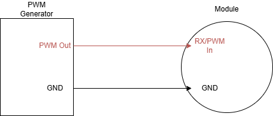

.. include:: ../text_colors.rst
.. toctree::

.. _spin_with_pwm_generator_tutorial:

###############################################
Module Control With a Generic PWM Generator
###############################################

This tutorial is designed to help guide you through spinning your module with a generic PWM generation device. In this example, we will use a `Pololu USB Servo Controller with their Maestro software <https://www.pololu.com/category/102/maestro-usb-servo-controllers>`_, 
but the same logic applies to all PWM generators.

*************************
Hardware Configuration
*************************

All Vertiq modules accept PWM inputs on their RX/PWM In pins. You will need to connect your PWM generator's output to the module's RX pin, and tie the two devices' ground connections together. Please refer to your module's family page to find specific pinouts.

**********************
Module Configuration
**********************

We are going to configure our module exactly as we would for integration with a flight controller. So, we will follow the instructions found :ref:`here <hobby_fc_tutorial_motor_configuration>` 
through the *Testing the Module* section.

******************************
Spinning With Pololu Maestro
******************************

.. warning:: Before attempting any tests that may cause the module to spin, ensure any propellers are removed from the module and that the module is safely secured.

Make sure that you have rebooted your module after communicating with it over IQUART before beginning these steps.

First, open the Pololu Maestro Control Center, and you should see the following:

Ensure that your *Channel Settings* are correct for standard PWM ESC control. That means sending 1000us pulses for 0% throttle and 2000us pulses of 100% throttle. 
In our example, the default settings will work for our needs with the minimum pulse being slightly below the 0% threshold.

Connect your module to the Maestro using any desired channel, and enable the channel. By default, the Maestro will start sending 1500us pulses (50% throttle). This is outside of our 
default :ref:`arming region <arming_throttle_regions>`, so the module will not do anything.

Lower the throttle by moving the blue slider to the left until you hear the module :ref:`arm <arming_song>`. You should now be able to spin the module by adjusting the throttle.

You can see this demonstrated below:

.. raw:: html

    
    <video class='center_vid' controls muted><source src="../_static/tutorial_images/calibration_tutorial/pololu_spinning_demo.mp4" type="video/mp4"></video>

*********************************
Calibrating With Pololu Maestro
*********************************

Timer based protocol calibration ensures that both the module and its controller interpret different pulse lengths as identical throttle percentages. You can read more about 
calibration in :ref:`hobby_calibration_tutorial`.

Use the following steps to calibrate your module to a Pololu Maestro:

#. Turn off your Vertiq module
#. Connect the module to the Maestro output you plan on using
#. Make sure your Maestro channel is enabled, and set its target pulse length to 2000
#. Power on your module, and you should hear it start playing its calibration song <LINK>
#. Slowly decrease the throttle until you reach the minimum pulse width output
#. Increase the throttle again to complete calibration

You can see this demonstrated below:

.. raw:: html

    
    <video class='center_vid' controls muted><source src="../_static/tutorial_images/calibration_tutorial/pololu_calibration_demo.mp4" type="video/mp4"></video>