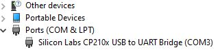
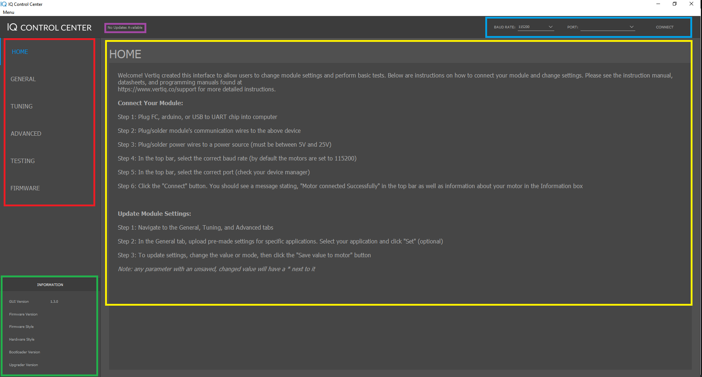
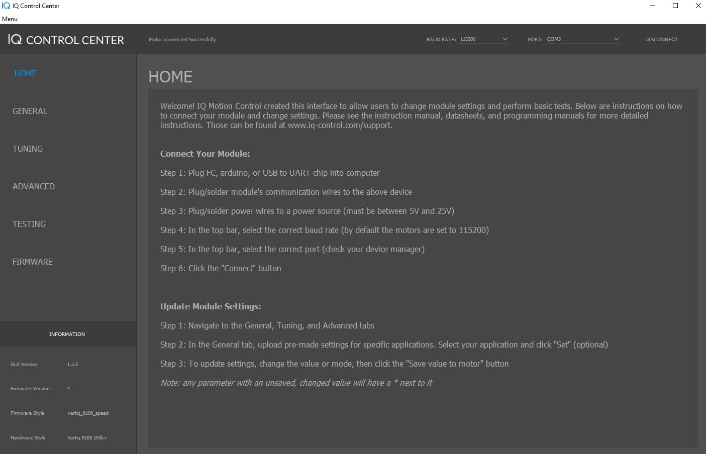
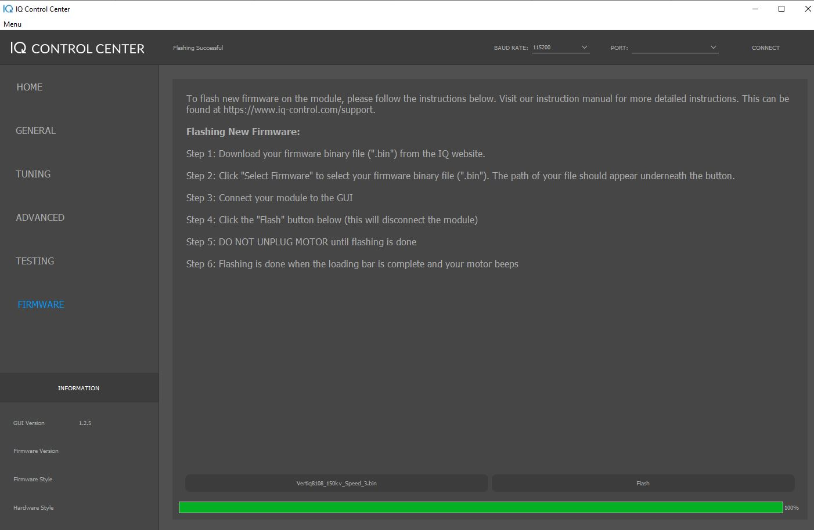
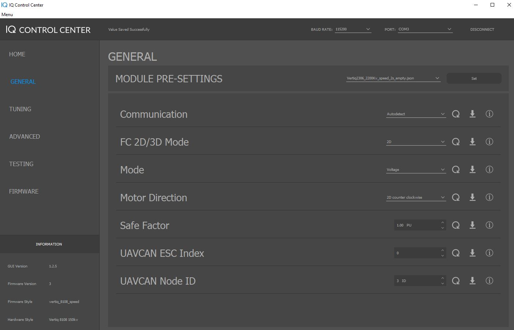
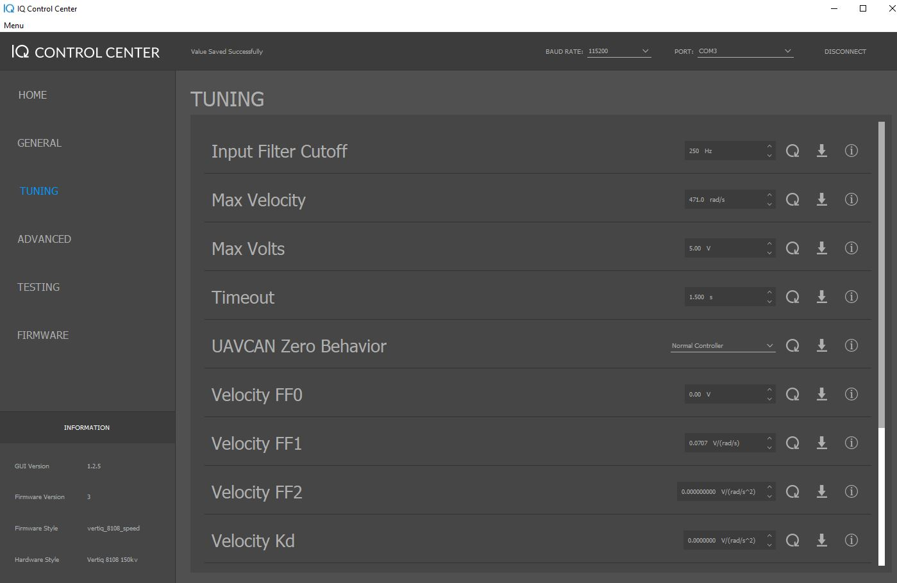

.. include:: ../text_colors.rst
.. toctree::

.. _control_center_tutorial:

*********************************************************
Getting Started with Speed Motors Using IQ Control Center
*********************************************************

The easiest way to get started with any IQ Motor is with the IQ Control Center. 
The IQ Control Center is a simple application that allows you to configure and test
an IQ Motor from your PC, without the need for a flight controller or specialized hardware.

This tutorial will take you through the process of getting started with a motor using
the IQ Control Center. It will outline how to setup the necessary hardware and software,
provide a brief introduction to the Control Center, and teach you how to peform some basic
tests on the motor with the Control Center.

**This tutorial is applicable for both the Vertiq 2306 and the Vertiq 8108, but only when 
using the Speed firmware. If you are using the position firmware, some of the parameters discussed here
will not be available.**

Motor Datasheets
===================
Before trying to use the motors, it is advised to read through their datasheets to
get a better sense of what they can do and how the hardware is setup. The datasheets
for all IQ modules can be found under the `Support <https://www.vertiq.co>`_
section of our website, and individual links are provided below for convenience:

* `Vertiq 2306 2200KV <https://static1.squarespace.com/static/62981f8ddf7dc07b7eed3f3f/t/63063670f72c060db8879052/1661351539244/Vertiq_23-06_2200kv_module_datasheet.pdf>`_
* `Vertiq 2306 220KV <https://static1.squarespace.com/static/62981f8ddf7dc07b7eed3f3f/t/63066cb62767660deec6dadd/1661365431560/Vertiq_23-06_220kv_module_datasheet.pdf>`_
* `Vertiq 8108 150KV <https://static1.squarespace.com/static/62981f8ddf7dc07b7eed3f3f/t/6306367b2b9a912706a32f22/1661351553848/Vertiq_81-08_150kv_module_datasheet.pdf>`_

Hardware Setup
==============
To communicate with the motor using IQ Control Center, you will need:

* A USB-to-UART converter (FTDI, CP2012, etc.)
* Wires or a cable to connect your USB-to-UART converter to the motor's communication pins
* A battery or power supply to connect to your motor

First, plug your USB-to-UART converter into your computer, and install any drivers if necessary 
(refer to the manufacturers documentation for your USB-to-UART converter).
If installed correctly, a new serial port should be avaiable on your PC. Take note of the
name of this new serial port. In Windows you can see this under Device Manager->Ports (COM & LPT).
The image below shows an example where the connected USB-to-UART converter shows up as COM3. This
port will be used later when connecting with the Control Center

    COM Port in Device Manager

Then, connect your cable or wires from the USB-to-UART converter to the appropriate pins or pads
on your motor. See the "Electrical Interface" sections in the datasheets linked above for details
on what each pin or pad on your motor is. 

Now you can connect power to your motor. Refer to the "Electrical Specifications" and
"Electrical Interface" sections of the appropriate datasheet above for information on the
correct voltages and connectors to use with each type of motor. When you power the motor
on, you should hear 5 beeps. This indicates the motor has powered on successfully and is ready
to connect to. Now we can set up the Control Center.

.. raw:: html

    
    <video class='center_vid' controls><source src="../_static/tutorial_images/control_center_tutorial/8108_startup_sound.mp4" type="video/mp4"></video>

Installing the Control Center
==============================
The latest release of the IQ Control Center can always be found on Github under the 
`Releases Page <https://github.com/iq-motion-control/iq-control-center/releases>`_ of the 
iq-control-center repository.

Download the appropriate zip file for your operating system, then extract and run the installer.
Click "Next" on the first screen, then select a directory to install the Control Center in. The default
directory is usually fine unless you are an advanced user.

On the "Select Components" screen, leave "IQ Control Center" checked, and click "Next". 
Accept the License Agreement, and click "Next" on the License Agreement and Start Menu 
Shortcuts screen. Then click "Install", and wait for the installation to complete. Click
"Finish" after the installation completes. The IQ Control Center should now be installed,
and on Windows can be run from the Start Menu.

Control Center Overview
=======================
When you first open the Control Center, you should see a screen similar to the image below,
though without the colored highlighting.

    Control Center w/ Highlighted Sections

There are 5 major sections of the Control Center interface, which have been highlighted
with colored boxes in the figure above and are described below:

* The :red:`Tabs` section lists the different tabs of the Control Center that are avaiable when
  you are connected to a motor. Each tab offers access to different configuration parameters and
  functionality. We will cover some settings in these tabs in greater detail later.
* The :green:`Information` section lists information about the Control Center and connected motor, if there is one.
  When there is no motor connected, this only lists the Control Center version. When a motor is connected, this will
  also list its Firmware Version, Firmware Style, and Hardware Style. Check this information to make sure you are using 
  the proper hardware with the latest firmware. You can check for new firmware under the
  `Products <https://www.vertiq.co>`_ section of our website.
* The :blue:`Connection` section is used to connect to motors. You can select the baud rate and the serial port
  to use for the motor  you want to connect to. The default baud rate of 11520 bps should be used with all of
  our products. The serial port is determined by the name of the serial port used by your USB-to-UART converter,
  see the `Hardware Setup`_ section for more details on how to determine that port name.
* The :gold:`Display` section displays information, configuration parameters, and controls relevant to your current
  tab. When you change tabs, the controls and information shown here will change. This is where the majority of your 
  interactions with a connected motor will take place.
* The :purple:`Log` section displays information about the Control Center that can be useful for understanding what 
  state the Control Center is in and debugging connection problems. Check here if you are having connection issues
  for feedback.

Connecting To the Motor
=======================
Connecting to a motor is simple. Make sure the motor is powered on and connected to a USB-to-UART converter
connected to your PC (see the `Hardware Setup`_ section for details). Then in the Connection section
in the top right of the Control Center, leave the baud rate at 115200 bps and from the "PORT" dropdown select
the serial port that corresponds with your USB-to-UART converter. Then click "Connect", and wait several
seconds for the Control Center to connect to the motor.

If the connection is succesful, the Control Center will display "Motor Connected Successfully" in the Log section
in the top left and the Information section will be populated with information about the connectd motor. The image
below shows an example of what the Control Center will look like when connecting to a Vertiq 8108.

.. warning:: Before proceeding any further, check that the firmware style indicates this motor is using speed firmware.
    This tutorial is only intended for speed firmware, and not for position firmware.

    Control Center Connected to Vertiq 8108

Updating Firmware
=================
If you do need to update the motor firmware, you can do it through the Control Center. First download the firmware binary you want to update to, and then open the Firmware tab. 
Click on "Select Firmware Binary", and select the binary you downloaded. Make sure you are connected to the motor, and then hit "Flash". The motor should disconnect, and a progress
bar at the bottom of the Control Center should start filling. When the progress bar is full, the flash is complete. The motor should restart and play its 5 beep startup song. An 
example of the Control Center after a successful flash is shown below.

    Control Center After Flashing

Spinning the Motor
==================
.. warning:: Before setting any parameters, ensure that the motor does NOT have a propeller attached and
     is held in place securely. If the motor is unsecured it could move unexpectedly when it starts to spin. 
     This could damage the motor, its connectors, or any nearby observers.

Now that we are connected, it's time to spin the motor. But first, we need to use the Control Center
to configure the motor. Specifically, we are going to configure the motor to operate in Voltage mode 
with a safe voltage limit for testing, and to use counter-clockwise as its positive direction.

First, click on the General tab. To set a parameter, enter the value you want in the dropdown or text box, and then
click the downward facing set arrow to the right of the parameter. **If the parameter has an asterisk next to it
after changing the value, then you have not saved that value onto the motor yet**. See the note below for more detailed information on
the controls for setting parameters.

.. note:: Each parameter has controls and visual indicators that allow you to interact with it. These controls are highlighted here. The :purple:`asterisk` indicates that
    you have changed the value of the parameter in control center but have not actually set that new value on the motor. The :red:`refresh button` refreshes the current value
    of the parameter from the motor, so it can be used to check that a parameter was actually set to what you expect. The :blue:`set arrow` sets and saves the value of the
    parameter selected in Control Center onto the motor. After clicking this, the asterisk should disappear. The :green:`information button` provides some brief information
    on the purpose and usage of a parameter.

    .. image:: ../_static/tutorial_images/control_center_tutorial/colored_parameter_controls.png
        :align: center
        :alt: Parameter Controls

There are several configuration parameters here, but only 2 that matter for this example:

* **Mode**: For this example, set the Mode to **Voltage**. This determines how the motor interprets setpoint commands it gets, i.e. when commanded to go 
  to a 50% setpoint, what does that mean? If you are using our IQUART protocol with one of our communication 
  libraries to directly command a specific voltage or velocity to the motor, this doesn't matter because you
  are explicitly telling the motor what to do. But often when integrating with flight controllers over other 
  protocols (such as DSHOT or PWM), the motor will receive commands that simply tell it to go to a certain percentage throttle. 
  The Mode parameter determines if we consider those percentage commands to be telling us to go to a specific velocity, a 
  specific voltage, or a fraction of our input voltage. 
* **Direction**: For this example, set the Direction to **2D Counter Clockwise**. This sets what direction the motor considers to be the positive direction for throttle commands from a flight controller. 
  So in 2D mode, like we are for this example, the motor will always spin this way on a throttle command. So our motor will spin counter clockwise when controlled by the flight controller. 
  The use of 2D or 3D should match the "FC 2D/3D Mode" parameter, which defaults to 2D.

The figure below shows what your General tab should look like after setting the parameters.**Note that you may have more or less parameters than are shown here if you are
on a different firmware style or a more updated version. Some of your default settings may also be slightly different. That is fine, these images are only meant as a guide
for the important parameters.**

    General Tab Settings

Now, we can move onto the Tuning tab. This also has a large number of parameters, but the majority of them can be safely left at their defaults.
There are only 2 that we are interested in for this example:

* **Max Volts**: Set this to **5V**. This parameter sets the maximum voltage the motor will use when in Voltage mode. Voltage mode interprets setpoints
  as a value between 0V and this maximum voltage. If your maximum voltage is set to 5V, then a 50% setpoint will set the motor to spin with 2.5V. 5V 
  is used here because it is a fairly safe low voltage for testing, but the motor can handle much more.
* **Timeout**: Set this to **1.5s**. This parameter determines how long the motor will wait to receive a command before timing out. When the motor times 
  out, it will stop spinning and repeatedly beep 3 times. This is a safety feature to stop the motor if the controller is not communicating. The Control
  Center only sends commands once per second, so 1.5s is a good choice when controlling the motor from the Control Center.

The figure below shows what your Tuning tab should look like after setting the parameters. Some of your default settings may be slightly different on a 
2306, but that is fine:

    Tuning Tab Settings

.. warning:: Double check that the motor is secured and there is no propeller attached before applying any of these testing parameters.

Now at long last we can make the motor spin. Open the Testing tab, and scroll down to the bottom. At the bottom of the tab you should see 5 important testing parameters:

* **Coast**: This commands the motor to coast, which means that the motor allows its rotor to slowly decelerate and come to a stop. It is a safe way 
  to stop the motor when testing, since it does not cause the motor to rapidly decelerate.
* **ESC Input**: This commands the motor to spin in the same way that a typical hobby protocol used by an ESC would, i.e. it sends a percentage throttle command. So setting this
  to 0.5 will send the motor a 50% throttle command. Since we are in Voltage mode, this will be interpreted as a percentage of the maximum voltage, which should be 5V. So setting 
  this to 0.5 should set the motor to the same speed as setting the Voltage parameter to 2.5V.
* **PWM**: This tells the motor to spin with a percentage of its input voltage. For example, if your input voltage is 20V, and you set this parameter to 0.5, the motor will spin with
  a 10V drive voltage, since 50% of 20V is 10V. A positive PWM percentage always goes in the counter-clockwise direction, and a negative PWM percentage always goes clockwise.
* **Velocity**: This commands the motor to try and maintain a specific velocity in rad/s, using closed loop PID control. A positive velocity always goes in the counter-clockwise direction, and a negative velocity always goes clockwise.
* **Voltage**: This commands the motor to a specific drive voltage. A positive voltage always goes in the counter-clockwise direction, and a negative voltage always goes clockwise.

Try out some of these parameters and observe how the motor spins. For example, try setting the Voltage to 2.5V, then set the ESC Input to 0.5. You should observe the motor
staying at the same speed. You can repeat this with 5.0V and a 1.0 ESC input. The motor is now set up for basic testing with the Control Center. For integrating with a flight controller,
more setup is needed, refer to the flight controller tutorials for details.