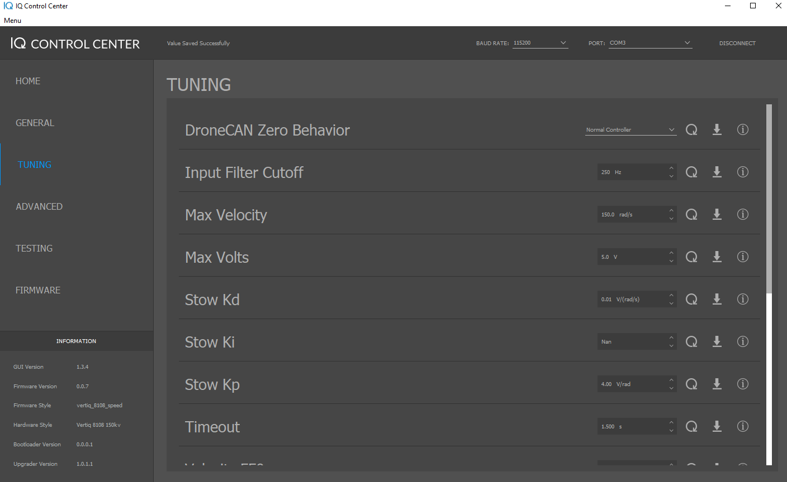

.. include:: ../text_colors.rst
.. toctree::

.. _control_center_tutorial:

************************************************************
Getting Started with Speed Modules Using IQ Control Center
************************************************************

The easiest way to get started with any Vertiq module is with the IQ Control Center. 
The IQ Control Center is a simple application that allows you to configure and test
a Vertiq module from your PC, without the need for a flight controller or specialized hardware.

This tutorial will take you through the process of getting started with a module using
the IQ Control Center. It outlines how to set up the necessary hardware and software,
provides a brief introduction to the Control Center, and teaches you how to perform some basic
tests on the module with the Control Center.

**This tutorial was created using a Vertiq 8108 module on firmware version 0.0.7, and with Control Center version 1.3.4. However, this tutorial is applicable for any Vertiq module when using
speed firmware. If you are using position firmware, some of the parameters discussed here will not be available.**

Module Datasheets
===================
Before trying to use your module, we recommend that you read through its datasheet to
understand its mechanical and electrical specifications. The datasheets
for all Vertiq modules can be found under the appropriate product tab in the Products section of the `Vertiq website <https://www.vertiq.co/>`_.

Hardware Setup
==============
.. warning:: **If you are using a power supply to power your module, it is possible  to damage or destroy your module with aggressive commands, e.g. quickly switching from spinning at full speed to stopping.** 
  This is because Vertiq modules can also act as generators. In general, power supplies, unlike batteries, cannot absorb the energy generated by the module. As such, aggressive commands can 
  lead to dangerous voltage spikes when connected to a power supply. To prevent damage to the module when commanding it aggressively on a power supply, it is recommended to turn on the 
  regeneration voltage protection feature.

To communicate with the module using IQ Control Center, you will need:

* A USB-to-UART converter (FTDI, CP2012, etc.)
* Wires or a cable to connect your USB-to-UART converter to the module's communication pins
* A battery or power supply to connect to your module

First, plug your USB-to-UART converter into your computer and install any necessary drivers
(refer to the manufacturer's documentation for your USB-to-UART converter).
If installed correctly, a new serial port should be available on your PC. Take note of the
name of this new serial port. In Windows you can see this under Device Manager->Ports (COM & LPT).
The image below shows an example where the connected USB-to-UART converter shows up as COM3. This
port will be used later when connecting with the Control Center.

    COM Port in Device Manager

Now, connect your cable or wires from the USB-to-UART converter to the appropriate pins or pads
on your module. See the "Electrical Interface" sections in the datasheets linked above for details
on what each pin or pad on your module is. 

Now you can connect power to your module. Refer to the "Electrical Specifications" and
"Electrical Interface" sections of the appropriate datasheet above for information on the
correct voltages and connectors to use with each type of module. When you power the module
on, you should hear 5 beeps. This indicates the module has powered on successfully and is ready
to connect. Now, you can set up the Control Center.

.. raw:: html

    
    <video class='center_vid' controls><source src="../_static/tutorial_images/control_center_tutorial/8108_startup_sound.mp4" type="video/mp4"></video>

Installing the Control Center
==============================
The latest release of the IQ Control Center can always be found on Github under the 
`Releases Page <https://github.com/iq-motion-control/iq-control-center/releases>`_ of the 
iq-control-center repository.

Download the appropriate zip file for your operating system, then extract and run the installer.
Click "Next" on the first screen, then select a directory in which to install the Control Center.
In general, the default installation directory is adequate.

On the "Select Components" screen, leave "IQ Control Center" checked, and click "Next." 
Accept the License Agreement, and click "Next" on the License Agreement and Start Menu 
Shortcuts screen. Then click "Install," and wait for the installation to complete. Click
"Finish" after the installation completes. The IQ Control Center should now be installed,
and on Windows, can be run from the Start Menu.

Control Center Overview
=======================
When you first open the Control Center, you should see a screen similar to the image below, without the colored highlighting.

    Control Center w/ Highlighted Sections

There are 5 major sections of the Control Center interface, which have been highlighted
with colored boxes in the figure above and are described below:

* The :red:`Tabs` section lists the different tabs of the Control Center that are available when
  connected to a module. Each tab offers access to different configuration parameters and
  functionality. The settings in these tabs will be covered in greater detail later.
* The :green:`Information` section lists information about the Control Center and connected module, if there is one.
  When there is no module connected, this only lists the Control Center version. When a module is connected, this will
  also list its Firmware Version, Firmware Style, Hardware Style, Bootloader Version, and Upgrader Version. 
  Check this information to make sure you are using the proper hardware with the latest firmware. 
  You can check for new firmware under the `Products <https://www.vertiq.co>`_ section of the Vertiq website.
* The :blue:`Connection` section is used to connect to modules. You can select the baud rate and the serial port
  to use for the module  you want to connect to. The default baud rate of 11520 bps should be used with all of
  our products. The serial port is determined by the name of the serial port used by your USB-to-UART converter.
  See the `Hardware Setup`_ section for more details on how to determine that port name.
* The :gold:`Display` section displays information, configuration parameters, and controls relevant to your current
  tab. When you change tabs, the controls and information shown here will change. This is where the majority of your 
  interactions with a connected module will take place.
* The :purple:`Log` section displays information about the Control Center that can be useful for understanding what 
  state the Control Center is in and debugging connection problems. Check here if you are having connection issues
  for feedback.

Connecting To the Module
==========================
Connecting to a module is simple. Make sure the module is powered on and connected to a USB-to-UART converter
connected to your PC (see the `Hardware Setup`_ section for details). Then in the Connection section
in the top right of the Control Center, leave the baud rate at 115200 bps and from the "PORT" dropdown select
the serial port that corresponds with your USB-to-UART converter. Then click "Connect," and wait several
seconds for the Control Center to connect to the module.

If the connection is successful, the Control Center will display "Module Connected Successfully" in the Log section
in the top left and the Information section will be populated with information about the connected module. The image
below shows an example of what the Control Center will look like when connecting to a Vertiq 8108. If the module does not
yet have a bootloader or upgrader, N/A is filled into the respective version.

.. warning:: Before proceeding any further, check that the firmware style indicates this module is using speed firmware.
    This tutorial is only intended for speed firmware, and not for position firmware.

    Control Center Connected to Vertiq 8108

Updating Firmware
=================
If you need to update the module's firmware, you can do so through the Control Center. Older versions of Control Center lack some of the firmware update features of more 
recent updates. The sections below cover the process for older and more recent versions of Control Center.

Control Center Versions Below 1.3.0
************************************
First, download the firmware binary you want to update to from the `Vertiq website <https://www.vertiq.co/>`_, and then open the Firmware tab. 
Click on “Select Firmware Binary,” and select the binary you downloaded. Make sure you are connected to the module, and then hit “Flash.”
The module should disconnect, and a progress bar at the bottom of the Control Center should start filling. When the progress bar is full, the flash is complete. 
The module should restart and play its 5 beep startup song.

Control Center Versions Above 1.3.0
************************************
First, download the most recent firmware from the `Vertiq website <https://www.vertiq.co/>`_, either .bin or .zip (if available).
Click on "Select Firmware (".bin" or ".zip")," and select the file or archive you downloaded. Make sure you are connected to the module. 
If you are using a binary file, you will see a button marked Flash appear. Click Flash to begin the update. 
If you are using a zip archive (the preferred method), you will be presented with up to 4 options (see below) depending on the state of your module. 
Note that you may see as few as 1 option when using a zip archive. The number depends on the type of updates that are deemed to be appropriate for each release: 

* **Flash App**: Updates only the application code, which is the section of code that runs during normal operation.
* **Flash Boot**: Updates the proprietary bootloader.
* **Flash Upgrade**: Updates the proprietary upgrade firmware.
* **Flash Combined**:  Updates all three sections.

**If you are unsure of which type of update to perform, it is recommended to select Flash Combined.**
After you select your flashing option, the module should disconnect, and a progress bar at the bottom of the Control Center should start filling. When the progress bar is full, the flash is complete. 
The module should restart and play its 5 beep startup song. An example of the Control Center during the flash process is shown below.

    All Possible Flash Options Presented When Using a Vertiq Supplied Archive

    Control Center During Flashing

.. _control_center_tutorial_spinning_motor:

Spinning the Module
====================
.. warning:: Before setting any parameters, ensure that the module does NOT have a propeller attached and
     is held in place securely. If the module is unsecured it could move unexpectedly when it starts to spin. 
     This could damage the module, its connectors, or any nearby observers.

Now that you are connected with IQ Control Center, it's time to spin the module. But first, you need to use the Control Center
to configure the module. Specifically, you are going to configure the module to operate in Voltage mode 
with a safe voltage limit for testing, and to use counter-clockwise as its positive direction.

General Tab Configurations
***************************
First, click on the General tab. To set a parameter, enter the value you want in the dropdown or text box, and then
click the downward facing set arrow to the right of the parameter. **If the parameter has an asterisk next to it
after changing the value, then you have not saved that value onto the module yet**. See the note below for more detailed information on
the controls for setting parameters.

.. note:: Each parameter has controls and visual indicators that allow you to interact with it. These controls are highlighted here. The :purple:`asterisk` indicates that
    you have changed the value of the parameter in Control Center but have not actually set that new value on the module. The :red:`refresh button` refreshes the current value
    of the parameter from the module, so it can be used to check that a parameter was actually set to what you expected. The :blue:`set arrow` sets and saves the value of the
    parameter selected in Control Center onto the module. After clicking this, the asterisk should disappear. The :green:`information button` provides some brief information
    on the purpose and usage of a parameter.

    .. image:: ../_static/tutorial_images/control_center_tutorial/colored_parameter_controls.png
        :align: center
        :alt: Parameter Controls

There are several configuration parameters here, but only 2 of importance for this example:

* **Mode**: For this example, set the *Mode* to **Voltage**. This determines how the module interprets setpoint commands it gets, i.e. when commanded to go 
  to a 50% setpoint, what does that mean? If you are using our IQUART protocol with one of our communication 
  libraries to directly command a specific voltage or velocity to the module, this doesn't matter because you
  are explicitly telling the module what to do. But often when integrating with flight controllers over other 
  protocols (such as DSHOT or PWM), the module will receive commands that simply tell it to go to a certain percentage throttle. 
  The Mode parameter determines if the module considers those percentage commands to be telling the module to go to a specific velocity, a 
  specific voltage, or a fraction of our input voltage. For more information on the *Mode* parameter, refer to the :ref:`throttle_mode_maximums_directions` section of the Feature Reference Manual.
* **Direction**: For this example, set the *Direction* to **2D Counter Clockwise**. This sets what direction the module considers to be the positive direction for throttle commands from a flight controller. 
  So in 2D mode, as will be used in this example, the module will always spin this way on a throttle command. This means the module will spin counter clockwise when controlled by the flight controller. 
  For more details on how the module interprets throttle commands and how to configure the direction of the module, see the :ref:`manual_throttle` section of the Feature Reference Manual.

The figure below shows what the relevant portion of the General tab should look like after setting the parameters on a Vertiq 8108 on firmware version 0.0.7. **Note that you may have more or fewer parameters than are shown here if you are
on a different firmware style or a more updated version. Some of your default settings may also be slightly different. That is fine, these images are only meant as a guide
for the important parameters.**

    General Tab Settings on Vertiq 8108 with Firmware Version 0.0.7

Tuning Tab Configurations
**************************
Now, you can move on to the Tuning tab. This also has a large number of parameters, but the majority of them can be safely left at their defaults.
There are only 2 that must be altered for this example:

* **Max Volts**: Set *Max Volts* to **5V**. This parameter sets the maximum voltage the module will use when in Voltage mode. Voltage mode interprets setpoints
  as a value between 0V and this maximum voltage. If your maximum voltage is set to 5V, then a 50% setpoint will set the module to spin with 2.5V. 5V 
  is used here because it is a fairly safe low voltage for testing, but Vertiq modules generally can handle higher voltages. Refer to the datasheet 
  for more information on a module's electrical specifications. For more information on the *Max Volts* parameter, refer to 
  the :ref:`throttle_mode_maximums_directions` section of the Feature Reference Manual.
* **Timeout**: Set *Timeout* to **1.5s**. This parameter determines how long the module will wait to receive a command before timing out. When the module times 
  out with its default settings, it will stop spinning and repeatedly beep 3 times. This is a safety feature to stop the module if the controller is not communicating. The Control
  Center only sends commands once per second, so 1.5s is a good choice when controlling the module from the Control Center. For more information on configuring
  the timeout settings on a module, refer to the :ref:`manual_timeout` section of the Feature Reference Manual.

The figure below shows what your Tuning tab should look like after setting the parameters. Some of your default settings may be slightly different on 
a different module, but only the *Max Volts* and *Timeout* parameters are important for this example:

    Tuning Tab Settings on Vertiq 8108 with Firmware Version 0.0.7

.. warning:: Double check that the module is secured and there is no propeller attached before applying any of these testing parameters.

Testing the Module
*******************
Now you can make the module spin. Open the Testing tab, and scroll down to the bottom. At the bottom of the tab, you should see 5 important testing parameters:

* **Coast**: This commands the module to coast, which means that the module allows its rotor to slowly decelerate and come to a stop. It is a safe way 
  to stop the module when testing since it does not cause the module to rapidly decelerate. 
* **PWM**: This tells the module to spin with a percentage of its input voltage. For example, if your input voltage is 20V, and you set this parameter to 0.5, the module will spin with
  a 10V drive voltage, since 50% of 20V is 10V. A positive PWM percentage always goes in the counter-clockwise direction, and a negative PWM percentage always goes clockwise.
* **Velocity**: This commands the module to try and maintain a specific velocity in rad/s, using closed loop PID control. A positive velocity always goes in the counter-clockwise direction, and a negative velocity always goes clockwise.
* **Voltage**: This commands the module to a specific drive voltage. A positive voltage always goes in the counter-clockwise direction, and a negative voltage always goes clockwise.
* **ESC Input**: This commands the module to spin in the same way that a typical :ref:`hobby protocol <manual_hobby>` used by a flight controller would, i.e. it sends an :ref:`IQUART throttle command <manual_throttle>`. So, setting this
  to 0.5 will send the module a 50% throttle command with the configuration specified in this example. 
  **However, because this test is meant to simulate commands from a flight controller, it is affected by the** :ref:`manual_advanced_arming` **feature. That means that setting this parameter will not 
  cause the module to spin until the module has armed.** By default Vertiq speed modules require 10 consecutive throttle commands between 0% and 7.5% to arm. So, to arm your module using the
  *ESC Input* parameter, set the *ESC Input* to 0.05 to send a 5% throttle command, and click the set arrow 10 times. On the 10th time you click the set arrow, the module should play 
  its 2 note arming song, and begin spinning. Now that the module is armed, any new throttle commands sent using the *ESC Input* parameter will change how it is spinning.
  For example, setting *ESC Input* to 0.5 should set the module to the same speed as setting the Voltage parameter to 2.5V. 
  This is because the module is in Voltage mode with a *Max Volts* of 5V, so a 50% throttle command will set the module to spin with a drive voltage of 2.5V.
  For more information on how to configure the module to properly interpret throttle commands, see the :ref:`manual_throttle` section of the Feature Reference 
  Manual. For more information on arming and disarming the module, refer to the :ref:`manual_advanced_arming` section of the Feature Reference Manual.

Try out some of these parameters and observe how the module spins. For example, try setting the Voltage to 2.5V, then set the ESC Input to 0.5. You should observe the module
staying at the same speed. You can repeat this with 5.0V and a 1.0 ESC input. Remember, to accept commands from *ESC Input*, the module must be :ref:`armed <manual_advanced_arming>` as described above. 
The module is now set up for basic testing with the Control Center. For integrating with a flight controller, more setup is needed. Refer to the :ref:`hobby_fc_tutorial` 
and the :ref:`dronecan_fc_tutorial` for more details on integrating with flight controllers.

Recovery Mode
==================

In the event that your module enters Recovery Mode, the Control Center can be used to recover it. If you believe your module is in Recovery Mode, simply attempt
to connect the module to the Control Center using the steps above. If the device is, in fact, in Recovery Mode, you will receive a message confirmation. Following 
the message prompt allows you to safely flash your module using the same steps outlined above, taking it out of Recovery Mode.

    Recovery Mode Message

    Recovery Mode Tab