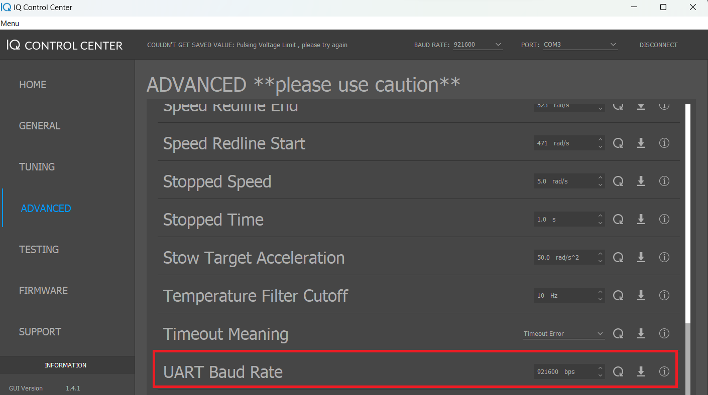

.. include:: ../text_colors.rst
.. toctree::

.. _up12_initial_configuration:

.. |propeller_name| replace:: UP12
.. |motor_name| replace:: Vertiq 2306

****************************************************
Setting up the |motor_name| for the |propeller_name|
****************************************************

For the |propeller_name| to create control torque, the |motor_name| must have the appropriate firmware and settings applied. You can download the pulsing firmware for the |motor_name| on the `underactuated propeller page <https://www.vertiq.co/up12>`_. To flash the downloaded firmware use the instructions in :ref:`updating_firmware`.

Once the firmware is flashed, connect the module to IQ Control Center and go to the ‘General’ tab.

.. warning::
    With firmwares older than V0.0.27 defaults for the UP12 were not included in the firmware and custom defaults needed to be flashed. To do this download the :download:`UP12 Custom Defaults File<../_static/defaults_files/custom_defaults_pulsing_12x4.json>`. Use the ‘Import’ button to load the defaults file into IQ Control Center.
    Use the ‘Set’ button to save the settings from the defaults file onto the |motor_name|. This will set all the required settings as well as change the |motor_name|’s baud rate. Reboot the |motor_name|. Once rebooted, to reconnect to IQ Control Center you must set the baud rate to 921600.

We also recommend using a baudrate of 921600 to increase the throughput of the serial line. This can be done by going to the ‘Advanced’ tab in IQ Control Center and changing the baudrate setting.

    Setting Buad Rate

Once the baud rate is changed in the module settings the module must be rebooted. Once rebooted, to reconnect to IQ Control Center you must set the baud rate to 921600.

    Setting Control Center Baud Rate

Now the forward direction of the |motor_name| must be decided. Usually this is done by mounting the |motor_name| to the aircraft with the adapter and main shoulder bolt mounted to the |motor_name|. After mounting your |motor_name| to your aircraft, choose the direction you want to treat as forward and rotate the shoulder bolt to that angle.

.. figure:: ../_static/tutorial_images/up12_initial_configuration/motor_forward.png
    :align: center
    :scale: 15
    :alt: Setting Aircraft Forward

    Setting Aircraft Forward

Connect the |motor_name| to IQ Control  Center (using 921600 as baud rate). Go to the ‘General’ tab, and while the bolt is angled forwards select ‘Sample Pulsing Zero Angle’. This will tell the |motor_name| which direction is forward.

    Sampling Zero Angle

The module will now respond properly to X, Y and Throttle commands sent to it via packed control messages as explained in :ref:`controlling_ifci`. The final step is to correct the propeller torque angle as described in :ref:`Underactuated Propeller Torque Angle Correction<correcting_underactuated_torque>`.