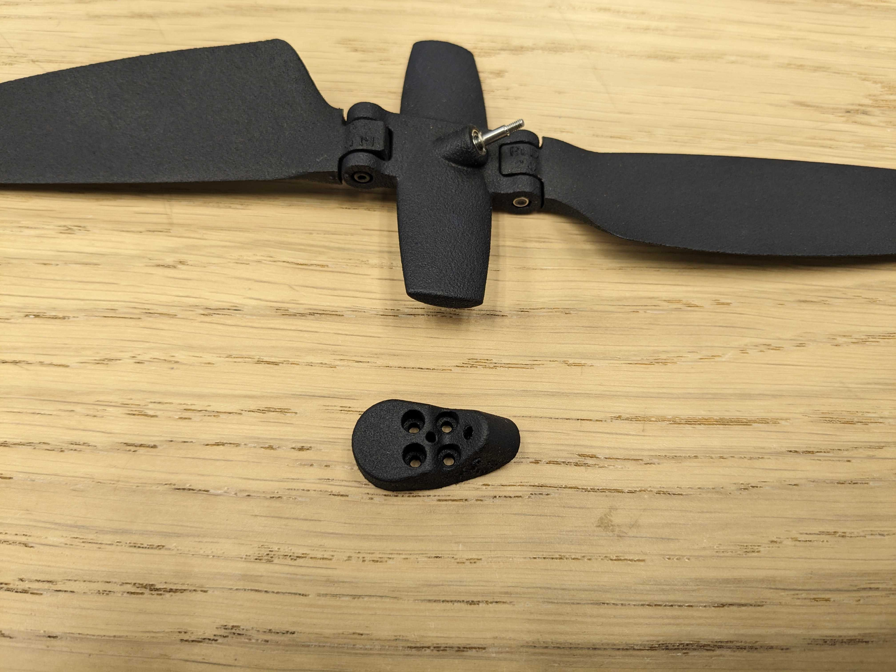

.. include:: ../text_colors.rst
.. toctree::

.. _up12_installation_tutorial:

.. |propeller_name| replace:: UP12
.. |motor_name| replace:: Vertiq 2306

*********************************************
Installing |propeller_name| on a |motor_name|
*********************************************

    Annotated |propeller_name|

To install the |propeller_name| on a |motor_name| module, you must first remove the main shoulder bolt from the adapter. Be sure not to lose the two washers on either side of the propeller hub. 

    Adapter and Hub Separated

Use the supplied M2x6 Screws to mount the adapter to the |motor_name|.

    Adapter mounted to module

Re-attach the propeller hub to the adapter. When tightening the main shoulder bolt, continue tightening until the hub does not spin freely. Loosen the bolt ¼ turn at a time until it again spins freely. There should be very little axial play of the hub along the main shoulder bolt.

    |propeller_name| on |motor_name|

