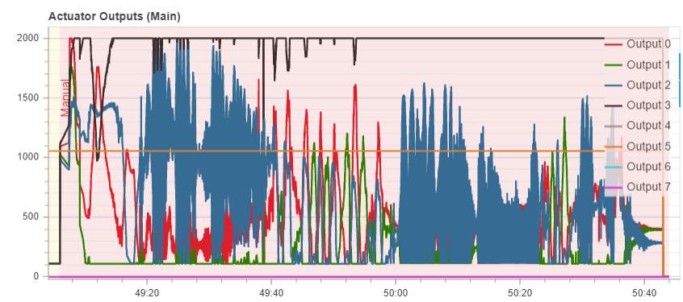
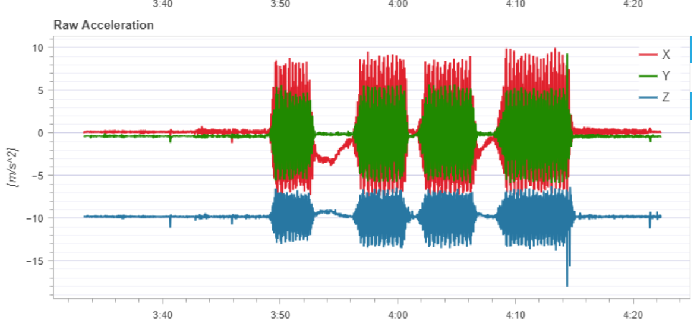
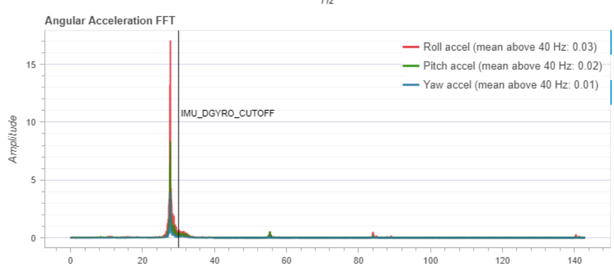
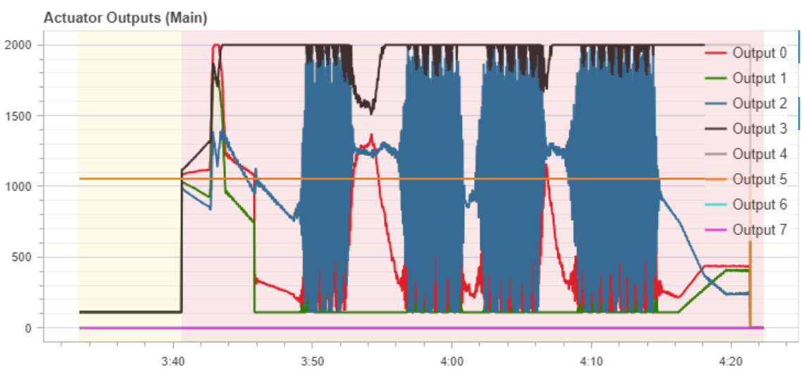
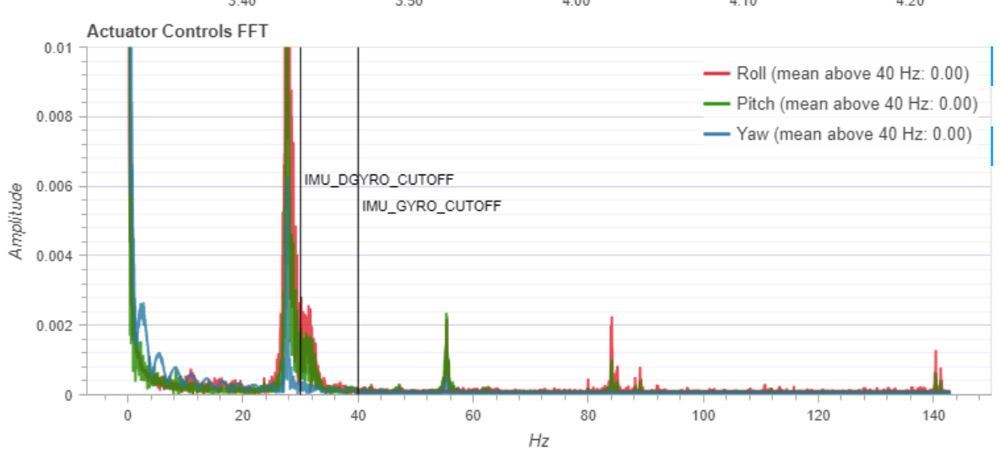
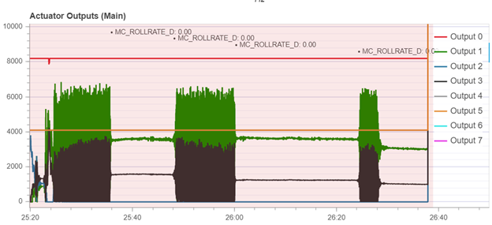

.. include:: ../text_colors.rst
.. toctree::

.. meta:: 
        :description: Learn how to identify and resolve motor jitter caused by flight controller vibrations using PX4 and ArduPilot log analysis, PID tuning, and vibration isolation techniques. 
        :keywords: flight controller vibration, motor jitter, PX4, ArduPilot, log analysis, PID gains, vibration isolation, actuator oscillation, sensor noise, Mission Planner, QGroundControl, troubleshooting

.. _vibration_and_jittering:

***********************************************************************
Understanding and Addressing Flight Controller and Motor Vibrations
***********************************************************************

.. _vibration_problem_overview:

Problem Overview
==================
Flight controllers typically have built-in accelerometers and gyroscopes that are sensitive to high vibrations. Extreme 
vibration can lead to bad readings from these sensors, which can lead to a range of problems, including instability and 
rapidly oscillating actuator outputs. These oscillating actuator outputs from the flight controller can lead to your motors 
seeming to “jitter,” switching their setpoint constantly instead of smoothly spinning. This article is intended to help with 
identifying and addressing these types of vibration-induced jittering motor issues. For more information on the effects of 
vibration on flight controllers, see the PX4 wiki’s pages on `Vibration Isolation <https://docs.px4.io/main/en/assembly/vibration_isolation.html#vibration-isolation>`_ 
and `Vibration Log Analysis <https://docs.px4.io/main/en/log/flight_review.html#vibration>`_. Ardupilot’s wiki also has useful information on how to 
`measure vibration <https://ardupilot.org/copter/docs/common-measuring-vibration.html>`_ and possible ways to 
`dampen it <https://ardupilot.org/copter/docs/common-vibration-damping.html>`_ if you are using an Ardupilot based flight controller.

.. _vibration_symptoms:

Symptoms of Excessive Flight Controller Vibration
===================================================
The `PX4 wiki <https://docs.px4.io/main/en/log/flight_review.html#vibration>`__ lists a range of possible issues that can result from excessive vibration, including:

* Less efficient flight and reduced flight time
* Overheating motors
* Increased material wearout
* Inability to tune the vehicle tightly, resulting in degraded flight performance
* Sensor clipping
* Position estimation failures, potentially resulting in fly-aways

For this article however, the focus is primarily on the negative effect that excessive vibration can have on a flight controller’s actuator outputs, and therefore on the performance of your 
Vertiq modules.

The accelerometer and gyroscope on the flight controller can pick up these vibrations, and it can make the output of the sensors appear extremely noisy. 
Depending on the tuning of the rate controllers on the flight controller, they can react aggressively to try and correct for the apparent error in the vehicle’s roll/pitch/yaw resulting from this noise, 
leading to them sending rapidly changing actuator outputs. When the motors receive these oscillating outputs, they try to respond to them by rapidly speeding up and slowing down, which leads to the motors 
seeming to jitter and vibrate. This can increase the vibration on the airframe, which leads to even more extreme oscillations on the actuator outputs in a vicious cycle. The PX4 wiki has 
examples of how these oscillations can appear in logs for `sensor data <https://docs.px4.io/main/en/log/flight_review.html#examples-bad-vibration-2>`_ 
and `actuator outputs <https://docs.px4.io/main/en/log/flight_review.html#actuator-outputs>`_. 
The Ardupilot wiki also shows some `examples of excessive vibration in Mission Planner <https://ardupilot.org/copter/docs/common-measuring-vibration.html#vibe-dataflash-log-message>`_.

Below is an example of an actuator output plot from testing at Vertiq where we faced these kinds of issues. Note the periods of extreme oscillation on Output 2 especially.

        Example of Oscillating Actuator Outputs Caused By Vibration of Flight Controller

The video below shows an example of the kind of jittering behavior you might observe from the module when you are having these kinds of problems.

.. raw:: html

    
    <video class='center_vid' controls><source src="../_static/tutorial_images/vibration_tutorial/vertiq_jittering_example.mp4" type="video/mp4"></video>

Diagnosing and Analyzing Vibration Issues
==========================================
The following sections cover possible approaches for diagnosing if you may be experiencing vibration related issues.

Analyzing Logs and Flight Controller Data
*******************************************
The best way to diagnose possible vibration problems is to analyze the logs produced by your flight controller. 
Both PX4 and Ardupilot based flight controllers have tools available to help with reviewing their logs and identifying potential issues.

PX4
####
`Flight Review <https://docs.px4.io/main/en/log/flight_review.html#log-analysis-using-flight-review>`_ is a very useful tool provided by PX4 that simplifies analyzing logs and identifying problems.

First, configure the `logging profile <https://docs.px4.io/main/en/advanced_config/parameter_reference.html#SDLOG_PROFILE>`_ on your flight controller. The default logging set is a good starting point, 
but we also recommend turning on `high-rate logging <https://docs.px4.io/main/en/advanced_config/parameter_reference.html#SDLOG_PROFILE>`_ before running any 
tests to try and diagnose the issue. Having high-rate logging turned on increases the amount of data logged by the flight-controller and allows additional useful analysis features in 
Flight Review, such as an FFT on the actuator output. 

There is also the option to turn on `raw FIFO high-rate data from the IMU or gyroscope <https://docs.px4.io/main/en/log/flight_review.html#raw-high-rate-imu-data-plots>`_. This is generally not necessary for an initial diagnosis of vibration issues, but if you want to 
look specifically at high frequencies it can be useful. This does add considerably to the logging bandwidth, so it can lead to drop-out of logging data and large log file sizes, 
so it is best to avoid using those settings if it is not necessary.

Once your logging profile is appropriately configured, safely run a test to replicate the issue and generate a log. Then, upload the `log to Flight Review <https://logs.px4.io/>`_. 
This should generate a series of plots summarizing the data from the log. 

The PX4 wiki page on `Log Analysis using Flight Review <https://docs.px4.io/main/en/log/flight_review.html>`_ provides an overview of how to use these plots to analyze the performance of your vehicle. 
We will focus on a few of the most relevant sections for analyzing vibration issues here.

Raw sensor data can be a useful place to start when looking for vibration issues. Periods of extreme oscillation are a sign that vibrations are causing issues for the sensors. 
The graph below shows a particularly bad example of what this can look like for raw acceleration.

        Example of Raw Sensor Data Showing Impact of Vibrations

Flight Review also provides graphs of the FFT of sensor data if high-rate logging is turned on. This helps identify the vibrations' specific frequencies and their severity. 
An FFT from the previous example can be seen below, showing one quite extreme peak.

        Example of Sensor Data FFT Showing Impact of Vibrations

Reviewing the actuator outputs is also very useful, especially if you are having problems with your motors “jittering”. Oscillating motor outputs means that the jitter is due to 
the commands from the flight controller changing rapidly, which may mean the root cause of the issue is linked to vibration. An extreme example of these oscillating motor 
outputs is shown below. Note how the periods of oscillation on the outputs correspond with the periods of oscillation on the raw acceleration graph that was previously shown.

        Example of Oscillating Actuator Outputs Showing Impact of Flight Controller Vibrations

The `actuator controls FFT <https://docs.px4.io/main/en/log/flight_review.html#actuator-controls-fft>`_ graph is also useful. Peaks on this graph indicate the frequency of the actuator outputs' oscillations. If they correspond with the peaks on the 
sensor data's FFTs, that indicates that the oscillation of the outputs is likely due to vibration. An example FFT graph is shown below, note how its peak is at a similar frequency to the peak on the acceleration FFT that was previously shown.

        Example of Actuator Output FFT Showing Impact of Flight Controller Vibrations

Flight Review also provides graphs giving a general overview of the output of the PID controllers. Oscillations on these outputs corresponding with oscillations on 
actuator output or sensor data graphs are further evidence that vibrations are negatively impacting your performance and causing your motors to "jitter."

Ardupilot
##########
The Ardupilot wiki provides instructions on how to use Mission Planner to `measure and analyze vibrations <https://ardupilot.org/copter/docs/common-measuring-vibration.html#measuring-vibration>`_. 
Similarly to data available with PX4's high-rate logging and Flight Review, they also provide information on `logging raw IMU for FFT analysis <https://ardupilot.org/copter/docs/common-raw-imu-logging.html#common-raw-imu-logging>`_.

Similar techniques to those discussed in the PX4 section above with Flight Review can be employed with these Mission Planner graphs. Start by checking the data from the sensors, 
such as the VibeX, VibeY, and VibeZ data from the primary accelerometer. Periods of extreme oscillation on these readings may indicate vibration issues. 
Compare that data with data from the actuator outputs, and determine if the oscillations on the sensor readings correspond with oscillations in the actuator outputs. 
If so, vibrations may be the cause of any “jittering” motor issues.

Compare Performance of Independent Motor Testing and Full System Testing
***************************************************************************
Both `QGroundControl <https://docs.px4.io/v1.12/en/config/motors.html>`_ and `Mission Planner <https://ardupilot.org/copter/docs/connect-escs-and-motors.html#checking-the-motor-numbering-with-the-mission-planner-motor-test>`_ 
provide utilities for independently testing that your motors are properly configured. These tests do not use the rate controller or the 
sensors on the flight controller at all, they allow you to directly command the motors. That means that the output to the motors will not be affected by any vibration issues. 
If you are having issues with jittering motors when attempting to fly your vehicle, it can be useful to see if the problem persists when running these motor tests. 
If the modules do not exhibit the jittering issue when running these tests, that indicates that the problem is likely not due to any module configuration and is more likely 
to be related to vibrations affecting the outputs of the flight controller when the full system is running.

Suggested Solutions
====================
`PX4 <https://docs.px4.io/main/en/assembly/vibration_isolation.html#vibration-isolation>`__ and `Ardupilot <https://ardupilot.org/copter/docs/common-vibration-damping.html#vibration-damping>`__ 
both list some recommended solutions for handling vibration on their wikis, so those are good resources to start with.

Some specific approaches that we have found useful in our previous testing and work with customers are covered below.

Vibration Isolation
********************
Mechanically improving the vibration isolation of the flight controller, e.g. using mounting foam or a mount specifically intended for reducing vibrations can 
help eliminate the problem by reducing the vibrations impacting the flight controller.

Adjusting PID Gains
********************
If possible without meaningfully degrading the performance of your vehicle, experimenting with reducing the gains on the PID controllers can help address vibration issues 
if they are being exacerbated by a motor to flight controller feedback loop, as previously described in the :ref:`vibration_symptoms` section. A less aggressive response from the controllers 
can help break this loop. The figure below shows an example where raising and lowering the D gain on the roll rate controller can cause the “jittering” to start and stop. 
Note that while the figure shows the gain as staying the same, it was actually lowering and raising between 0.003 and 0.0004 in this instance, the numbers in the figure 
only show the value out to two decimal places.

        Reducing Vibration and Jittering By Adjusting Controller Gains

The specific gains that are most likely to be effective in addressing these issues will depend on your vehicle. Consulting the log data from your flight controller can help 
determine which controller is the most problematic. More information on tuning PID gains can be found on the `PX4 <https://docs.px4.io/main/en/config_mc/pid_tuning_guide_multicopter_basic.html>`__ 
and `Ardupilot <https://ardupilot.org/copter/docs/common-tuning.html>`__ wikis. 

Software Filters
*****************
Both `PX4 <https://docs.px4.io/main/en/config_mc/filter_tuning.html>`__ and `Ardupilot <https://ardupilot.org/copter/docs/common-imu-notch-filtering.html#managing-gyro-noise-with-the-dynamic-harmonic-notch-filters>`__ 
have software filters available to try and address these types of issues. Notch filters and `slew rates <https://docs.px4.io/main/en/advanced_config/parameter_reference.html#MOT_SLEW_MAX>`_ can be useful 
for suppressing the effects of vibrations in software. Refer to the documentation on your flight controller’s available software filtering for more information. 