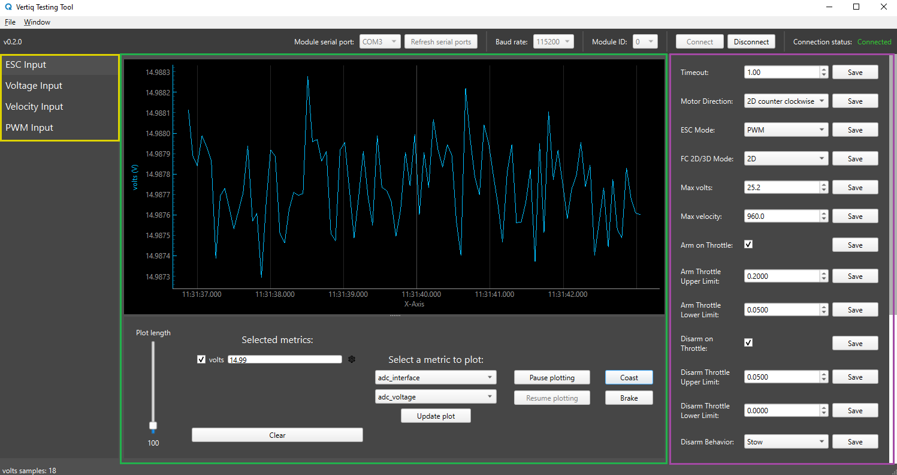
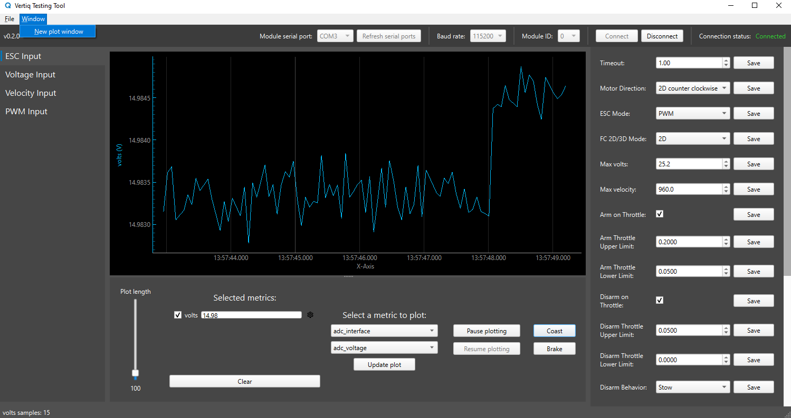
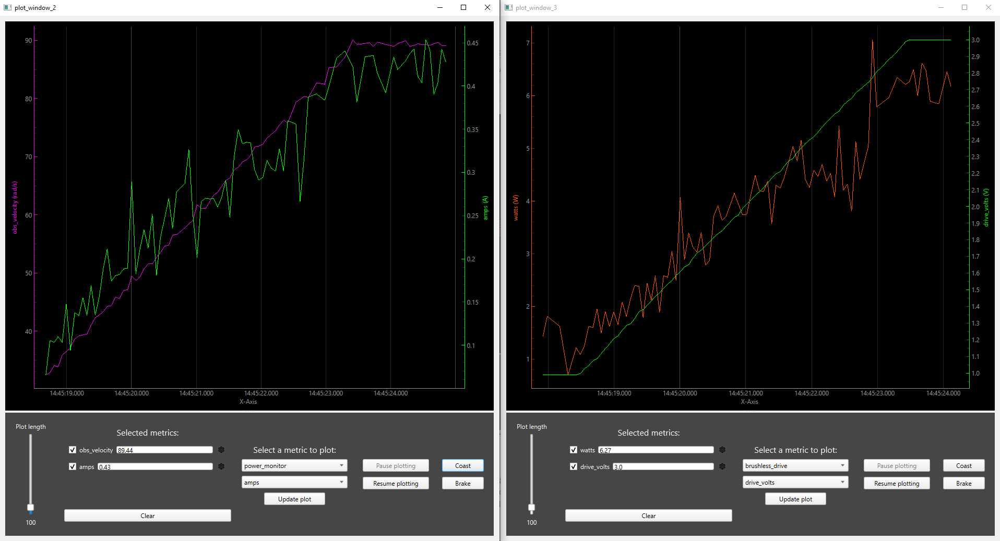
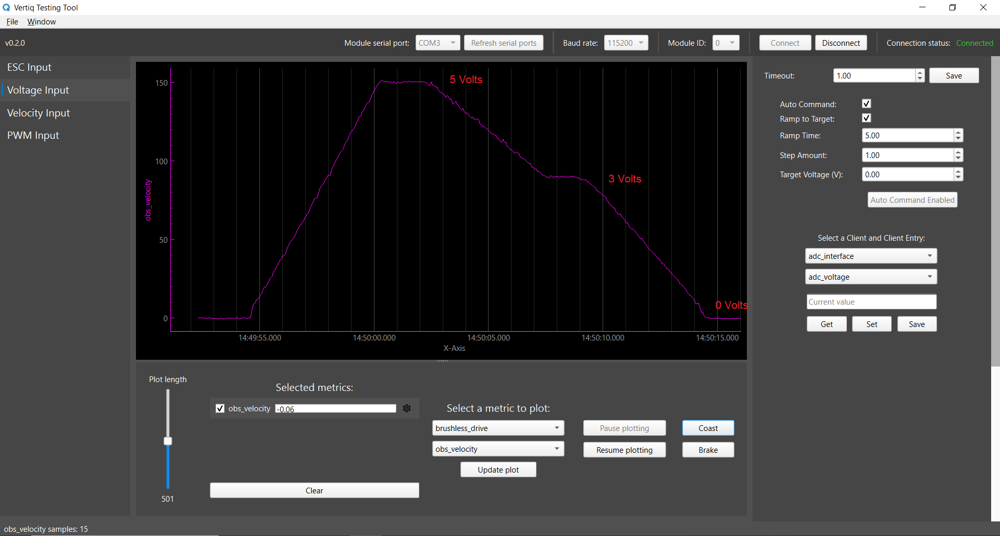

.. include:: ../text_colors.rst
.. toctree::

.. _vertiq_testing_tool_guide:

########################################
Getting Started with Vertiq Testing Tool
########################################

*****
About
*****

Vertiq Testing Tool is a supplemental application to :ref:`IQ Control Center <control_center_start_guide>`. 
It provides a streamlined interface to control your module using ESC, Voltage, Velocity, and PWM inputs.

********
Download
********
Vertiq Testing Tool is available on Windows and Linux.
You can download Vertiq Testing Tool on our `Support Page <https://www.vertiq.co/support>`_.

**********************
Hardware Configuration
**********************
Please follow the 'Connection with a Computer' and 'Wiring' sections of the :ref:`Control Center documentation <connection_guide>` to connect your module to your computer.

********
Overview
********
Once downloaded on Linux, extract and run the Vertiq Testing Tool executable. 

Once downloaded on Windows, follow the instructions in the installer. When running this application for the first time, 
you may encounter a Windows Defender SmartScreen warning.

If the popup below appears, click on 'More info'.

.. image:: ../_static/vertiq_testing_tool_pictures/windows_defender.png

Then click 'Run anyway'.

Once the application loads, you will be presented with the welcome screen. Follow the instructions on this screen to connect your module.

.. image:: ../_static/vertiq_testing_tool_pictures/welcome_screen.png

Once connected, you should see the ESC Input tab as shown below. The Control Panel contains the same parameters necessary to configure your module for use with a flight controller as in this :ref:`Control Center example <flight_controller_config_with_control_center>`.

.. note::
    .. image:: ../_static/vertiq_testing_tool_pictures/module_id_widget.png

    If multiple modules have been connected as described in the :ref:`Multiple Module Wiring <connection_guide>` section, you can communicate with each module by changing the Module ID in the widget shown above.

#. The :goldenrod:`Tabs` section provides different widgets for controlling your module. 

    * ESC Input provides configuration parameters necessary for integrating properly with a flight controller as well as simulating flight controller throttle commands via the IQUART raw value message. Please refer to the :ref:`Throttle Command and Modes <throttle_iquart_ref>` documentation to learn more about ESC Input.
    * Voltage Input provides controls to send voltage commands to the module.
    * Velocity Input provides controls to send velocity commands to the module.
    * PWM Input provides controls to send PWM input commands to the module.
    * Please refer to the :ref:`Throttle Command and Modes <throttle_mode>` documentation to learn more about Voltage, Velocity, and PWM modes.

#. The :green:`Plotting` section contains a live plot in the upper section and a dashboard with widgets to control the live plot in the lower section.

#. The :purple:`Control Panel` section contains widgets to configure specific parameters and to control your module. The Control Panel on each tab contains different widgets.

==================
Continuous command
==================

A notable feature in the ESC Input tab is the 'Continuous command' toggle at the bottom of the Control Panel. This feature is disabled by default, which means you need to click the 'Command ESC' button every time you want to send an ESC command.
When this feature is enabled, the ESC command will be continuously sent at the 'Command rate' with 10 Hz being the default value. The 'Command rate' can be adjusted to send the ESC command at different rates. 
You can also use the slider to adjust the ESC input value, which mimics adjusting the flight controller's throttle input between [0, 1].

.. note::
    Continuous command will be automatically disabled when your module is disconnected for safety purposes.

================================
Live Plotting and Active Metrics
================================

One main feature of Vertiq Testing Tool is the ability to plot any supported metric. 
Please refer to the :ref:`IQUART Client Table Reference tables <iquart_client_reference_tables>` to find the endpoints that allow for 'get' in the Access field, 
as these are the supported metrics that can be plotted. Also, please make sure that your module supports that client by checking its :ref:`Module Family page <module_families>`.

.. warning::
    Please remove all propellers from any module you plan on testing. Failure to do so can result in harm to you or others around you. Further, please ensure that your module is secured to a stationary platform or surface before attempting to spin it. 

For example, let's walk through the process of commanding the module to a 3V drive voltage using the Control Panel in the Voltage Input tab and plotting the value of *drive_volts* from the Brushless Drive client.

.. note::
    Please refer to the :ref:`Velocity and Voltage Based Control Mechanisms <manual_velocity_control_mechanisms>` documentation to learn more about Velocity and Voltage Control.

In order to visualize the module's drive voltage, navigate to the widget labeled 'Select a metric to plot'. The upper dropdown menu allows you to pick a client, and the lower a client entry.
Please refer to :ref:`Getting Started with Vertiq's APIs <getting_started_with_apis>` to learn more about IQUART clients.

In the upper dropdown menu, select *brushless_drive*. This corresponds to the :ref:`Brushless Drive <brushless_drive>` client.
In the lower dropdown menu, select *drive_volts*, which corresponds with brushless drive's *drive_volts* entry. Now, click 'Update Plot'.

Notice that the *drive_volts* metric is added to the 'Selected metrics' widget. By default, *volts* from the :ref:`Power Monitor <power_monitor>` client is preloaded in the 'Active metrics' widget.
Selecting a metric activates it, and updates the live plot with the now active metric. Multiple metrics can be plotted at once, so when *drive_volts* is added both *volts* and *drive_volts* will be plotted.
At this point, *drive_volts* should be 0V, as no drive voltage has been commanded to the motor yet.

To plot only the *drive_volts* metric, uncheck the *volts* metric. This will hide that metric on the plot so only the *drive_volts* metric will be visible.

.. image:: ../_static/vertiq_testing_tool_pictures/hide_volts_example.png

Note that the position of the y-axes is determined by the order of the metrics in the metrics list. Because *volts* is the first metric in the list, its y-axis will be on the left
and all other metrics will have their y-axes on the right, even when the first metric is hidden. To remove a metric from the metrics list, right click on it and select 'Remove'.
If *volts* is removed, *drive_volts* will be the first metric in the list and will move its y-axis to the left, as can be seen below.

Now that the plot is set up to plot only *drive_volts*, we can see how the value changes as we command the module. Select the Voltage Input tab on the left-hand side of the tool.
Set the 'Target Voltage' to 3.00 and click 'Send Command'. The module will ramp up to 3 volts over the next 5 seconds as specified by the 'Ramp Time' value.
After 5 seconds, the module should now have a constant, 3V, drive voltage. The plot of *drive_volts* shows this ramp and final setpoint, as shown below.

.. image:: ../_static/vertiq_testing_tool_pictures/voltage_input_command_example.png

==============================
Customizing Plotted Metrics
==============================
In versions v0.2.0 and above, it is possible to further customize the plotting of metrics. Specifically, the color of the line, the label used on the y-axis, and the visibility of the y-axis can be configured.
To change these properties of the metric, select the gear icon next to the metric in the 'Selected metrics' list. This will bring up a small dialog box with options for customizing the metric.
The images below show the gear icon and metric customization dialog.

On the metric customization dialog, "Show y-axis" controls whether the y-axis for this metric is visible. The color palette allows you to select what color the axis and line should be.
The label allows you to customize the label on the y-axis for this metric. The picture below shows an example of using this dialog to change both the color and label of a metric.

============
Plot Windows
============
In versions v0.1.0 and above, there is a feature that allows you to create multiple plot windows. To use this feature, navigate to Windows \> New plot window in the menu bar: 

You can create multiple plot windows to plot different metrics, and each of these plot windows has the same ability to plot and customize multiple metrics as previously described.
The image below shows an example of two additional plot windows with multiple active metrics.

===============================
Auto Command and Ramp to Target
===============================

Another useful feature in the Voltage, Velocity, and PWM Input tabs is the 'Ramp to target' option found in the Control Panel.
This feature is enabled by default, which means when you click 'Send Command' after setting the desired Target Voltage, the module ramps to the target voltage incrementally over the time defined in Ramp Time. 
The increments are determined by the ramp time, so increasing the ramp time will make it so that the module takes longer to reach the target voltage.

The 'Auto Command' feature is disabled by default. When enabled, you will not have to click the 'Send Command' button to send a voltage command. 
Instead, the application will automatically send the command whenever the target voltage value changes.

.. warning::
    Be very cautious when 'Auto Command' is enabled and 'Ramp to Target' is disabled. It is recommended to lower the 'Step Amount' to avoid large jumps between each target voltage command.

.. image:: ../_static/vertiq_testing_tool_pictures/voltage_input.png

The example below shows the plot of the observed velocity of the module. 'Ramp to target' was enabled when the module was commanded to 5 Volts. The plot shows that the module took 5 seconds to ramp up to the target voltage.
The module was then commanded to 3V, and then 0V.

In this example, 'Ramp to target' was disabled when the module was commanded to 1V, 2V, 3V, and finally 0V. The steep jumps between each target voltage command shows that the module was not ramping.

=================
Custom API Widget
=================

In versions v0.1.0 and above, there is a new widget in all tabs called the API widget:

This widget allows you to choose any client and client entry that is supported on your module, and perform GET/SET/SAVE commands.
Here is an example of getting the input amperage to your module using the 'amps' entry from the 'power_monitor' client:

For more information about clients and client entries, please refer to the :ref:`Client Table Reference <iquart_client_reference_tables>`.

You can also use the 'Add API widget' to add additional API widgets in the control panel:

.. note::
    Thank you for using our application! Please note that it is currently in active development, and you may encounter some bugs or unexpected behavior. 
    Your experience and feedback are extremely valuable to us as we continue to improve the application. 
    If you notice any issues or have any questions reach out to us at support@vertiq.co. Suggestions and feature requests are welcomed!