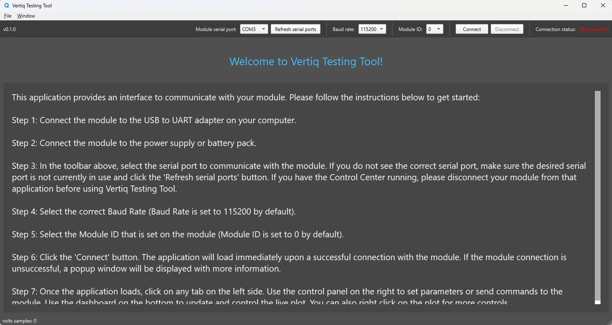
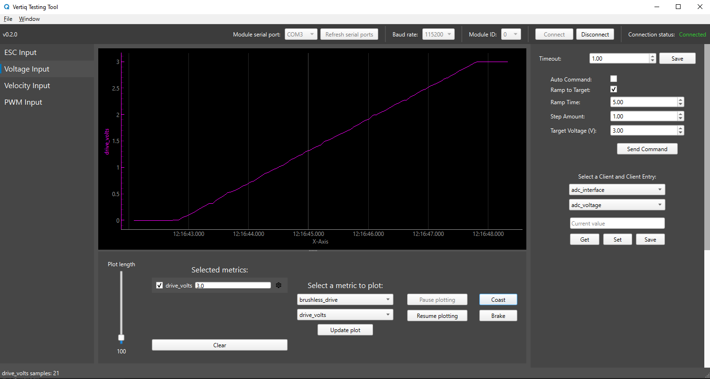
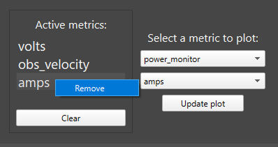
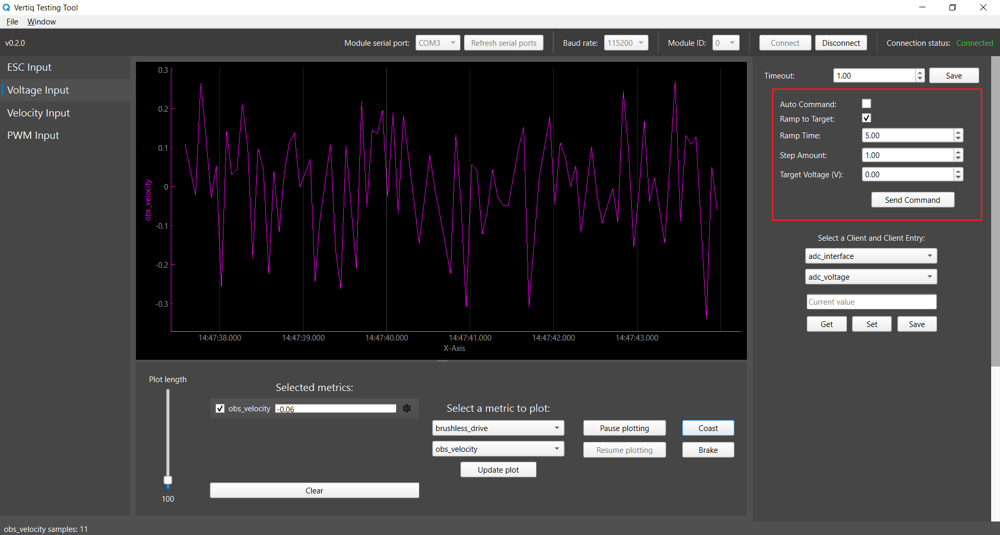

.. include:: ../text_colors.rst
.. toctree::

.. _vertiq_testing__guide:

########################################
Getting Started with Vertiq Testing Tool
########################################

*****
About
*****

Vertiq Testing Tool is a supplemental application to :ref:`IQ Control Center <control_center_start_guide>`. 
It provides a streamlined interface to control your module using ESC, Voltage, Velocity, and PWM inputs.

********
Download
********
Currently, Vertiq Testing Tool is only available on Windows.
You can download Vertiq Testing Tool on our `Support Page <https://www.vertiq.co/support>`_.

**********************
Hardware Configuration
**********************
Please follow the 'Connection with a Computer' and 'Wiring' sections of the :ref:`Control Center documentation <connection_guide>` to connect your module to your computer.

********
Overview
********
Once downloaded, extract and run the Vertiq Testing Tool executable. When running this application for the first time, 
you may encounter a Windows Defender SmartScreen warning.

.. image:: ../_static/vertiq_testing_tool_pictures/windows_defender.png

Click on 'More info'.

.. image:: ../_static/vertiq_testing_tool_pictures/windows_defender_more_info.png

Then click 'Run anyway'.

Once the application loads, you will be presented with the welcome screen. Follow the instructions on this screen to connect your module.

.. image:: ../_static/vertiq_testing_tool_pictures/esc_input.png

Once connected, you should see the tab as shown above.

#. The :gold:`Tabs` section provides different widgets for controlling your module. ESC Input provides configuration parameters necessary for integrating properly with a flight controller as well as simulating flight controller throttle commands via the IQUART raw value message.

#. The :green:`Plotting` section contains a live plot in the upper section and a dashboard with widgets to control the live plot in the lower section.

#. The :purple:`Control Panel` section contains widgets to configure specific parameters and to control your module. The Control Panel on each tab contains different widgets.

In the ESC Input tab shown above, the Control Panel contains the same parameters necessary to configure your module for use with a flight controller as in this :ref:`Control Center example <flight_controller_config_with_control_center>`.

==================
Continuous command
==================

.. image:: ../_static/vertiq_testing_tool_pictures/esc_input_command_widget.png

A notable feature in the ESC Input tab is the 'Continuous command' toggle at the bottom of the Control Panel. This feature is disabled by default, which means you need to click the 'Command ESC' button every time you want to send an ESC command.
When this feature is enabled, the ESC command will be continuously sent at the 'Command rate' with 10 Hz being the default value. The 'Command rate' can be adjusted to send the ESC command at different rates. 
You can also use the slider to adjust the ESC input value, which mimics adjusting the flight controller's throttle input between [0, 1].

================================
Live Plotting and Active Metrics
================================

One main feature of Vertiq Testing Tool is the ability to plot any supported metric. 
Please refer to the :ref:`IQUART Client Table Reference tables <iquart_client_reference_tables>` to find the endpoints that allows for 'get' in the Access field, 
as these are the supported metrics that can be plotted.

For example, let's command the module to a 3V drive voltage using the Control Panel in the Voltage Input tab and plot the *drive_volts* from the Brushless Drive client.

.. note::
    Please refer to the :ref:`Velocity and Voltage Based Control Mechanisms <manual_velocity_control_mechanisms>` documentation to learn more about Velocity and Voltage Control.

.. warning::
    Please remove all propellers from any module you plan on testing. Failure to do so can result in harm to you or others around you. Further, please ensure that your module is secured to a stationary platform or surface before attempting to spin it. 

Set the 'Target Voltage' to 3.00 and click 'Send Command'. The module will ramp up to 3 volts over the next 5 seconds specified by the 'Ramp Time' value.
After 5 seconds, the module should now have a constant, 3V, drive voltage. We can confirm this by plotting the drive volts.

.. image:: ../_static/vertiq_testing_tool_pictures/drive_volts_metric_plotting_example.png

In order to visualize the module's drive voltage, navigate to the widget labeled 'Select a metric to plot'. The upper dropdown menu allows you to pick a client, and the lower a client entry.
Please refer to :ref:`Getting Started with Vertiq's APIs <getting_started_with_apis>` to learn more about IQUART clients.

In the upper dropdown menu, select *brushless_drive*. This corresponds to the :ref:`Brushless Drive <brushless_drive>` client.
In the lower dropdown menu, select *drive_volts*, which corresponds with brushless drive's drive_volts entry.
Now, click 'Update Plot'. 

Notice that the *drive_volts* metric is added to the 'Active metrics' widget. By default, *obs_velocity*, *watts*, and *amps* are preloaded in the 'Active metrics' widget.
Selecting a metric activates it, and updates the live plot with the now active metric. Only one metric can be active at a time, but there is no limit to the number of metrics that can be added to the 'Active metrics' widget.

To remove a metric from the 'Active metrics' widget, simply right click on it and select 'Remove metric'.

===============================
Auto Command and Ramp to Target
===============================

Another useful feature in the Voltage, Velocity, and PWM Input tabs is the 'Ramp to target' option found in the Control Panel.
This feature is enabled by default, which means when you click 'Send Command' after setting the desired Target Voltage, the module ramps to the target voltage incrementally over the time defined in Ramp Time. 
The increments are determined by the ramp time, so increasing the ramp time will make it so that the module takes longer to reach the target voltage.

The 'Auto Command' feature is disabled by default. When enabled, you will not have to click the 'Send Command' button to send a voltage command. 
Instead, the application will automatically send the command whenever the target voltage value changes.

Be very cautious when 'Auto Command' is enabled and 'Ramp to Target' is disabled. It is recommended to lower the 'Step Amount' to avoid large jumps between each target voltage command.

.. note::
    Thank you for using our application! Please note that it is currently in active development, and you may encounter some bugs or unexpected behavior. 
    Your experience and feedback are extremely valuable to us as we continue to improve the application. 
    If you notice any issues or have any questions reach out to us at support@vertiq.co. Suggestions and feature requests are welcomed!
