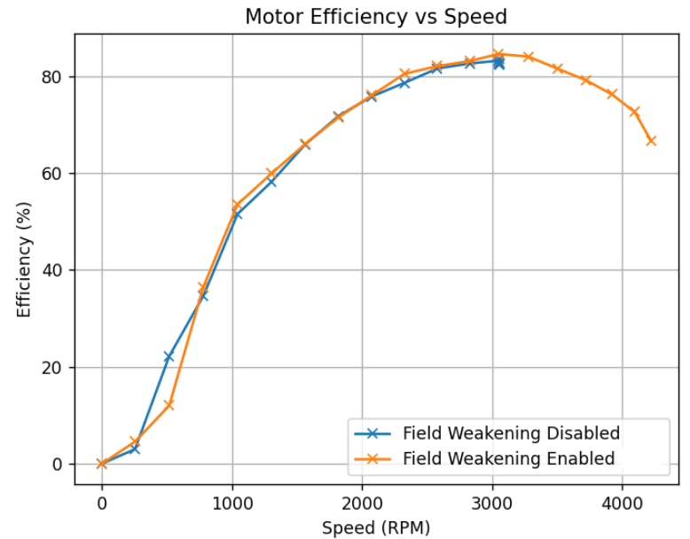

.. include:: ../text_colors.rst
.. toctree::

.. _vspin_automatic_field_weakening:

#################################
VSpin Automatic Field Weakening
#################################

******************************************************
What is Field Weakening
******************************************************
Field weakening, also known as flux weakening, is a technique used to increase a motor’s speed beyond what would normally be possible given a certain supply voltage. At a high level, this is achieved by varying the driving current in order to alter the motor’s magnetic field strength, effectively changing the motor’s Kv. 
With this technique, a motor can reach speeds at a given supply voltage that would typically require a motor with a higher Kv at the cost of reduced efficiency. VSpin firmware introduces optional automatic field weakening as a feature. This can be useful for users who need to operate in velocity ranges that lie between 
what is possible with Vertiq’s Kv offerings or who need to burst occasionally to higher speeds while being able to tolerate decreased efficiency.

When field weakening, part of the motor’s input power is redirected to altering its internal magnetic field. This means that not all input power is applied to torque production, and the motor will be less efficient in terms of producing torque. The motor can reach speeds it would not have been able to before, 
but it will become increasingly less efficient as it pushes further past its normal top speed at a given supply voltage and Kv. This also leads to greater heat generation, making it more likely for the module to overheat when operating for sustained periods with field weakening. 
This tradeoff in efficiency for higher speed should be considered carefully when determining if field weakening is a good choice for an application and evaluating what setpoints can be sustained safely.

The results from a test demonstrating field weakening can be seen on the graphs below. A module with a propeller was commanded with voltage commands from -2V to -36V with a 24V supply voltage. This is not meant as to provide details on specific thrust or efficiency information, just to demonstrate the general concept of field weakening.

Note how when field weakening is disabled, in blue, the module does not go any faster than ~3000 RPM, but when field weakening is enabled the module continues to speed up as the voltage commands increase. Also note that the efficiency continually decreases as the commands move further past the supply voltage.

    VSpin Field Weakening Example Data

******************************************************
How To Use Field Weakening
******************************************************
When enabled, Vertiq modules using VSpin firmware can automatically field weaken as necessary based on user commands. To enable this feature through IQ Control Center, set the ``Field Weakening`` parameter to ``Enabled`` on the General tab as shown below.

    VSpin Field Weakening Enable Parameter

Once enabled, the module automatically applies field weakening as needed based on incoming commands. There is no need to specifically alter your motor commands to make use of field weakening (besides possibly extending the range of meaningful commands). 
If you have a module that is connected to a 24V power supply with field weakening disabled, commanding any :ref:`voltage <throttle_voltage_mode>` above 24V will not cause the module to go faster than it would with a 24V command. For example, commanding the motor to spin at 28V 
will not cause the motor to go any faster than a 24V command. Since the module is limited by the supply voltage when field weakening is disabled, it cannot go any faster. With field weakening enabled, however, commands above 24V are meaningful 
because the module will automatically apply field weakening to go faster despite the supply voltage being limited. In this case, a 28V command would cause the motor to go faster than a 24V command. Similarly, if you were commanding :ref:`velocities <throttle_velocity_mode>`, 
then field weakening will be automatically applied to try and reach the target velocity. Simply request the velocity you want to achieve, and the automatic field weakening will attempt to apply any needed field weakening to reach the target.

.. note::
    Field weakening is not able to infinitely extend the range of possible speeds for a given module. At a certain point, field weakening can no longer increase the module's speed. The exact point this occurs depends on the module's load. 
    A more heavily loaded module will not be able to extend its range of possible speeds as far as an unloaded module can. Also, as mentioned previously, when operating with field weakening the efficiency of the module is decreased, leading to greater heat generation. 
    It is important to test and evaluate what is possible to sustain safely with your specific load when using field weakening.

******************************************************
Speed Limits with Field Weakening
******************************************************
One of your module's system safeties is a :ref:`speed limit <vspin_speed_limiter>` used to protect the motor from exceeding rated mechanical speeds. Operating outside of your module's rated speeds can cause serious damage to the module. You should not attempt to use field weakening to get to, 
or above, the module's rated mechanical speed as speed limits are necessary to protect the motor from damage due to overspeed, and should not be exceeded.
