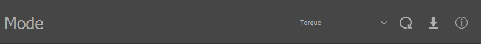

.. include:: ../text_colors.rst
.. toctree::

.. _vspin_command_current_and_torque:

#######################################
Commanding Motor Current and Torque
#######################################
In addition to the voltage and velocity setpoints that are available on stock speed and servo firmwares, VSpin firmware makes it possible to command modules to a specific motor current or torque setpoint. 
This page covers some of the basics of commanding torque and motor current setpoints.

.. warning::
    A torque command causes the module to accelerate, and without a load to create a counteracting torque, the module will continue to accelerate until it hits its speed limits. With a propeller or similar loads, as the load’s speed increases 
    it exerts increasing torque on the module, allowing the module’s speed to settle. If you command high torques when the module is unloaded, it will accelerate up to the speed limits, which can be dangerous if the motor is not properly secured.

******************************************************
Torque Mode
******************************************************
For commanding torque setpoints using a typical :ref:`throttle command <manual_throttle>` sent using a protocol such as :ref:`PWM <timer_based_protocol>` or :ref:`DroneCAN <dronecan_protocol>`, VSpin firmware introduces a new Torque :ref:`mode <throttle_mode>`. This can be configured in a similar way to Voltage or Velocity mode. 
First, set the module’s mode to Torque as shown below on the General tab of the Control Center.

    Torque Mode Parameter

Then, set the Max Torque to configure the range of torques that the throttle commands will correspond to. A 100% throttle command will command the motor to ``Max Torque`` N*m, a 0% throttle command will command the motor to 0 N*m, and a -100% throttle command will command the motor to ``-Max Torque`` N*m. 
Refer to this :ref:`documentation <throttle_mapping>` for more information on mapping throttles. For example, with a Max Torque of 1.0 N*m, a 50% throttle command would command a setpoint of 0.5 N*m.  

    Max Torque Parameter

******************************************************
Direct API Commands
******************************************************
It is also possible to directly command the motor to torque or motor current setpoints using the API. See the ctrl_torque entry **<LINK WHEN AVAILABLE>** of the Propeller Motor Control client and the torque_target entry of the Drive Control Interface client **<LINK WHEN AVAILABLE>** for details on the relevant API entries.