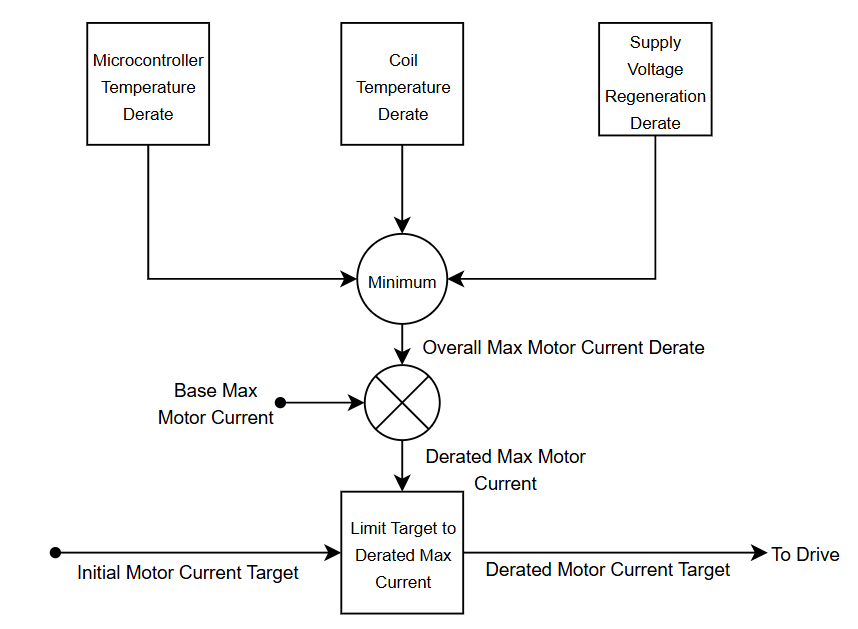
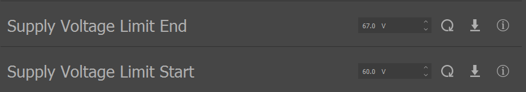
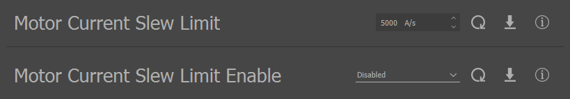
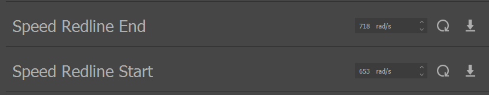

.. include:: ../text_colors.rst
.. toctree::

.. _vspin_safeties:

#################################
VSpin Safeties
#################################
This page provides information on how safeties function and what has changed for VSpin firmware.

.. note:: 
    Before using Control Center with VSpin, we recommend updating your Control Center to v1.11.0 or later for full support
    
******************************************************
Derating Motor Current
******************************************************
For reference information on how the derates on stock speed and servo firmwares function, see the :ref:`Safety Systems <manual_safety>` page. Basically, a derate is a scaling factor that adjusts a module’s output to keep it in a safe operating region based on some operating characteristic of the module such as speed or temperature. All derate values on Vertiq’s modules are represented as float values from [0,1]. 
A derate of 1 means that no derating is occurring, and a derate of 0 means that the module is fully derated. On stock speed and servo firmwares, the applied drive voltage is directly derated.

Derates are still used to protect the motor on VSpin, however the exact nature and sources of derates have changed. Rather than directly derating the applied drive voltage, the derates now act on a module's maximum allowed motor current. Additionally, rather than multiplying the derate sources together to calculate the total derate, 
only the minimum (strongest derating) of all of the derate sources is used. This can be expressed as:

.. math::
    \text{Derated Maximum Motor Current} = \text{Base Maximum Motor Current}*\text{Minimum Derate}

The maximum motor current is then applied in the same way as our existing motor :ref:`current limiter <bd_motor_current_limit>`. Derating the maximum motor current has different performance characteristics than derating the applied drive voltage. When derating the applied drive voltage, the motor immediately begins to slow down when the derate drops below 1. Now, with derating of the maximum motor current, 
the motor’s performance will not outwardly change until the derated maximum motor current is at or below the motor current that is being applied to the drive. With small loads that do not require much motor current, the derate may not affect the motor’s output until the derate is well below 1.

VSpin Derate Sources
======================================
VSpin has various different safeties that can each produce a derate. Some of them are shared with the stock speed or servo firmware, but there have also been some changes. Speed limiting no longer uses a derate, while supply voltage limiting now does use a derate. The diagram below illustrates these derate sources on VSpin.

    VSpin Derate Sources Diagram

Microcontroller Temperature Derate
--------------------------------------
The microcontroller temperature derate on VSpin firmware functions and can be configured in the same way as the microcontroller temperature derate on the stock speed and servo firmwares. For more information, see the :ref:`documentation here <microcontroller_derate>`.

Coil Temperature Derate
--------------------------------------
The coil temperature derate on VSpin firmware functions and can be configured in the same way as the coil temperature derate on the stock speed and servo firmwares. For more information, see the :ref:`documentation here <coil_temp_derate>`.

Supply Voltage Regeneration Derate
--------------------------------------
This safety fills the same role on VSpin as the :ref:`regeneration voltage limiter <protect_against_regen>` does on stock speed and servo firmwares. See that documentation for more background on regeneration, how it can affect your module, and general guidelines on how to set your voltage limits. 

VSpin has the same functionality, though now it is implemented as a derate on motor current. The Supply Voltage Regeneration derate is controlled by the Supply Voltage Limit Start and Supply Voltage Limit End parameters. The total supply voltage regeneration derate is calculated by the following equation, where the solution is saturated to [0,1]:

.. math::
    \text{Supply Voltage Regeneration Derate} = Sat(\frac{\text{Supply Voltage Limit End} - \text{Supply Voltage}}{\text{Supply Voltage Limit End} - \text{Supply Voltage Limit Start}}, 0, 1) 

This means that for any supply voltage below ``Supply Voltage Limit Start``, there is no derate applied. For any voltage at or above ``Supply Voltage Limit End``, the supply voltage regeneration derate is 0. Any supply voltage in that range is subject to a variable derate [0, 1] as determined by the formula above.

The configuration process for this safety on VSpin is similar to the process on the stock speed or servo firmware. The ``Supply Voltage Limit Start`` and ``Supply Voltage Limit End`` set the supply voltage range over which the module will derate. These should be configured in the same way as :ref:`Volts Limit and Volts Limit Starting Voltage <bd_regen_limiter_configuration>` on the stock speed or servo firmwares.

    VSpin Supply Voltage Regeneration Limit Parameters

******************************************************
Motor Current Slew Limit
******************************************************
Modules that use VSpin have a configurable motor current slew limit instead of a :ref:`motor voltage slew limit <slew_rate>`. While a motor voltage slew limit effectively limits how quickly the module’s speed can change, a motor current slew limit limits how quickly the module’s torque can change. When using speed-dependent loads like propellers, this distinction is often not obvious, since speed and torque are so closely linked. 
For other types of loads that are not speed-dependent or when the module is unloaded, this difference can be meaningful. **Note that the motor current is not the same as the supply current, these values are generally not the same.**

The motor current slew limit puts a limit on how quickly the applied motor current can change, regardless of how quickly the incoming commands change. This is configured in terms of A/s, where for example a limit of 100 A/s means that the motor current can not increase or decrease by more than 100 A/s per second. If the module was originally commanding a motor current of 0A, and the command changed to 200A, 
then with a limit of 100 A/s it would take 2 seconds to reach that target. How this translates to changes in torque will depend on the Kt of the module in use. 

Generally, if you do make use of the motor current slew limit, it is best to keep the limit as high as is acceptable for your application. Excessively limiting the motor current slew rate can make your module generally less responsive and can make it more difficult to maintain a steady voltage or velocity target. Enabling the slew limit with the default setting of 5000 A/s and working gradually down from there is recommended.

The motor current slew limit can be configured through the Tuning tab of Control Center. The ``Motor Current Slew Limit Enable`` parameter enables or disables the motor current slew limit, and the ``Motor Current Slew Limit`` sets the motor current slew limit in units of A/s.

    VSpin Motor Current Slew Limit Parameters

.. _vspin_speed_limiter:

******************************************************
Speed Limiter
******************************************************
Similar to the stock speed and servo firmwares, VSpin firmware includes a speed limiter to protect the module from mechanical failures. The speed limiter, however, is not implemented using a derate, so its impact cannot be observed by monitoring the derate. Instead, the speed limiter applies progressively more torque in the opposite direction that the module is spinning to decelerate the module as its speed exceeds the start of the speed redline range. 
Despite that, the speed limiter is still configured in the same way as on previous firmware styles, so customers should not notice a significant functional difference in the operation of the speed limiter. 

The ``Speed Redline Start`` and ``Speed Redline End`` parameters, shown below, still determine the range which the speed limiter will attempt to keep the motor’s speed within. Previous guidance provided in our documentation for configuring the :ref:`speed limiter on stock speed and servo firmware <speed_derate>` is still generally applicable.

    VSpin Speed Limiter Parameters

******************************************************
Power Safety
******************************************************
The operation of power safety is unchanged between stock speed and servo firmwares and the VSpin firmware. Refer to our :ref:`existing documentation <power_safety>` for more information.

******************************************************
Motor Current Limiter
******************************************************
.. warning::
    Generally, we recommend not altering this limit without directly consulting with the Vertiq engineering team, as that could potentially damage your module. 

The overall motor current limiter is functionally the same on VSpin firmware as it is on stock speed and servo firmwares. It limits the maximum motor current that can be drawn at any time to protect against dangerous current surges, which is primarily applicable on hard steps or when the motor is stalled. See our :ref:`existing documentation <bd_motor_current_limit>` for more information. The primary difference is that it can no longer be configured through the :ref:`Brushless Drive client <brushless_drive>` on VSpin firmware. 
It has moved to the :ref:`Current Safeties client <current_safeties_api>`. 

******************************************************
Closed Loop Supply Current Limiter
******************************************************
The Closed Loop Supply Current Limiter is functionally the same on VSpin firmware as it is on stock speed and servo firmwares. See our :ref:`existing documentation <bd_closed_loop_supply_limiter>` for more information. The primary difference is that it can no longer be configured through the :ref:`Brushless Drive client <brushless_drive>` on VSpin firmware. All of the pertinent entries to the :ref:`Current Safeties client <current_safeties_api>`. 